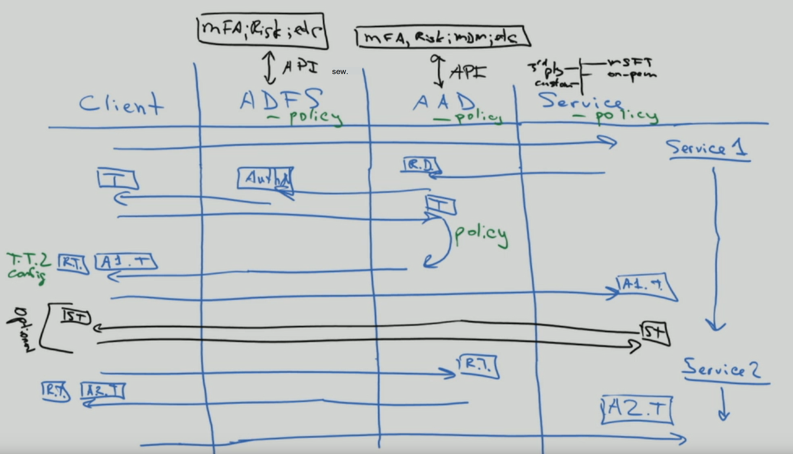
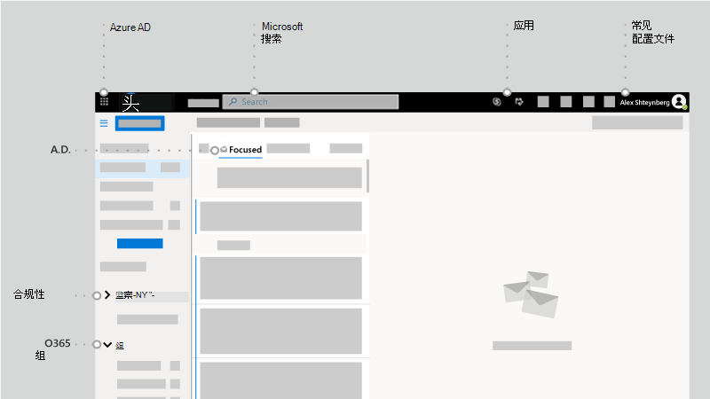

# 为了标识和超越 — 一个架构师的见解

本文中，Microsoft 首席技术架构师[Alex Shteynberg](https://www.linkedin.com/in/alex-shteynberg/)讨论了采用 Microsoft 云服务和其他 Microsoft 云服务的企业Microsoft 365的主要设计策略。

## 作者简介

我是纽约 Microsoft 技术中心的主要技术 [架构师](https://www.microsoft.com/mtc?rtc=1)。 我主要与大型客户和复杂的要求合作。 我的想法和意见基于这些交互，可能并不适用于所有情况。 但是，在我的体验中，如果我们可以帮助客户应对最复杂的挑战，那么我们可以帮助客户。

我通常每年与 100 多个客户合作。 虽然每个组织都有独特的特征，但了解趋势和共同点会十分有趣。 例如，许多客户对一个趋势是跨行业的兴趣。 毕竟，银行分支还可以是一家咖啡店和社区中心。

以我的角色，我专注于帮助客户找到最佳的技术解决方案，以解决他们独特的业务目标集。 正式上，我重点介绍标识、安全性、隐私和合规性。 我喜欢这样一个事实，即这些触摸我们所做的一切。 它使我有机会参与大多数项目。 这可使我非常忙碌并享受此角色。

我居住在纽约市 (最佳！) 真正享受其文化、食物和人们的多样性， (交通) 。 我喜欢在可以时旅行，并且希望在我的一生看到大部分世界。 我目前正在研究到非洲的旅行，以了解动物。

## 指导原则

- **简单通常更好**：你几乎可以 (技术) 任何内容，但这并不意味着你应该这样做。 尤其是在安全空间中，许多客户过度开发解决方案。 我想要从 Google [的](https://www.youtube.com/watch?v=SOQgABDSYZE) "条纹"会议播放此视频来强调这一点。
- **人员、流程、技术**[：针对人员进行](https://en.wikipedia.org/wiki/Human-centered_design)设计以改进流程，而不是先进行技术改进。 没有"完美"的解决方案。 我们需要平衡各种风险因素，并针对每个业务做出不同的决策。 客户过多，他们设计的方法是用户稍后避免的。
- **首先关注"为什么**"和"如何"：成为具有一百万个问题的令人厌烦的 7-yr 旧人。 如果不知道要提出正确的问题，我们无法得出正确的答案。 许多客户都假设需要如何工作，而不是定义业务问题。 始终可以采取多个路径。
- **过去最佳做法的长尾：** 认识到最佳做法正在以轻快的速度变化。 如果你查看了三Azure AD之前，你很可能已过期。 此处的所有内容在发布后可能会更改。 现在，"最佳"选项可能与现在 6 个月后不同。

## 基线概念

不要跳过此部分。 我通常发现，即使对于已使用云服务多年的客户，我也必须回到这些主题。
话说，语言不是精确的工具。 我们通常使用相同的单词来表示不同的概念或不同的单词来表示同一概念。 我通常使用此图建立一些基准术语和"层次结构模型"。
  

 

当你学习如何出发时，最好从池中开始，而不是在陆地中间开始。 我并未尝试在此图的技术上准确。 它是一个讨论一些基本概念的模型。

本图示内容：

- Tenant = Azure AD。 它位于层次结构的"顶部"或图表中的级别 1。 我们可以将此问题作为"边界"，其中除[B2B](/azure/active-directory/b2b/what-is-b2b)外， (Azure AD一切) 。 所有 Microsoft 企业云服务都是这些租户之一的一部分。 使用者服务是独立的。 文档中的"租户"Office 365租户、Azure 租户、WVD 租户等。 我通常发现这些变体导致客户混淆。
- 服务/订阅（图中的级别 2）仅属于一个租户。 大多数 SaaS 服务都是一对一，如果不迁移，则不能移动。 Azure 不同，你可以将 [计费和](/azure/cost-management-billing/manage/billing-subscription-transfer) /或 [订阅移动到](/azure/active-directory/fundamentals/active-directory-how-subscriptions-associated-directory) 另一个租户。 有许多客户需要移动 Azure 订阅。 这有各种含义。 订阅之外的对象不会移动 (例如，基于角色的访问控制或 Azure RBAC，Azure AD 对象（包括组、应用、策略等）) 。 此外，某些服务 (Azure Key Vault、Data Vault 等) 。 如果没有良好的业务需求，请不要迁移服务。 一些有助于迁移的脚本在 GitHub[上共享](https://github.com/lwajswaj/azure-tenant-migration)。
- 给定服务通常具有某种"子级别"边界，或级别 3 (L3) 。 了解这一点对于分离安全性、策略、管理等非常有用。 遗憾的是，我并没有知道的统一名称。 L3 的一些示例名称如下：Azure Subscription = [resource](/azure/azure-resource-manager/management/manage-resources-portal);Dynamics 365 CE = [instance](/dynamics365/admin/new-instance-management);Power BI = [workspace](/power-bi/service-create-the-new-workspaces);Power Apps = [environment](/power-platform/admin/environments-overview);等等。
- 级别 4 是实际数据所位于的地方。 此"数据平面"是一个复杂的主题。 某些服务对 RBAC Azure AD，而其他服务则没有。 在介绍委派主题时，我将进行一些讨论。

我找到许多客户 (和 Microsoft) 对以下内容感到困惑或有疑问的其他概念：

- 任何人都可以 [创建](/azure/active-directory/fundamentals/active-directory-access-create-new-tenant) 多个租户 [，无需任何费用](https://azure.microsoft.com/pricing/details/active-directory/)。 不需要其中设置服务。 我拥有数十个。 每个租户名称在 Microsoft 的全球云服务中都是唯一 (也就是说，两个租户之间不能具有相同的) 。 它们全部采用 TenantName.onmicrosoft.com。 还有一些进程会自动创建租户 ([托管租户](/azure/active-directory/users-groups-roles/directory-self-service-signup)) 。 例如，当用户使用任何其他租户中不存在的电子邮件域注册企业服务时，可能会发生这种情况。
- 在托管租户中， [可以在其中注册](/azure/active-directory/fundamentals/add-custom-domain) 多个 DNS 域。 这不会更改原始租户名称。 除了迁移迁移外，当前 (重命名租户) 。 尽管租户名称从技术上来说这些天不是关键，但一些用户可能会发现这有限制。
- 即使尚未计划部署任何服务，也应为组织保留租户名称。 否则，其他人可以从你那里接受它，并且没有简单的过程可以 (DNS 名称) 。 我经常会从客户听到这样的声音。 租户名称应该是一个讨论主题。
- 如果你拥有 DNS 命名空间 () ，你应该将所有这些命名空间添加到租户 (租户) 。 否则， [可以创建具有此](/azure/active-directory/users-groups-roles/directory-self-service-signup) 名称的非托管租户，这会导致中断， [使其进行管理](/azure/active-directory/users-groups-roles/domains-admin-takeover)。
- DNS 命名空间 (，例如 contoso.com) 只能属于一个租户。 这对各种方案有一些 (例如，合并或收购期间共享电子邮件域等) 。 有一种方法可以注册 DNS 子 (，div.contoso.com) 租户中的 DNS 子服务器，但应避免这样操作。 通过注册顶级域名，假定所有子域属于同一租户。 在多租户方案中 (请参阅) 我通常建议使用其他顶级域名 (如 contoso.ch 或 ch-contoso.com) 。
- Who"拥有"租户？ 我通常看到不知道当前拥有其租户的客户。 这是一个大的红色标志。 致电 Microsoft 支持 ASAP。 与问题一样，当服务所有者 (指定Exchange管理员) 管理租户时。 租户将包含将来可能需要的所有服务。 租户所有者应是一个组，可以决定启用组织的所有云服务。 另一个问题就是当要求租户所有者组管理所有服务时。 这不能针对大型组织进行扩展。
- 没有子/超级租户的概念。 出于某种原因，此等待器会不断重复自身。 这也适用于[Azure AD B2C](/azure/active-directory-b2c/)租户。 我听到过多次"我的 B2C 环境在我的 XYZ 租户中"或"如何将 Azure 租户移入我的 Office 365 租户？"
- 本文档主要侧重于商业全球云，因为大多数客户正在使用此云。 了解独立云有时 [很有用](/azure/active-directory/develop/authentication-national-cloud)。 独立云具有其他含义，可讨论哪些内容超出了此讨论的范围。

## 基准标识主题

有许多有关 Microsoft 标识平台的文档 - Azure Active Directory (Azure AD) 。 对于刚开始工作的人，经常感到不知所措。 即使在了解它之后，保持持续创新与变革也极具挑战性。 在我的客户交互中，我常常发现自己充当业务目标与"良好、更好、最好"方法之间的"转换器"，以解决这些 (和这些主题的"注释") 。 很少有一个完美答案，"正确"决策是各种风险因素的平衡。 以下是我通常与客户讨论的一些常见问题和混淆区域。

### 预配

Azure AD无法解决标识领域缺乏治理的问题！ [身份管理](/azure/active-directory/governance/identity-governance-overview) 应该是独立于任何云决策的关键元素。 治理要求会随着时间的推移而发生变化，这就是它是一个程序而不是工具的原因。

[Azure AD 连接](/azure/active-directory/hybrid/whatis-azure-ad-connect)第[三](/microsoft-identity-manager/microsoft-identity-manager-2016)Microsoft Identity Manager (MIM) 自定义 (与其他内容相比) ？ 现在和将来都为自己省去许多麻烦，并Azure AD 连接。 此工具中提供了所有类型的智能，可解决客户配置和持续创新的问题。

一些可能会推动构建更复杂的体系结构的边缘案例：

- 我有多个 AD 林，两者之间没有网络连接。 有一个新的选项称为 [云预配](/azure/active-directory/cloud-provisioning/what-is-cloud-provisioning)。
- 我既没有 Active Directory，也不想安装它。 Azure AD 连接配置为从[LDAP](/azure/active-directory/hybrid/plan-hybrid-identity-design-considerations-tools-comparison)同步 (可能需要合作伙伴) 。
- 我需要将相同的对象预配到多个租户。 这在技术上不受支持，但取决于"相同"的定义。

我应自定义默认同步规则 ([筛选器对象](/azure/active-directory/hybrid/how-to-connect-sync-configure-filtering)、 [更改](/azure/active-directory/hybrid/reference-connect-sync-attributes-synchronized)属性、备用登录) [ID](/azure/active-directory/hybrid/plan-connect-userprincipalname)等？ 请避免！ 标识平台的价值仅与使用该平台的服务一样重要。 虽然你可以执行各种类型的配置，但若要回答此问题，你需要查看对应用程序的影响。 如果筛选启用邮件的对象，则联机服务的 GAL 将不完整;如果应用程序依赖于特定属性，则筛选这些属性将具有不可预知的影响;等。 这不是标识团队决策。

XYZ SaaS 支持实时 (JIT) 预配，为什么需要我进行同步？ 具体步骤请见上文。 许多应用程序需要"配置文件"信息来使用功能。 如果所有启用邮件的对象都不可用，则不能拥有 GAL。 这同样适用于与应用程序[集成](/azure/active-directory/app-provisioning/user-provisioning)的应用程序中的用户Azure AD。

### 身份验证

[密码哈希同步](/azure/active-directory/hybrid/how-to-connect-password-hash-synchronization) (PTA) [ (](/azure/active-directory/hybrid/how-to-connect-pta-how-it-works)身份验证与 PTA) 身份验证的传递身份验证[。](/azure/active-directory/hybrid/how-to-connect-fed-compatibility)

通常，会围绕 [联盟展开热](/azure/active-directory/hybrid/choose-ad-authn) 讨论。 更简单通常更好，因此使用 PHS，除非你有一个很好的理由不这样做。 还可以为同一租户中的不同 DNS 域配置不同的身份验证方法。

某些客户启用联盟 + PHS 主要用于：

- 在联合 [身份验证服务](/azure/active-directory/hybrid/plan-migrate-adfs-password-hash-sync) (时回退到) 进行灾难恢复的选项。
- 其他功能 (例如：Azure AD [DS](/azure/active-directory-domain-services/tutorial-configure-password-hash-sync)) 和安全服务 ([例如：泄露](/azure/active-directory/reports-monitoring/concept-risk-events#leaked-credentials)的) 
- 在 Azure 中支持无法理解联合身份验证 (例如 [，Azure 文件](/azure/storage/files/storage-files-active-directory-overview)) 。

我经常与客户一起浏览客户端身份验证流程，以阐明一些想法。 结果如下图所示，与获取结果的交互过程不一样好。

这种类型的白板图说明了在身份验证请求流中应用安全策略的地方。 本示例中，通过 Active Directory 联合身份验证服务 (AD FS) 强制执行的策略将应用于第一个服务请求，而不是后续服务请求。 至少这是尽可能将安全控件移动到云的一个原因。

只要我记住，我们一直在 ( SSO) 单一登录这一理想。 一些客户认为，他们可以通过选择 STS (提供商的"正确") 实现此目的。 Azure AD启用[SSO](/azure/active-directory/manage-apps/plan-sso-deployment)功能，但 STS 没有神奇。 "旧"身份验证方法太多，仍用于关键应用程序。 通过Azure AD[解决方案扩展](/azure/active-directory/saas-apps/tutorial-list)解决方案可以解决许多此类情况。 SSO 是一种策略和旅程。 如果不实现应用程序标准， [你无法达到此目标](/azure/active-directory/develop/v2-app-types)。 与本主题相关的是无密码身份验证之旅，这同样没有神奇答案。

[MFA (](/azure/active-directory/authentication/concept-mfa-howitworks) 多重) 身份验证功能 ([此](https://techcommunity.microsoft.com/t5/azure-active-directory-identity/your-pa-word-doesn-t-matter/ba-p/731984) 为更多) 。 向它 [添加用户行为分析](/azure/active-directory/authentication/tutorial-risk-based-sspr-mfa) ，并且你拥有一个可阻止最常见的网络攻击的解决方案。 甚至消费者服务也需要 MFA。 但是，我仍与许多不想迁移至新式身份验证 [方法](../enterprise/hybrid-modern-auth-overview.md) 的客户会面。 我听到的最大参数是，它将影响用户和旧版应用程序。 有时，良好的动作可能会帮助客户前进 - Exchange Online[宣布的更改](https://techcommunity.microsoft.com/t5/exchange-team-blog/basic-auth-and-exchange-online-february-2020-update/ba-p/1191282)。 现在[Azure AD大量](/azure/active-directory/fundamentals/concept-fundamentals-block-legacy-authentication)报告来帮助客户进行此过渡。

### Authorization

根据 [Wikipedia，"](https://en.wikipedia.org/wiki/Authorization)授权"是定义访问策略。 许多人认为它能够定义对对象的访问权限控件， (文件、服务等) 。 在当前网络威胁的世界，此概念正在迅速演变为动态策略，该策略可以响应各种威胁矢量并快速调整访问控制以响应这些威胁。 例如，如果我从异常位置访问我的银行帐户，我会收到其他确认步骤。 为此，我们不仅需要考虑策略本身，还需要考虑威胁检测和信号相关方法的生态系统。

策略策略引擎Azure AD条件访问[策略实现](/azure/active-directory/conditional-access/overview)。 此系统依赖于来自各种其他威胁检测系统的信息来做出动态决策。 简单视图如下图所示：

将所有这些信号组合在一起可实现如下所示的动态策略：

- 如果在你的设备上检测到威胁，你只能访问 Web 数据，但无法下载。
- 如果你正在下载非常大量的数据，你下载的一切内容都将被加密和限制。
- 如果从非托管设备访问服务，将阻止访问高度敏感数据，但允许访问非受限数据，但不能将其复制到其他位置。

如果你同意授权这一扩展定义，则需要实现其他解决方案。 实现哪些解决方案将取决于您希望策略的动态性以及要设置优先级的威胁。 此类系统的一些示例包括：

- [Azure AD Identity Protection](/azure/active-directory/identity-protection/)
- [Microsoft Defender for Identity](/azure-advanced-threat-protection/)
- [Microsoft Defender for Endpoint](/windows/security/threat-protection/microsoft-defender-atp/microsoft-defender-advanced-threat-protection)
- [Microsoft Defender for Office 365](../security/office-365-security/defender-for-office-365.md)
- [Microsoft Defender for Cloud Apps](/cloud-app-security/) (Defender for Cloud Apps) 
- [Microsoft 365 Defender](../security/defender/microsoft-365-defender.md)
- [Microsoft Intune](/mem/intune/)
- [Microsoft 信息保护 (](../compliance/information-protection.md) MIP) 
- [Microsoft Sentinel](/azure/sentinel/)

当然，除了Azure AD，各种服务和应用程序还具有其自己的特定授权模型。 委派部分稍后将讨论其中一些内容。

### Audit

Azure AD具有[详细的审核和报告](/azure/active-directory/reports-monitoring/)功能。 但是，这通常不是做出安全决策所需的唯一信息源。 请参阅委派部分对此进行更多讨论。

## 没有Exchange

请勿担心！ 这并不意味着Exchange或 (或SharePoint等) 。 它仍然是一项核心服务。 我指的是，在相当长一段时间以来，技术提供商一直在将用户体验 (UX) 包含多个服务的组件。 在Microsoft 365中，一个简单的示例[是"新式](https://support.office.com/article/Attach-files-or-insert-pictures-in-Outlook-email-messages-BDFAFEF5-792A-42B1-9A7B-84512D7DE7FC)附件"，其中电子邮件的附件存储在 SharePoint Online 或 OneDrive for Business。

看一Outlook客户端，你可以看到许多作为此体验的一部分"连接"的服务，而不只是Exchange。 这包括Azure AD、Microsoft 搜索、应用、配置文件、合规性Office 365组。

阅读[有关Microsoft Fluid Framework](https://techcommunity.microsoft.com/t5/microsoft-365-blog/microsoft-ignite-blog-microsoft-fluid-framework-preview/ba-p/978268)功能预览的详细信息。 现在，在预览版中，我可以直接在 Teams 中阅读和回复Outlook。 事实上[，Teams](https://products.office.com/microsoft-teams/download-app)客户端是此策略的更突出的示例之一。

总的来说，在 Microsoft 云中的服务和其他服务之间Office 365越来越困难。 我将它视为客户的一大好处，因为他们可以从我们所做的所有事情的总创新中获益，即使他们使用一个组件。 相当酷，对很多客户具有广泛的影响。

如今，我发现许多客户 IT 组都是围绕"产品"构建的。 对于本地环境来说，这是逻辑上的，因为每个特定产品都需要专家。 但是，我完全满意地看到，当这些服务移动到云时，我不必Exchange调试 Active Directory 或数据库。 自动化 (哪种云类型) 可删除某些重复的手动 (查看工厂) 。 但是，为了理解跨服务交互、影响、业务需求等，这些要求被替换为更复杂的要求。 如果你愿意学习 [，](/learn/)云转换将带来巨大的机遇。 在跳转到技术之前，我经常与客户讨论管理 IT 技能和团队结构的变化。

对于所有SharePoint和开发人员，请停止询问"如何在线执行 XYZ SharePoint？ 对于[Power Automate (](/power-automate/)或Flow) ，它是一个更强大的平台。 使用 [Azure Bot Framework](/azure/bot-service/) 为 500 K 项列表创建更好的 UX。 开始使用[Microsoft Graph](https://developer.microsoft.com/graph/)而不是 CSOM。 [Microsoft Teams](/MicrosoftTeams/Teams-overview)包括SharePoint，但世界更多。 我还可以列出许多其他示例。 有一个巨大而出色的企业。 打开门并开始 [探索]()。

另一个常见影响是在合规性方面。 这种跨服务方法似乎使许多合规性策略完全混淆。 我一直看到组织："我需要将所有电子邮件通信记录到电子数据展示系统。" 当电子邮件不再只是电子邮件而是其他服务的窗口时，这真正意味着什么？ Office 365具有全面的合规性[方法](../compliance/index.yml)，但更改人员与流程通常比技术困难得多。

许多其他人员以及进程含义。 我认为，这是一个关键和讨论不足的区域。 可能在另一篇文章中介绍更多内容。

## 租户结构选项

### 单租户与多租户

通常，大多数客户应该只有一个生产租户。 有很多原因导致多个租户在搜索 (或阅读必应[搜索](https://www.bing.com/search?q=office%20365%20multiple%20tenants)) 存在[挑战](https://aka.ms/multi-tenant-user)。 同时，我合作的许多企业客户都有另一 (小型) 租户进行 IT 学习、测试和试验。 使用 Azure Lighthouse 可以更轻松地跨[租户访问 Azure。](https://azure.microsoft.com/services/azure-lighthouse/) Office 365和许多其他 SaaS 服务对跨租户方案具有限制。 在[B2B](/azure/active-directory/b2b/what-is-b2b)方案中，需要考虑Azure AD很多。

许多客户在合并和收购后最终拥有多个生产租户 (M&A) 并想要合并。 现在这不简单，需要 Microsoft 咨询服务部门 (MCS) 合作伙伴以及第三方软件。 我们正在进行工程工作，以解决将来与多租户客户进行的各种方案。

一些客户选择使用多个租户。 这应该是一个非常谨慎的决策，并且几乎始终会驱动业务原因！ 一些示例包括：

- 一种保持类型公司结构，其中不需要不同实体之间的轻松协作，并且存在强大的管理和其他隔离需求。
- 在购置后，将做出业务决策来使两个实体保持独立。
- 模拟不会更改客户的生产环境的客户环境。
- 为客户开发软件。

在这些多租户方案中，客户通常希望跨租户保持一些配置相同，或报告配置更改和偏移。 这通常意味着从手动更改迁移到代码配置。 Microsoft Premiere 支持基于此公共 IP 提供针对这些类型的要求的研讨会 <https://Microsoft365dsc.com> ：。

### 多地理位置

对于 [多地理位置](../enterprise/microsoft-365-multi-geo.md) 或多地理位置，这就是问题。 通过Office 365多地理位置，可以在已选择满足数据驻留要求的地理位置中预配和存储[静止数据。](../enterprise/o365-data-locations.md) 对此功能有很多误解。 请注意以下几点：

- 它不提供性能优势。 如果网络设计不正确，则 [会使](https://aka.ms/office365networking) 性能变得更糟。 使设备"接近"Microsoft 网络，不一定与数据接近。
- 这不是符合 [GDPR 的解决方案](https://www.microsoft.com/trust-center/privacy/gdpr-overview)。 GDPR 不专注于数据当权或存储位置。 还有一些针对此的合规性框架。
- 它不能解决管理委派 (请参阅下面的) 信息 [障碍](../compliance/information-barriers.md)。
- 它与多租户不同，需要其他用户 [预配](https://github.com/MicrosoftDocs/azure-docs-pr/blob/master/articles/active-directory/hybrid/how-to-connect-sync-feature-preferreddatalocation.md) 工作流。
- 它不会将[你的租户 (](../enterprise/moving-data-to-new-datacenter-geos.md)另Azure AD) 地理位置。

## 管理委派

在大多数大型组织中，将职责和基于角色的访问控制 (RBAC) 是必需的现实。 我将提前表示抱歉。 这不是某些客户希望的那么简单。 客户、法律、合规性和其他要求各不相同，并且有时会全球存在冲突。 简单性和灵活性通常相互冲突。 不要让我出错，我们可以在这一方面做更好的工作。 随着时间的推移， (和) 重大改进。 请访问本地 [Microsoft 技术中心](https://www.microsoft.com/mtc) ，以找出符合业务需求的模型，而无需阅读 379230 文档！ 在这里，我将着重讨论你应当思考的问题，而不是为何如此。 以下是五个不同的计划区域以及我遇到的一些常见问题。

### Azure AD Microsoft 365管理中心

内置角色列表长且 [增长](/azure/active-directory/roles/permissions-reference)。 每个角色由分组在一起以允许执行特定操作的角色权限列表组成。 您可以在每个角色内的"说明"选项卡中查看这些权限。 或者，可以在中心内查看更人工可读Microsoft 365 管理版本。 无法修改内置角色的定义。 我通常按以下三种类别进行分组：

- **全局管理员**：此"所有强大"角色应受到 高度保护，就像在其他系统中一样。 典型建议包括：无永久分配和使用Azure AD Privileged Identity Management (PIM) ;强身份验证等。 有趣的是，默认情况下，此角色不会授予你访问所有内容的访问权限。 通常，我可以看到有关合规性访问和 Azure 访问的混淆，稍后将讨论。 但是，此角色始终可以分配对租户中其他服务的访问权限。
- **特定服务管理员**：某些服务 (Exchange、SharePoint、Power BI等) 使用来自 Azure AD 的高级别管理角色。 这在所有服务中并不一致，稍后将讨论更多特定于服务的角色。
- **功能**：角色列表 (，) 角色列表正在逐渐增加，这些角色 (来宾邀请者等) 。 会定期根据客户需求添加其中更多内容。

无法委派所有角色 (尽管差距正在) ，这意味着有时将需要使用全局管理员角色。 考虑配置即代码和自动化，而不是此角色的人成员资格。

**注意**：Microsoft 365 管理中心具有更用户友好的界面，但与管理体验相比，Azure AD子集。 两个门户使用相同的Azure AD角色，因此更改将在同一位置发生。 提示：如果你想要一个没有所有 Azure 待筛选邮件的侧重于标识管理的管理员 UI，请使用 <https://aad.portal.azure.com> 。

名称中有什么？ 请勿根据角色名称进行假设。 语言不是一种非常精确的工具。 目标应该是定义在查看所需的角色之前需要委派的操作。 将某人添加到"安全读者"角色并不能让他们看到所有内容中的安全设置。

创建自定义角色 [的能力是](/azure/active-directory/users-groups-roles/roles-custom-overview) 一个常见问题。 这仅限于Azure AD， (如下所示) 但功能会随着时间的推移而增长。 我认为这些模型适用于 Azure AD 中的函数，并且可能不会跨越上面讨论 (模型) 。 每当我处理"自定义"时，我都会回到"简单更好"的主体。

另一个常见问题是能否将角色范围缩小到目录的子集。 例如，"仅欧盟用户支持管理员"。 [AU (](/azure/active-directory/users-groups-roles/directory-administrative-units)) 旨在解决这一问题。 如上文所述，我认为这些函数适用于 Azure AD，不能跨越"向下"。 当然，某些角色不能将作用域 (全局管理员、服务管理员等) 。

现在，如果使用[PIM](/azure/active-directory/privileged-identity-management/) (，所有这些角色都需要直接成员身份Azure AD动态) 。 这意味着客户必须在安全组中直接管理Azure AD并且它们不能基于安全组成员身份。 我不太希望创建脚本来管理这些脚本，因为它将需要使用提升权限运行。 我通常建议 API 与流程系统（如 ServiceNow）集成，或者使用合作伙伴管理工具（如 Saviynt）。 随着时间的推移，我们进行工程工作来解决这一问题。

我[Azure AD PIM。](/azure/active-directory/privileged-identity-management/) 有一个Microsoft Identity Manager (MIM) [Privileged Access Management](/microsoft-identity-manager/pam/privileged-identity-management-for-active-directory-domain-services) (PAM) 解决方案，用于本地控制。 您可能还需要查看[Privileged Access Workstations](/windows-server/identity/securing-privileged-access/privileged-access-workstations) (PAW) Azure AD Identity [Governance](/azure/active-directory/governance/identity-governance-overview)。 还有各种第三方工具，它们可实现实时、足够且动态的角色提升。 这通常是有关保护环境的更大讨论的一部分。

有时，方案要求将外部用户添加到角色 (请参阅多租户部分，) 。 这很正常。 [Azure AD B2B](/azure/active-directory/b2b/)是另一个介绍客户浏览的大型而有趣的主题，可能在另一篇文章中。

### 安全与合规中心 (SCC) 

[安全与Office 365&](../security/office-365-security/permissions-in-the-security-and-compliance-center.md)中心中的权限是"角色组"的集合，这些组与Azure AD不同。 这可能会令人困惑，因为其中某些角色组的名称与 Azure AD 角色相同 (例如，Security Reader) ，但是它们可以具有不同的成员身份。 我倾向于使用Azure AD角色。 每个角色组由一个或多个"角色"组成 (查看我有关重新使用同一单词的含义？) 并拥有来自 Azure AD 的成员，这些成员是启用电子邮件的对象。 此外，可以创建与角色同名的角色组，该角色组可能包含也可能不包含该角色 (避免这种混淆) 。

从某种意义上说，这些角色组模型Exchange发展。 但是，Exchange Online具有自己的[角色组管理](/exchange/permissions-exo)界面。 Exchange Online 中的某些角色组从 Azure AD 或安全 & 合规中心锁定和管理，但其他角色组的名称可能相同或相似，在 Exchange Online (中进行管理会进一) 。 建议您避免使用 Exchange Online 用户界面，除非需要作用域进行Exchange管理。

无法创建自定义角色。 角色由 Microsoft 创建的服务定义，随着新服务的引入，角色将增长。 这一点在概念[上类似于应用程序中](/azure/active-directory/develop/howto-add-app-roles-in-azure-ad-apps)应用程序Azure AD。 启用新服务后，通常需要创建新角色组才能授予或委派访问这些角色 (例如，内部风险管理) 。 

这些角色组还需要直接成员身份，并且不能包含Azure AD组。 遗憾的是，目前这些角色组不受 PIM Azure AD支持。 和Azure AD角色一样，我倾向于建议通过 API 或合作伙伴管理产品（如 Saviynt 或其他）管理这些角色。

安全&合规中心角色跨Microsoft 365并且不能像在 Azure AD) 中管理单元一样，将这些角色组的范围范围缩小到环境 (。 许多客户询问他们如何进行子删除。 例如，"仅为欧盟用户创建 DLP 策略"。 现在，如果你对安全与合规中心中的特定功能&，则你拥有对租户中此功能涵盖的所有功能的权利。 但是，许多策略具有面向环境子集 (例如，"使这些标签仅可供这些用户使用") 。  正确的治理和通信是避免冲突的关键组成部分。 某些客户选择在安全与合规中心实施"配置即代码"&交付。 某些特定服务支持子 (请参阅下面的) 。

值得注意的是，当前通过安全 & 合规中心 (protection.office.com) 管理的控件正在迁移到两个单独的管理门户：security.microsoft.com 和 compliance.microsoft.com。 更改是唯一的常量！

### 特定于服务

如前面所述，许多客户希望实现更精细的委派模型。 一个常见示例："仅管理部门 X 用户和位置的 XYZ (或其他维度) 。 能否执行这一点取决于每项服务，并且不同服务和功能不一致。 此外，每个服务可能都有一个单独且唯一的 RBAC 模型。 我将添加每个服务的相关 (，而不是讨论所有这些) ，而是将永久删除。 这不是一个完整的列表，但它将让你开始操作。

- **Exchange Online** - (/exchange/permissions-exo/permissions-exo) 
- **SharePoint Online** - (/sharepoint/manage-site-collection-administrators) 
- **Microsoft Teams** - (/microsoftteams/itadmin-readiness) 
- **电子数据展示** - (。/compliance/index.yml) 
  - **权限筛选** - (。。/compliance/index.yml) 
  - **合规性边界** - (。/compliance/set-up-compliance-boundaries.md) 
  - **Advanced eDiscovery** - (。。/compliance/overview-ediscovery-20.md) 
- **Yammer** - (/yammer/manage-yammer-users/manage-yammer-admins) 
- **多地理位置** - (。/enterprise/add-a-sharepoint-geo-admin.md) 
- **Dynamics 365** – (/dynamics365/) 

  注意：此链接指向文档的根目录。 管理/委派模型中存在多种具有变体的服务类型。

- **Power Platform** - (/power-platform/admin/admin-documentation) 
  - **Power Apps** - (/power-platform/admin/wp-security) 

    注意：管理/委派模型中存在多个具有变体的类型。

  - **Power Automate** - (/power-automate/environments-overview-admin) 
  - **Power BI** - (/power-bi/service-admin-governance) 

    注意：数据平台安全性和委派 (，Power BI是一个复杂) 组件。

- **MEM/Intune** - (/mem/intune/fundamentals/role-based access-control) 
- **Microsoft Defender for Endpoint** - (/windows/security/threat-protection/microsoft-defender-atp/user-roles) 
- **Microsoft 365 Defender** - (。。/security/defender/m365d-permissions.md) 
- **Microsoft Defender for Cloud Apps** - (/cloud-app-security/manage-admins) 
- **Stream** - (/stream/assign-administrator-user-role) 
- **信息屏障** - (。/compliance/information-barriers.md) 

### 活动日志

Office 365具有统一[审核日志。](../compliance/search-the-audit-log-in-security-and-compliance.md) 这是一个非常 [详细的日志](/office/office-365-management-api/office-365-management-activity-api-schema)，但不要过多地读取名称。 它可能不包含满足安全性和合规性需求所需的全部内容。 此外，一些客户对高级 [审核真正感兴趣](../compliance/advanced-audit.md)。

通过Microsoft 365 API 访问的日志示例包括：

- [Azure AD (](/azure/azure-monitor/platform/diagnostic-settings)活动与活动Office 365) 
- [Exchange邮件跟踪](/powershell/module/exchange/get-messagetrace)
- 上面讨论的威胁/UEBA 系统 (例如，Azure AD Identity Protection、Microsoft Defender for Cloud Apps、Microsoft Defender for Endpoint 等) 
- [Microsoft 信息保护](../compliance/data-classification-activity-explorer.md)
- [Microsoft Defender for Endpoint](/windows/security/threat-protection/microsoft-defender-atp/api-power-bi)
- [Microsoft Graph](https://graph.microsoft.com)

首先确定安全与合规计划所需的所有日志源非常重要。 另请注意，不同的日志具有不同的在线保留限制。

从管理员委派的角度来看，Microsoft 365活动日志没有内置的 RBAC 模型。 如果您有权查看日志，则可以看到日志中的所有内容。 客户要求的一个常见示例是："我希望仅能够查询欧盟用户的活动"， (其他维度) 。 为了实现此要求，我们需要将日志转移到其他服务。 在 Microsoft 云中，我们建议将其传输到 [Microsoft Sentinel 或](/azure/sentinel/overview) Log [Analytics](/azure/azure-monitor/learn/quick-create-workspace)。

高级图表：

上图显示了向事件中心和/或事件中心发送日志的内置功能Azure 存储和/或 Azure Log Analytics。 并非所有系统都包括此开箱即用。 但是，还有其他方法可以将其发送到同一存储库。 例如，请参阅[使用 Microsoft Sentinel Teams保护你的邮件](https://techcommunity.microsoft.com/t5/azure-sentinel/protecting-your-teams-with-azure-sentinel/ba-p/1265761)。

将所有日志合并到一个存储位置具有其他好处，例如跨关联、自定义保留时间、使用支持 RBAC 模型所需的数据扩充等。 数据位于此存储系统中后，可以使用适当的 RBAC 模型Power BI仪表板 (或另) 类型的可视化对象。

日志不需要仅定向到一处。 在云应用中将Office 365 [Microsoft Defender for Cloud Apps](/cloud-app-security/connect-office-365-to-microsoft-cloud-app-security)或自定义 RBAC 模型集成可能[也Power BI。](../admin/usage-analytics/usage-analytics.md) 不同的存储库具有不同的优势和受众。

值得一提的是，在名为 Microsoft 365 Defender 的服务中，有一个非常丰富的内置分析系统用于安全、威胁、漏洞[等](../security/defender/microsoft-365-defender.md)。

许多大型客户希望将此日志数据传输给第三方系统 (例如 SIEM) 。 虽然存在不同的方法，但一般的[Azure](/azure/azure-monitor/platform/stream-monitoring-data-event-hubs)事件中心[Graph是不错的](/graph/security-integration)起点。

### Azure

我通常会询问是否有方法在 Azure AD、Azure 和 SaaS (（例如，Azure Office 365 全局管理员）之间分离高特权) 。  没有。  如果需要完全管理分离，需要多租户体系结构，但这会增加 (的复杂性，) 。  所有这些服务都是相同安全/标识边界的一 (查看上述层次结构) 。

了解同一租户中各种服务之间的关系非常重要。 我与许多正在构建跨 Azure、Office 365 和 Power Platform (且通常还支持本地和第三方云服务) 的客户合作。 一个常见示例：

1. 我希望协作处理一组文档/图像/等 (Office 365) 
2. 通过 Power Platform (审批流程发送每个) 
3. 批准所有组件后，通过 Microsoft Graph API ()  (Azure) [Graph API](/azure/active-directory/develop/microsoft-graph-intro)将组件组合为统一的可交付结果组件。  设计跨多个租户的解决方案并非不可能，但要复杂 [得多](/azure/active-directory/develop/single-and-multi-tenant-apps)。

Azure Role-Based访问控制 (RBAC) 为 Azure 启用精细的访问管理。 使用 RBAC，您可以通过向用户授予执行其作业所需的最小权限来管理对资源的访问权限。 详细信息不在此文档的范围之内，但有关 RBAC 的详细信息，请参阅什么是 Azure 中基于角色的访问控制 ([RBAC) ？](/azure/role-based-access-control/overview) RBAC 很重要，但只是 Azure 管理注意事项的一部分。 [云采用框架](/azure/cloud-adoption-framework/govern/) 是了解更多信息的一个很好的起点。 我想要在我的好友 [Andres Ravinet](https://www.linkedin.com/in/andres-ravinet/)中逐步引导客户通过各种组件来决定方法。 各种元素高级视图 (获取实际客户模型的过程) 如下所示：

如上图所示，许多其他服务都将被视为设计方案（例如 (Azure 策略[、Azure](/azure/governance/policy/overview)[蓝图](/azure/governance/blueprints/overview)、管理组等）的一) 。

## 总结

作为简短摘要启动，结束时间长于我预期。  现在，我希望您准备好深入了解如何为组织创建委派模型。  此对话与客户非常常见。 没有适用于所有人的模型。 在记录我们在整个客户看到的常见模式之前，等待 Microsoft 工程部门规划的一些改进。 在此期间，你可以与 Microsoft 帐户团队一起安排访问最近的 [Microsoft 技术中心](https://www.microsoft.com/mtc)。  请在这里看到！
