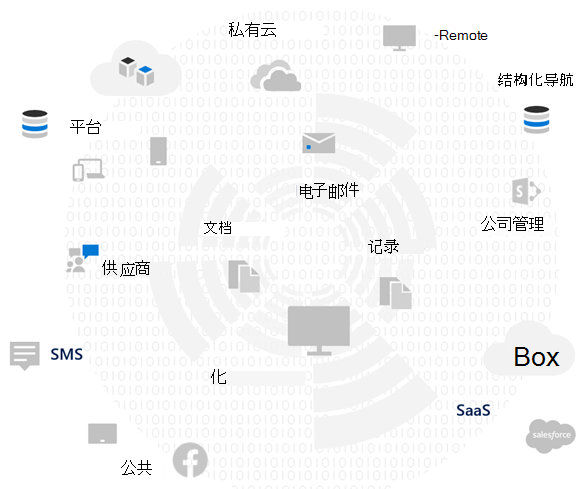
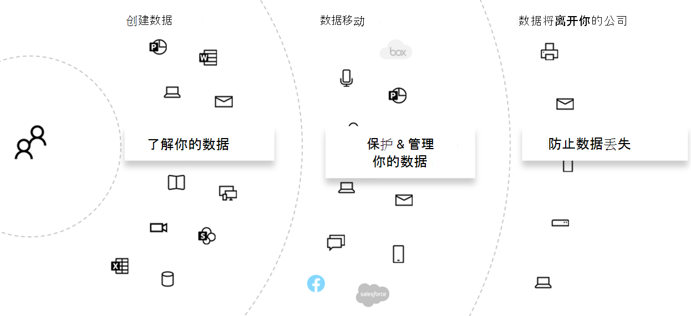
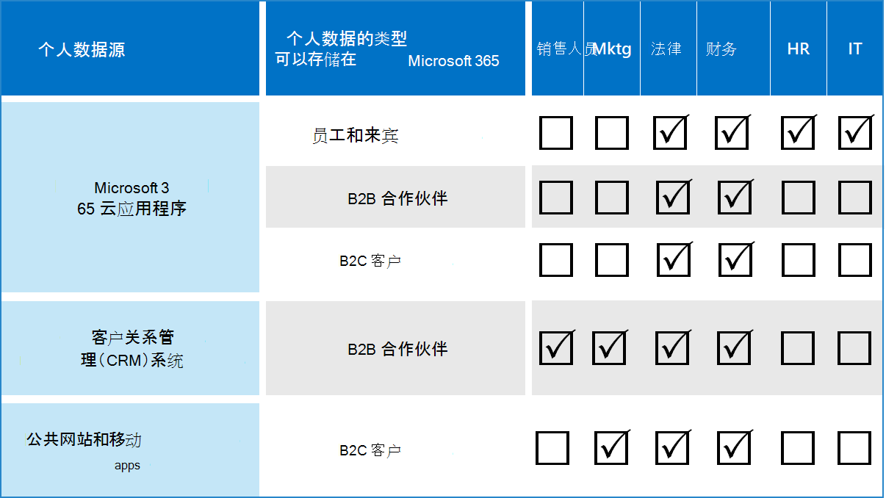

# 使用Microsoft 365评估数据隐私风险并识别敏感项目

在实施任何相关的改进操作（包括可通过Microsoft 365功能和服务实现的操作）之前，先评估组织所要遵守的数据隐私法规和风险。

## 可能适用的数据隐私法规

有关数据隐私法规的更广泛监管框架的良好参考，请参阅 [Microsoft 服务信任门户](https://servicetrust.microsoft.com/) 和 [有关一般数据保护条例 (GDPR) 法规的一系列文章](/compliance/regulatory/gdpr)。 另请查看有关你在行业或区域中可能遵守的法规的材料。

### GDPR

GDPR 是数据隐私法规中最为人知和引用的。 它管理与欧盟 (欧盟) 居民的标识或可识别的自然人相关的任何个人数据的收集、存储、处理和共享。

根据 GDPR 第 4 条：

- “个人数据”是指与标识或可识别的自然人 (“数据主体”) 相关的任何信息：可识别的自然人是可以直接或间接标识的人，特别是通过引用标识符（例如姓名、标识号、位置数据、联机标识符或特定于该自然人的身体、生理、遗传、心理、经济、文化或社会标识）的一个或多个因素来识别。

### ISO 27001

遵守 ISO 27001 等其他标准也被几个欧洲监管机构确认为跨人员、流程和技术范围的有效意向代理。 它指定的重叠和遵守 ISO-27001 驱动的保护机制的标准可以被视为在某些情况下履行某些隐私义务的代理。

### 其他数据隐私法规

其他突出的数据隐私法规还规定了处理个人数据的要求。

在美国中，其中包括《加州消费者保护法》 ([CCTA](/compliance/regulatory/ccpa-faq)) 、HIPAA-HITECH (美国医疗保健隐私法案) 和格雷厄姆·利奇·布利法案 (GLBA) 。 其他特定于国家/地区的法规也已就地或正在开发中。

在世界各地，其他示例包括德国的《国家 GDPR 实施法》 (BDSG) 、巴西数据保护法 (LGPD) 等。

## Microsoft 365技术控制类别的法规映射

许多与数据隐私相关的法规具有重叠的要求，因此在制定任何技术控制方案之前，应了解它们受哪些法规约束。

有关此整体解决方案文章的后续参考，此表提供数据隐私法规采样的摘录。

|调节|文章/节|节录|适用的技术控制类别|
|---|---|---|---|
|GDPR|第 5 条 (1)  (f) |个人数据的处理方式应确保个人数据的适当安全性，包括防止未经授权或非法处理，以及使用适当的技术或组织措施 (完整性和保密性，防止意外丢失、破坏或损坏。| (所有)    标识   Device   威胁防护   保护信息   管理信息   发现和响应|
||文章 (32)  (1)  (a) |考虑到艺术的状况、实施成本以及处理的性质、范围、上下文和目的，以及自然人权利和自由发生不同可能性和严重性的风险，控制者和处理者应实施适当的技术和组织措施，以确保符合风险的安全级别， 包括以下内容： () 个人数据的假名化和加密。|保护信息|
||文章 (13)  (2)  (a) |"...在获取个人数据时，控制器应向数据主体提供确保公平和透明处理所需的以下进一步信息： () 个人数据的存储期限，或者如果不能，则为确定该时间段所用的条件。|管理信息|
||文章 (15)  (1)  (e) |数据主体应有权从控制器确认中获取有关其的个人数据是否正在处理中，如果是这种情况，则有权访问个人数据和以下信息： (e) 存在要求控制者纠正或擦除个人数据或限制处理有关数据主体或对象的个人数据的权利到此类处理|发现和响应|
|LGPD|第 46 条|处理代理应当采取安全、技术和行政措施，防止个人数据未经授权访问和意外或非法破坏、丢失、变更、通信或任何类型的不当或非法处理。|保护信息   管理信息   发现和响应|
||第 48 条|控制器必须与国家颁发机构和数据主体通信，以便发生可能对数据主体造成风险或相关损害的安全事件。|发现和响应|
|HIPPA-HITECH|45 CFR 164.312 (e)  (1) |实施技术安全措施，防止未经授权访问通过电子通信网络传输的电子保护的运行状况信息。|保护信息|
||45 C.F.R. 164.312 (e)  (2)  (ii) |实现一种机制，以便在适当的时候加密受电子保护的运行状况信息。|保护信息|
||45 CFR 164.312 (c)  (2) |实施电子机制，证实未以未经授权的方式更改或销毁电子保护的运行状况信息。|管理信息|
||45 CFR 164.316 (b)  (1)  (i) |如果此子部分需要记录操作、活动或评估，请维护可能为操作、活动或评估的电子) 记录的书面 (|管理信息|
||45 CFR 164.316 (b)  (1)  (ii) |将本部分的段落 (b)  (1) 所需的文档保留 6 年，从其创建日期或上次生效的日期（以更高者为准）。|管理信息|
||45 C.F.R. 164.308 (a)  (1)  (ii)  (D) |实施定期查看信息系统活动记录的过程，例如审核日志、访问报告和安全事件跟踪报告|发现和响应|
||45 C.F.R. 164.308 (a)  (6)  (ii) |识别和响应可疑或已知的安全事件;在可行的程度上减轻所涵盖实体或业务关联人已知的安全事件的有害影响;并记录安全事件及其结果。|发现和响应|
||45 C.F.R. 164.312 (b) |实施硬件、软件和程序机制，记录和检查包含或使用电子保护的运行状况信息的信息系统中的活动。|发现和响应|
|CCPA|1798.105 (c) |收到消费者根据本部分) 细 (分删除消费者个人信息的可验证请求的企业，应当从其记录中删除消费者的个人信息，并指示任何服务提供商从其记录中删除消费者的个人信息|发现和响应|
||1798.105 (d) |将异常 (到 1798.105 (c)    如果企业或服务提供商需要维护消费者的个人信息，则不得要求企业或服务提供商遵守消费者删除其个人信息的请求，以便： (参阅现行法规以获取其他信息) 。|发现和响应|
|||||

> [!IMPORTANT]
> 这不是一个详尽的列表。 有关所列技术控制类别的引用部分适用性的详细信息，请参阅 [合规性](../compliance/compliance-manager.md) 管理器或法律或合规性顾问。

## 了解数据

无论遵守何种法规，组织内部和外部的不同用户数据类型与系统交互都是可能影响整体个人数据保护策略的重要因素，但须遵守适用于组织的行业和政府法规。 这包括个人数据的存储位置、它是什么类型以及其中有多少，以及在什么情况下收集它。

### 数据可移植性

随着数据的处理、优化和其他版本的派生，数据也会随时间推移而移动。 初始快照永远不够。 需要有一个持续的过程来了解数据。 这是处理大量个人数据的大型组织面临的最大挑战之一。 未解决“了解你的数据”问题的组织最终可能会受到非常高风险的风险和监管机构可能的罚款。

### 个人数据所在的位置

若要解决数据隐私法规问题，不能依赖于你认为个人数据现在或将来可能存在的位置的一般概念。 数据隐私法规要求组织证明他们知道个人数据的持续位置。 因此，必须创建所有数据源的初始快照，以便可能存储个人信息，包括Microsoft 365环境，并建立持续监视和检测机制。

如果尚未评估与数据隐私法规相关的总体就绪情况和风险，请使用以下三步框架入门。

> [!NOTE]
> 本文及其内容不应取代法律咨询服务。 它只是提供了一些基本指南和链接，这些指南和链接指向在评估的早期阶段可能有所帮助的工具。

## 步骤 1：基本了解组织的个人数据方案

你需要根据当前管理的个人数据类型、存储位置、在数据上放置哪些保护措施、如何管理其生命周期以及谁有权访问数据隐私风险来评估数据隐私风险。

首先，请务必清点Microsoft 365环境中存在哪些类型的个人数据。 使用以下类别：

- 执行日常业务功能所需的员工数据
- 组织在业务到企业 (B2B) 方案中拥有有关其业务客户、合作伙伴和其他关系的数据
- 组织的数据涉及向联机服务提供组织在企业到客户 (B2C) 方案中管理的信息的使用者

下面是组织典型部门不同类型的数据示例。

受数据隐私法规约束的大部分个人数据通常收集并存储在Microsoft 365之外。 任何面向消费者的 Web 或移动应用程序的个人数据都需要从此类应用程序导出到Microsoft 365，才能在Microsoft 365中接受数据隐私审查。

相对于 Web 应用程序和 CRM 系统而言，Microsoft 365中的数据隐私暴露可能更为有限，此解决方案无法解决此问题。

在评估风险配置文件时，还必须考虑以下常见的数据隐私合规性挑战：

- **个人数据分布。** 有关给定主题的信息有多分散？ 是否已知足以说服监管机构，适当的控制措施已经到位？ 是否可以根据需要对其进行调查和修正？
- **防止外泄。** 如何保护给定类型或源的个人数据不受泄露，以及如何在数据泄露时做出响应？
- **保护与风险。** 哪些信息保护机制相对于风险适用，以及如何在需要最终用户干预时保持业务连续性和工作效率并最大程度地减少最终用户的影响？ 例如，是否应使用手动分类或加密？
- **个人数据保留。** 出于有效的业务原因，需要保留包含个人数据的信息多长时间，以及如何避免过去保持永久性的做法，与业务连续性的保留需求相平衡？
- **处理数据主体请求。** 需要哪些机制来处理数据主体请求 (DSR) 以及任何补救措施（如匿名、重新执行和删除）？
- **持续监视和报告。** 哪些类型的日常监视、调查和报告技术可用于不同的数据类型和源？
- **数据处理的限制。** 对于组织必须在隐私控制中反映的这些方法收集或存储的信息，数据使用是否存在限制？ 例如，销售人员不会使用个人数据的承诺可能要求你的组织建立机制，以防止在与销售组织关联的系统中传输或存储该信息。

### 执行日常业务功能所需的员工数据

组织本质上需要收集有关员工的数据，以实现电子身份和人力资源目的，但须遵守他们在员工协议中同意的内容。 只要一个人为公司工作，这通常不是问题。 组织可能希望建立机制，防止恶意行为者泄露或泄露员工个人数据。

如果某人离开公司，组织通常具有删除用户帐户、停用邮箱和个人驱动器以及更改人力资源系统等内容中的员工状态的流程、过程以及保留和删除计划。 对于涉及诉讼的情况，员工或法律调查的另一方可能具有获取有关存储在组织系统中的个人数据信息的有效理由。 在某些情况下，该方可能会要求删除此类数据或匿名。

为了满足此类需求，组织应制定解决预防性、侦查和补救措施的流程和程序，以便为此类请求提供便利，并指出，有关员工的一些信息可能被合理视为对业务连续性至关重要。 例如，个人创作文件或执行函数的信息。

> [!NOTE]
> 有关Microsoft 365中个人数据的调查和修正技术，请参阅[监视器和响应文章](information-protection-deploy-monitor-respond.md)。 你可能还希望采用自动分类和保护方案，以确保在组织内部控制个人数据，并防止其在恶意执行组件的情况下离开组织。 有关详细信息，请参阅 [保护信息文章](information-protection-deploy-protect-information.md) 。

### 组织在 B2B 方案中拥有有关其业务客户的数据

收集 B2B 信息也是一项挑战，因为组织可能需要将客户姓名和事务的记录保存在其各种系统中，以实现业务连续性，同时保护该信息免受无意或恶意外泄。 与员工数据一样，组织必须制定策略、过程和技术控制措施来保护此类数据，并根据定义的保留和删除计划将其老化。

通常，与外部客户、合作伙伴以及组织与之业务的其他实体签订合同时，会使用语言来处理此类数据，包括在实体与组织建立关系期间和之后的保护、保留和删除。

### 组织的数据涉及向联机服务提供组织在 B2C 方案中管理的信息的使用者

由于客户数据泄露的许多公共实例，此类别是大多数人为数据隐私而考虑的类别。 这可能是故意的，例如与提供程序签订合同的第三方，或无意的，例如恶意执行组件的外泄。 消费者数据保护是欧盟和其他方面制定这些法规的主要原因之一。 GDPR 和 CCPA 等数据隐私法规要求你进行规划：

- [行动计划](/compliance/regulatory/gdpr-action-plan) 和 [问责就绪情况清单](/compliance/regulatory/gdpr-arc-Office365)
- [数据保护影响评估](/compliance/regulatory/gdpr-data-protection-impact-assessments)
- [违规通知](/compliance/regulatory/gdpr-breach-Office365)
- [数据主体请求](/compliance/regulatory/gdpr-dsr-Office365)

如果你的组织不进行大量直接从使用者数据收集，则此类别较少。 但是，可能需要完成这些文章中概述的流程才能实现符合性。

### 步骤 1 摘要

了解你面临的风险和数据隐私监管是一个重要的第一步，它基于对组织个人数据方案的基本理解。

如果你的Microsoft 365环境中没有来自使用者的个人数据，或者它局限于环境的某些部分，并且需要技术控制是基于消费者类型的数据公开，那么技术控制可能只需要在环境中的高风险部分使用，而不是在任何地方使用。

虽然外部组织或标准控制集建议（例如Microsoft 365中的合规性管理器建议）可能有助于通知控制策略，但你选择的实现应由数据清单意识驱动，以量化实际风险暴露。

大多数组织都会接触到上述方案之一。 采取全面的评估方法非常重要。

## 步骤 2：评估是否准备好遵守数据隐私法规

尽管这些问题特定于 GDPR，但在免费 [的 Microsoft GDPR 评估工具](https://clouddamcdnprodep.azureedge.net/gdc/1863571/original) 中提出的问题为了解总体数据隐私准备情况提供了一个良好的开端。

受其他数据隐私法规约束的组织（如美国中的 CCPA 或巴西 LGPD）也可能受益于此工具的就绪情况清单，因为与 GDPR 的规定重叠。

GDPR 评估包括以下部分：

|节|说明|
|:-------|:-----|
|管控|<ol><li>隐私策略是否显式说明正在处理哪些数据信息？ </li><li>是否定期 (PIA) 运行隐私影响评估？ </li><li> 是否使用工具管理 PI)  (个人信息？ </li><li> 您是否有法律权力对任何给定个人使用 PI 数据开展业务？ 是否跟踪数据许可？ </li><li> 是否跟踪、实施和管理审核控制？ 是否监视数据泄漏？ </li></ol>|
|删除和通知|<ol><li>是否提供有关如何访问用户数据的明确说明？ </li><li> 是否已记录处理选择退出许可的流程？ </li><li> 是否具有数据的自动删除过程？ </li><li> 在与客户接触时，是否需要验证标识？ </li></ol>|
|风险缓解和信息安全性|<ol><li>是否使用工具扫描非结构化数据？ </li><li>所有服务器是否均为最新服务器，是否利用防火墙来保护它们？ </li><li>是否运行服务器的定期备份？ </li><li>是否主动监视数据泄漏？ </li><li>是否在静态和传输中加密数据？ </li></ol>|
|策略管理|<ol><li>如何管理绑定公司规则 (BCR) ？ </li><li>是否跟踪数据许可？ </li><li> 在 1 到 5、5 的范围内，合同是否涵盖数据分类和处理要求？ </li><li>是否已定期测试事件响应计划？ </li><li>用于管理访问权限的策略是什么？ </li></ol>|
|||

## 步骤 3：识别Microsoft 365环境中发生的敏感信息类型

此步骤涉及识别受特定法规控制约束的特定敏感信息类型，以及它们在Microsoft 365环境中的出现情况。

在环境中查找包含个人内容的内容可能是一项艰巨的任务，以前涉及使用合规性搜索、电子数据展示、Advanced eDiscovery、DLP 和审核的组合。

借助 Microsoft 合规性管理中心中的新 **数据分类** 解决方案， [内容资源管理器](../compliance/data-classification-content-explorer.md) 功能（适用于内置或自定义敏感信息类型（包括与个人数据相关的信息类型）变得更加容易。

### 敏感信息类型

Microsoft 合规性管理中心预加载了 100 多种敏感信息类型，其中大多数与识别和查找个人数据相关。 这些内置的敏感信息类型可根据正则表达式 (正则表达式) 或函数定义的模式，帮助识别和保护信用卡号、银行帐号、护照号码等。 若要了解详细信息，请参阅[敏感信息类型查找的内容](../compliance/sensitive-information-type-entity-definitions.md)。

如果需要识别和保护组织特定或区域类型的敏感项目，例如员工 ID 的自定义格式，或者内置敏感信息类型尚未涵盖的其他个人信息，可以使用以下方法创建自定义敏感信息类型：

- PowerShell
- 具有完全数据匹配 (EDM) 的自定义规则
- 通过合规中心管理员 UI，如[“使用符合性分数和合规性管理器”一文](information-protection-deploy-compliance.md)中所述

还可以自定义现有的内置敏感信息类型。

有关详细信息，请参阅以下文章：

- [自定义内置敏感信息类型](../compliance/customize-a-built-in-sensitive-information-type.md)
- [了解敏感信息类型](../compliance/sensitive-information-type-learn-about.md)
- [在安全与合规中心内创建自定义敏感信息类型](../compliance/create-a-custom-sensitive-information-type.md)
- [使用安全与合规中心 PowerShell 创建自定义敏感信息类型](../compliance/create-a-custom-sensitive-information-type-in-scc-powershell.md)
- [使用基于精确数据匹配的分类创建自定义敏感信息类型](../compliance/create-custom-sensitive-information-types-with-exact-data-match-based-classification.md)

### 内容资源管理器

用于确定环境中敏感项目出现情况的重要工具是Microsoft 365合规性管理中心中的新[内容资源管理器](../compliance/data-classification-content-explorer.md)。 它是一种自动工具，用于初始和持续扫描整个Microsoft 365订阅，以查找敏感信息类型的出现和结果的显示。

新的内容资源管理器工具允许使用内置敏感信息类型或自定义信息类型快速识别环境中敏感项的位置。 这可能涉及建立一个过程，并分配了定期调查敏感项的存在和位置的责任。

除了本文中突出显示的其他步骤外，本文还提供了一个起点，用于确定通过计划内Microsoft 365配置和监视保护的敏感项目的总体风险暴露、就绪情况和位置。

### 用于标识环境中的个人数据的其他方法

除了内容资源管理器，组织还有权访问内容搜索功能，以生成自定义搜索，以使用高级搜索条件和自定义筛选器在其环境中查找个人数据。

[本文](/compliance/regulatory/gdpr)提供了有关使用内容搜索发现个人数据的详细指南。 GDPR 和 [CCPA 的 DSR](/compliance/regulatory/gdpr-dsr-Office365#introduction-to-dsrs) 中还探讨了内容搜索和其他发现技术。

监视器和[响应文章](information-protection-deploy-monitor-respond.md)提供了有关Microsoft 365中个人数据的调查和修正技术的其他见解。

> [!NOTE]
> 若要查找存储在本地文件中的敏感信息，请参阅 [Azure 信息保护](/azure/information-protection/quickstart-findsensitiveinfo)。
