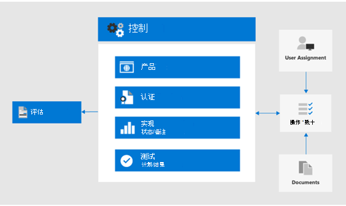

# 使用合规性分数和合规性管理器管理改进操作

Microsoft 合规性分数和合规性管理器可结合使用，以管理与数据隐私法规相关的改进（如欧盟[通用数据保护条例（GDPR）](../compliance/gdpr.md)、[加利福尼亚州消费者保护法 CCPA）](../compliance/ccpa-faq.md)、HIPAA-高科技（美国卫生保健隐私法案）和巴西数据保护法案（LGPD）。 

本文提供了有关如何使用这些工具来实现数据保密的指南。

>[!Note]
>合规性管理器中提供的客户操作是建议。 在实施之前，您需要评估这些建议在法规环境中的有效性。 合规性管理器建议不应解释为合规性保证。
>

## 针对合规性分数和合规性管理器的计划更新

[合规性分数](../compliance/compliance-score.md)（当前处于预览阶段）需要在[合规性管理器](../compliance/compliance-manager-overview.md)中添加法规的目标评估（如 GDPR）。 在将来的版本中，合规性管理器中的很多功能将合并到统一的合规性分数体验中，从而减少了对多个工具的需求。

以下是你的订阅的工具，它需要你登录：

- [Microsoft 合规性管理中心中的合规性分数](https://compliance.microsoft.com/compliancescore)
- [Microsoft Services 信任门户中的合规性管理器](https://servicetrust.microsoft.com/ComplianceManager/V3)

## 合规性管理器入门 

[合规性管理器](../compliance/working-with-compliance-manager.md)（当前处于预览阶段）是 Microsoft 服务信任门户中的基于工作流的风险评估工具，用于管理与 Microsoft 云服务相关的法规遵从性活动。 作为 Microsoft 365 或 Azure Active Directory （Azure AD）订阅的一部分，合规性管理器可帮助您管理 Microsoft 云服务的共享职责模型中的法规遵从性。

虽然您可以查看您的总体合规性分数并在合规中心的**合规性分数**页面中执行许多其他功能，但您需要通过服务信任门户使用合规性管理器，以便先为您的数据隐私管理法规配置评估。 这些评估中的数据将显示在合规性分数中，以供进一步查看和筛选。 

使用合规性管理器界面，您可以选择一个或多个与数据隐私相关的规章模板，并对其进行分组以评估和跟踪整个集所需的改进操作。 您还可以查看有关特定于目标服务的控制措施的信息，由 Microsoft vs 和客户托管的控件分隔。

在此处选择的评估和改进状态也会在 Microsoft 合规性中心中显示，以强调合规性管理器中的初始设置的重要性。 此图中显示了这些关系。
 

下面是帮助您入门的关键步骤。

### 1. 评估模板

从合规性管理器中，第一步是添加特定于感兴趣的数据隐私规章的评估，并将其包含在定义的 "数据隐私法规" 组中。

[组](../compliance/working-with-compliance-manager.md#groups)是允许您组织评估的容器，并在评估之间共享具有相同或相关的客户托管控件的常见信息和工作流任务。 当同一个组中的两个不同评估共享客户托管控件时，该控件的实现详细信息、测试和状态的完成将自动同步到组中任何其他评估中的相同控件。 这将统一分配给组中每个控件的已分配操作项并减少重复工作。 

您还可以选择使用组进行组织。 按年、区域、合规性标准或其他分组进行评估，以帮助组织合规性工作。

### 2. 操作项

添加评估后，可以查看特定于每个组或单个规章的操作项：

- **改进操作列表。** 导航到 "操作项" 列表，并查看与组中包括的法规关联的改进操作。 许多操作都涉及管理法规，因此单个列表项可能代表多项管理法规。 
 
- **改进操作筛选。** 对于许多数据隐私法规和管理法规而言，改进操作列表可能非常大，因此请考虑使用筛选器下拉列表筛选列表。 例如，如果选择 "技术控件"，则该列表将减少为组织中具有技术实施的那些操作，因为许多操作与业务的各个方面（也在合规性管理器中进行了记录）的管理操作有关。 在本文中，我们将重点介绍技术控件，因此建议采用此筛选方法。
 
- **其他信息和审查。** 对于每个操作，您可以单击链接以**阅读更多**，这会告诉您有关建议的活动或**审阅**的详细信息，该窗体允许您执行以下操作：
 
   - 将操作分配给组织中的某个人以管理
   - 管理与解决操作相关的文档
   - 指定项目的状态
   - 指定实现和测试日期
   - 记录主题操作的其他信息、实现说明和测试计划备注
  
- **非适用项超出范围。** "操作项" 列表中包含的某些改进操作可能不适用于您计划的实现。 您可以指定它们不在合规性管理器的作用域中，并从 "合规性分数" 值的计算中删除该操作及其证据。 

例如，如果您的组织已选择使用 Microsoft 托管密钥 ""，则建议使用 "客户密钥" 不适用于您的部署。 在这种情况下，您的组织会将其标记为 "**不在作用域**中" 适用的规章模板的**控制操作**。
 
### 3. 控件信息

对于特定于评估的视图，请查看每个评估组的 "[控件信息](../compliance/compliance-manager-overview.md#controls)"。 这提供了特定于评估的视图，这与 "操作项" 列表不同，后者提供了特定于技术控件的视图。
 

导航到 "**控件信息**" 列表，并查看所述法规的范围内服务的列表。 
 
特定于规章的控制分组列出了由每个服务区域的控制区域提供的操作。 对于每组操作，合规性管理器都会提供有关操作的详细信息，并可能建议或提供审阅选项以帮助组织选择控制方法。
 
请注意，此接口提供了查看特定于技术操作的详细信息的功能，以及与该控件相关的操作的状态，以及与该操作相关的规章的补充上下文。

### 4. 模板下载

对于更熟悉基于电子表格的法规分析，另一种方法是使用 "模板" 列表下载每个相应评估的模板。 下载的模板列出了管理法规以及每个模板的技术控制信息，并且可能更易于特定角色导航/筛选和生成特定于业务的视图。
 
您还可以使用 "**添加模板**"，基于现有模板为您的组织添加一个新的自定义模板。 这要求您下载选择的模板（如 HIPAA/高科技）），然后根据您的需要修改它并将其上传回合规性管理器工具，在这种情况下，它将在整个合规性管理器和合规性记分工具集的一部分中推动与其他模板和评估类似的评估和评分。
 
>[!Tip]
>如果要处理大量管理法规或重叠的改进操作，请考虑分别下载每个模板并组合数据集，删除不适用于组织的改进操作或控制类型，然后重新上载。 这可能比导航每个 "控制信息" 部分更容易，并将每个 "" 标记为 "超出范围"。
>

## 合规性分数

在合规性管理器中执行评估和审阅规范之后，你现在可以转到 "[合规性分数](../compliance/compliance-score.md)" 工具并查看分数和切片，并进一步切出数据，包括控制区域。

Microsoft 365 合规性管理中心中的合规性分数工具提供了几种查看和筛选从合规性管理器和各种 Microsoft 365 服务获取的合规性数据的方法。 在实施各种配置设置并共享带有 Microsoft 安全分数的信号时，将自动更新此工具，以便在两个分数中显示多个改进操作。 
 
合规性分数提供了：

- 由 Microsoft 和客户托管的控件细分的收集分数
- 改进操作和完成状态的汇总
- 影响你成绩的 Microsoft 365 解决方案的列表

### 如何计算合规性分数

简言之，分数是基于 Microsoft 和客户托管的控制实施的组合计算的，如[Microsoft 合规性分数计算文章](../compliance/compliance-score-methodology.md)中更详细地介绍。

根据控件是强制性的还是自由的，以及是否为预防性、侦探或纠正措施，为控件分配分数值。 这些共同体现了其相对于其他控件的实现风险。

如 Microsoft 合规性分数计算文章中所示，预防性控制获得比侦探和纠正措施更高的分数，强制性控制措施比随机控制获得更高的分数。
 
请注意，合规性分数管理 UI 不会列出这些参数，也不能提供进行筛选的功能。 但是，如果从合规性管理器工具下载关联的模板，则生成的数据集将为大多数管理法规列出这些参数。

对于技术控制，在激活相关功能后，合规性分数将自动更新改进操作得分。 在 &mdash; &mdash; 服务信任门户的合规性管理器工具中，需要手动记录可运行或与文档相关的其他非技术性控制操作。 

您还需要为其他目的实施某些改进操作，例如， &mdash; 使用保留标签作为数据隐私法规遵从性之外的原因 &mdash; ，这样您就可以获得使用此类功能的信用，即使它用于其他用途，也不是有意的合规性操作的一部分。

应将合规性分数视为跟踪广泛规模改进的相对度量。 您不应争取一个理想的分数。 

### 其他指南

下面是有关使用合规性分数和合规性管理器来实现数据隐私法规遵从性的一些重要提示：

- 每个数据隐私法规都结合了技术控制、文档规范以及操作、过程和报告要求。 所有这些操作都显示在改进操作中。 

- 本文重点介绍了在合规性管理器和合规性分数中为数据隐私指定的技术控件的子集。 有关非技术性管理控件的详细信息，请参阅合规性管理器工具和[文档](../compliance/compliance-score.md)。

- 若要将改进操作视图集中到您感兴趣的领域，可以在合规性分数管理中的 "**解决方案**" 选项卡上按操作类型进行筛选。

- 应将合规性分数中确定的改进措施的相对重要性和优先级视为广泛风险审查的一部分，以及已确定组织需要管理的数据隐私风险。 

- 如果您是全球组织，并将多个数据隐私法规模板添加到合规性管理器中作为评估，则合规性分数将在每个改进操作的字段列表中合并每个适用的项。
 
- 即使选择了跨多个法规要求的改进操作聚合，如果选择了 GDPR、LGPD、CCPA 和 HIPAA-高科技的法规评估模板，例如，在合规性分数中将列出几乎400的改进操作。 若要更好地解决此较长的列表，请使用改进操作筛选器将结果集减少为更易于管理的列表。

- "类别" 筛选器提供了一种通过逻辑分组来筛选改进操作的方法，此整体解决方案中的跟踪、阻止、保护、保留和调查文章与对应。 

- 在改进操作中列出的某些控件可能更直接绑定到特定法规文章，而其他控件可能更与法规精神更直接关联，而在很多情况下，您应考虑无论如何做的事情。

