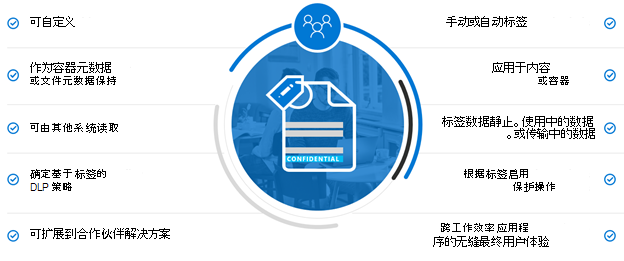
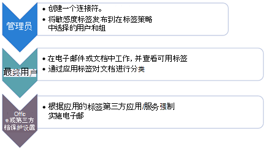
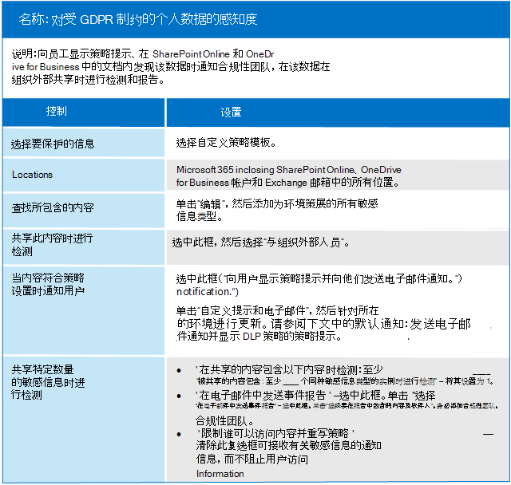

# 保护受数据隐私条例保护的信息

订阅中可以使用许多信息保护控件，以帮助满足数据隐私合规性要求和法规。 其中包括一般数据保护条例 (GDPR) 、HIPAA-HITECH (美国医疗保健隐私法案) 、加州消费者保护法案 (CCPA) 和巴西数据保护法案 (LGPD) 。

这些控件位于以下解决方案区域：

- 敏感度标签
- 数据丢失防护 (DLP)
- Office 邮件加密 (OME)
- Teams和网站访问控制

> [!NOTE]
> 此解决方案介绍用于保护受数据隐私法规限制的信息的安全和合规性功能。 有关安全中心中安全功能的完整Microsoft 365，请参阅Microsoft 365[安全文档](../security/index.yml)。 有关合规性文档中的合规性功能的完整Microsoft 365，请参阅Microsoft 365[合规性文档](../compliance/index.yml)。

## 影响信息保护控制的数据隐私法规

下面是可能与信息保护控制相关的数据隐私法规示例列表：

- GDPR 第 5 (1)  (f) ) 
- GDPR (32)  (1)  (a) 
- LGPD 文章 46
- HIPAA-HITECH (45 CFR 164.312 (e)  (1) ) 
- HIPAA-HITECH (45 C.F.R. 164.312 (e)  (2)  (ii) ) 

有关 [上述各项详细信息，](information-protection-deploy-assess.md) 请参阅评估数据隐私风险并识别敏感项目文章。

有关信息保护的数据隐私法规建议：

- 防止丢失或未经授权访问、使用和/或传输。
- 基于风险的保护机制的应用。
- 在适当时使用加密。

您的组织可能还希望出于其他Microsoft 365（如其他合规性需求或出于业务原因）保护内容。 应制定数据隐私信息保护方案，作为整体信息保护规划、实施和管理的一部分。

为了帮助你开始使用 Microsoft 365 中的信息保护方案，下一节包括一个简短列表，其中列出了针对 Microsoft 365 的相关功能和改进操作。 该列表包括适用于数据隐私法规的功能和改进操作。 但是，如果有较新的功能在很大程度上取代较旧的功能，则该列表不包含较旧的技术。 例如，列表中 (IRM) IRM SharePoint OneDrive但包含敏感度标签。

## 管理信息保护Microsoft 365

Microsoft[信息保护解决方案](../compliance/information-protection.md)包括许多跨 Microsoft 365、Microsoft Azure 和 Microsoft Windows 的集成Windows。 在Microsoft 365中，信息保护解决方案包括：

- [评估数据](../compliance/sensitive-information-type-entity-definitions.md) (和识别敏感项目一文中所述 [的](information-protection-deploy-assess.md) 敏感信息) 
- [敏感度标签](../compliance/sensitivity-labels.md)
  - 服务/容器级别
  - 客户端/内容级别
  - 自动处理用户和SharePoint OneDrive
- 数据丢失防护 (DLP)
- [Microsoft 365终结点数据丢失防护](../compliance/endpoint-dlp-learn-about.md)
- [Office 365 邮件加密 OME (OME) ](../compliance/ome.md) OME 高级邮件加密[的新功能](../compliance/ome-advanced-message-encryption.md)

此外，网站和库级别保护是任何保护方案中要包括的重要机制。

有关外部其他信息保护功能的信息Microsoft 365，请参阅：

- [Microsoft Defender for Cloud Apps](/cloud-app-security/)
- [Azure 信息保护](/azure/information-protection/what-is-information-protection)
- [Microsoft Endpoint Manager](https://www.microsoft.com/microsoft-365/microsoft-endpoint-manager)
- [Windows 信息保护](/windows/security/information-protection/windows-information-protection/protect-enterprise-data-using-wip)

## 敏感度标签

通过来自 Microsoft 信息保护 框架的敏感度标签，你可以对组织的数据进行分类和保护，而不受用户工作效率和协作能力的影响。

> [!div class="mx-imgBorder"]
> 

### 敏感度标签的先决条件

在实施以下突出显示的任何基于敏感度标签的功能之前，请完成这些活动：

1. 了解以下内容：
   - **业务需求。** 确定在企业中应用敏感度标签的业务原因。 例如，你的信息保护数据隐私要求。
   - **敏感度标签功能。** 敏感度标签可能会变得复杂，因此请确保在开始使用之前 [阅读敏感度标签](../compliance/sensitivity-labels.md) 文档。
   - **要记住的关键内容** 敏感度标签在 Microsoft 合规性管理中心内进行管理，但目标定位和应用程序选项明显不同。
      - 容器级别的站点、组和网站Teams有敏感度标签 (这些设置不适用于容器容器内) 。 当设置网站、组或团队时，这些策略将发布到应用它们的用户和组。
      - 活动内容有敏感度标签。 这些也会发布到用户或组，这些用户或组可以手动应用它们，或在以下条件时自动应用：
        - 文件将打开/编辑/保存到用户的桌面或SharePoint网站。
        - 电子邮件已起草并发送。
      - 除了通过 Exchange 传输的电子邮件外，SharePoint和 OneDrive 中的其余文件自动应用敏感度Exchange。 它们面向所有网站或特定网站，并自动应用于这些环境中处于其余位置的文件。

2. 通过过去的方法或替代方法使当前敏感度标签合理化

   - Azure 信息保护

      当前敏感度标签方案可能需要与任何现有的 [Azure 信息](../compliance/sensitivity-labels.md#sensitivity-labels-and-azure-information-protection) 保护标签实现协调。
   - OME

      如果你计划将新式敏感度标签用于电子邮件保护，并且现有电子邮件加密方法（如 OME）已就位，它们可以共存，但你应了解其中任一种应用的方案。 请参阅[Office 365 邮件加密 OME ](#office-365-message-encryption-ome-new-capabilities) (OME) 的新功能，其中包括比较现代敏感度标签类型保护与基于 OME 的保护的表。

3. 规划集成到更广泛的信息保护方案中。 除了与 OME 共存外，还可以同时使用敏感度标签，如 Microsoft 365 数据丢失防护 (DLP) 和 Microsoft Defender for Cloud Apps。 请参阅[Microsoft 信息保护Microsoft 365](../compliance/information-protection.md)实现数据隐私相关信息保护目标。

4. 制定敏感度标签分类和控制方案。 请参阅 [数据分类和敏感度标签分类](https://aka.ms/dataclassificationwhitepaper)。

### 一般指导

1. **架构定义。** 在使用技术功能应用标签和保护之前，请在整个组织中定义分类架构。 您可能已经拥有分类架构，这样更易于添加个人数据。
2. **入门。** 首先确定要实现的标签的数量和名称。 执行此活动，无需担心要使用哪种技术和如何应用标签。 在整个组织中普遍应用此架构，包括驻留在本地和其他云服务的数据。
3. **其他建议** 设计和实现策略、标签和条件时，请考虑遵循以下建议：

   - **使用现有分类架构 (（如果有) ）。** 许多组织已在使用某种形式的数据分类。 仔细评估现有标签架构，如果可能，请根据情况使用它。 使用最终用户可识别的熟悉标签将推动采用。
   - **从小开始。** 实际上，对可以创建的标签数量没有限制。 但是，大量标签和子标签可能会减慢采用速度。
   - **使用方案和用例。** 确定您组织内的常见用例，并使用派生自你所遵守的数据隐私法规的方案。 验证预想的标签和分类配置是否将实际工作。
   - **询问每个新标签请求。** 每个方案或用例是否确实需要新标签，或者你能否使用已有的标签？ 将标签数量保持为最小值可提高采用率。
   - **对关键部门使用子标签。** 某些部门将具有需要特定标签的特定需求。 将这些标签定义为现有标签的子标签，并考虑使用分配给用户组的范围策略，而不是全局策略。
   - **考虑作用域内策略。** 面向部分用户的策略将阻止标签重载。 作用域策略仅允许向为特定部门工作的员工分配角色或部门特定标签或子标签。
   - **使用有意义的标签名称。** 尽量不要将行话、标准或缩写词用作标签名称。 尝试使用与最终用户产生共鸣的名称以提高采用率。 请考虑非业务、公共、常规、机密和高度机密等名称，而不是使用 PII、PCI、HIPAA、LBI、MBI 和 HBI 等标签。

### 为网站、组和团队创建和部署敏感度标签

当你在[应用内创建](../compliance/sensitivity-labels-teams-groups-sites.md)敏感度Microsoft 365 合规中心，现在可以将它们应用于这些容器：

- Microsoft Teams网站
- Microsoft 365组 (组Office 365组) 
- SharePoint 网站

使用以下标签设置来帮助保护这些容器中的内容：

- 隐私 (组连接的) Microsoft 365站点Teams隐私
- 外部用户访问
- 非托管设备的访问

对于数据隐私，若要阻止容器的外部共享，这些容器将用于存储包含敏感个人数据的内容，请标记包含数据的文件为专用文件，并需要托管设备。

### 为内容创建和部署敏感度标签

应用于文件的敏感度标签允许你加密其内容、为内容添加水印，并定义 Office 应用程序内容的其他控件，包括Outlook和Office web 版。

当你准备好使用敏感度标签开始保护组织的数据时：

1. **创建应用程序。** 根据组织的分类法为不同敏感度级别的内容创建和命名敏感度标签。 有关开发分类分类的信息，请参阅数据分类和敏感度 [标签分类白皮书](https://aka.ms/dataclassificationwhitepaper)。
2. **定义每个标签的用途。** 配置要与每个标签关联的保护设置。 例如，你可能希望较低敏感度内容 (如"常规"标签) 应用一个页眉或页脚，而较高敏感度内容 (如"机密"标签) 应具有水印并启用加密。
3. **发布标签。** 配置灵敏度标签后，使用标签策略发布它们。 确定应该应用标签的用户和组以及要使用的策略设置。 单个标签可重复使用。 定义一次，然后可以将其包括在分配给不同用户的多个标签策略中。

从应用发布敏感度标签Microsoft 365 合规中心，它们开始显示在 Office[应用中](../compliance/sensitivity-labels-office-apps.md)，以便用户在创建或编辑内容时对其进行分类和保护。

对于数据隐私，你可以将带有加密和其他规则的敏感度标签手动应用于包含敏感个人信息的电子邮件或内容。

> [!NOTE]
> 对电子邮件启用加密的敏感度标签具有一些与 OME 重叠的功能。 请参阅 [安全电子邮件方案与 OME 和敏感度标签的比较](#secure-email-scenarios-comparison-with-ome-and-sensitivity-labels)。

### 用户编辑文档或撰写电子邮件时客户端自动标记

创建敏感度标签时，可以在符合指定条件时自动将标签分配给包括电子邮件在内的内容。

能否将敏感度标签自动应用于内容非常重要，这是因为：

- 无需为用户提供有关何时使用每种分类的培训。
- 无需依赖用户，即可对全部内容进行正确分类。
- 用户不再需要了解你的策略，可以专注于自己的工作。

自动标记支持向用户推荐标签，以及自动应用标签。 但在这两种情况下，用户都可以决定接受还是拒绝标签，以帮助确保正确标记内容。

此客户端标记的文档延迟最少，因为即使在保存文档之前也可以应用标签。 但是，并非所有客户端应用都支持自动标记。 Azure 信息保护统一标签客户端和某些版本的应用支持Office[此功能](../compliance/sensitivity-labels-office-apps.md#support-for-sensitivity-label-capabilities-in-apps)。

有关配置说明，请参阅如何为应用配置[自动Office标记](../compliance/sensitivity-labels-office-apps.md#support-for-sensitivity-label-capabilities-in-apps)。

对于数据隐私，可自动为包含敏感个人信息的内容应用敏感度标签。

### 保存内容时的服务端自动标记

此方法称为使用敏感度标签自动分类。 对于 SharePoint 和 OneDrive) 中的文档以及传输 (中由 Exchange) 发送或接收的电子邮件的数据，您可能还听到它称为"为其余 (的数据自动标记"。 例如Exchange，它不包含邮箱中的电子邮件。

由于此标签是由服务本身应用，而不是由用户应用程序应用，因此无需担心用户拥有的应用和版本。 因此，可立即在整个组织中使用此功能，并且适合大规模标记。 自动标记策略不支持推荐的标记，因为用户不与标记过程交互。 相反，管理员将在模拟模式下运行策略，以便在实际应用标签前，帮助确保正确标记内容。

有关配置说明，请参阅如何为 SharePoint、OneDrive 和 Exchange 配置[自动Exchange。](../compliance/apply-sensitivity-label-automatically.md#how-to-configure-auto-labeling-policies-for-sharepoint-onedrive-and-exchange)

对于关注网站内的数据隐私，可推送敏感度标签，以自动加密包含敏感个人信息的内容。

## 数据丢失防护

您可以使用 Microsoft 365 中的数据丢失防护[ (DLP) ](../compliance/dlp-learn-about-dlp.md)检测、警告和阻止存在风险、无意或不当共享（例如，在内部和外部共享包含个人信息的数据）。

DLP 允许您：

- 确定并监视有风险共享活动。
- 为用户提供上下文指导，以做出正确的决策。
- 对内容强制执行数据使用策略，而不会妨碍工作效率。
- 与分类和标签集成，以在共享数据时检测和保护数据。

### DLP 支持的工作负荷

使用 Microsoft 365 合规中心 中的DLP 策略，可以标识、监视和自动保护 Microsoft 365 中多个位置的敏感项目，例如 Exchange Online、SharePoint、OneDrive 和Microsoft Teams。

例如，您可以标识包含存储在任何 OneDrive 网站中的信用卡号的任何文档，也可以仅监视OneDrive用户的网站。

您还可以监视和保护本地安装的 Excel、PowerPoint 和 Word 版本中的敏感项目，其中包括识别敏感项目和应用 DLP 策略的能力。 当用户从这些应用程序共享内容时，DLP Office持续监视。

> [!div class="mx-imgBorder"]
> 

此图显示了 DLP 保护个人数据的示例。

> [!div class="mx-imgBorder"]
> 

DLP 用于标识包含运行状况记录的文档或电子邮件，然后自动阻止对该文档的访问或阻止发送电子邮件。 然后，DLP 使用策略提示通知收件人，并将警报发送给最终用户和管理员。

### 规划 DLP

规划 DLP 策略，以：

- 您的业务要求。

- 评估数据隐私风险并识别敏感项目一文中所述，对组织 [进行基于风险的评估](information-protection-deploy-assess.md)。

- 制定或规划数据隐私的其他信息保护和调控机制。

- 根据评估工作为个人数据标识的敏感信息类型，如评估数据隐私风险并识别 [敏感项目一文中所述](information-protection-deploy-assess.md)。 DLP 策略条件可以基于敏感信息类型和保留标签。

- 需要指定 DLP 条件的保留标签。 有关详细信息 [，请参阅组织中受数据隐私法规](information-protection-deploy-govern.md) 约束的治理信息文章。

- 持续 DLP 策略管理，要求组织人员对敏感信息类型、保留标签、法规和合规性策略的更改操作和调整策略。

虽然敏感度标签不能用于 DLP 策略条件，但阻止访问的某些保护方案可能只需使用敏感度标签（可基于敏感信息类型自动应用）就可以实现。 如果已设置可靠的敏感度标签，请考虑是否应该使用 DLP 来增强保护，因为：

  - DLP 可以阻止共享文件。 敏感度标签可能仅阻止访问。

  - DLP 在规则、条件和操作方面具有更精细的控制级别。

  - DLP 策略可以应用于聊天Teams消息。 敏感度标签只能应用于文档和电子邮件。

### DLP 策略

DLP 策略在 Microsoft 合规性管理中心进行配置，并指定保护级别、策略要查找的敏感信息类型以及目标工作负荷。 它们的基本组件包括标识保护和数据类型。

> [!div class="mx-imgBorder"]
> 

下面是用于了解 GDPR 的 DLP 策略示例。

有关 [创建](../compliance/create-test-tune-dlp-policy.md) 和应用 DLP 策略的信息，请参阅本文。

### 数据隐私的保护级别

下表列出了使用 DLP 增强保护的三种配置。

第一个配置"感知"可以用作起点和最低级别的保护，以满足数据隐私法规的合规性需求。

> [!NOTE]
> 随着保护级别的提高，在某些情况下，用户共享和访问信息的能力将会降低，并可能会影响用户的工作效率或完成日常任务的能力。

若要在提高保护级别时帮助员工在更安全的环境中继续高效工作，请花时间培训他们，让他们了解新的安全策略和程序。

### 将敏感度标签与 DLP 一同使用的示例

敏感度标签可以与 DLP 一起提供高度管控环境中的数据隐私。 以下是集成部署的关键步骤：

1. 记录数据隐私的法规和其他业务要求。
2. 目标数据源、类型和所有权的特征与数据隐私问题相关。
3. 已制定一个总体策略，以解决需求并保护并管理数据隐私热点。
4. 已制定解决数据隐私控制策略的分阶段行动计划。

确定这些元素后，可以同时使用敏感信息类型、敏感度标签分类和 DLP 策略。 此图显示了一个示例。

> [!div class="mx-imgBorder"]
> 

[查看此图像的较大版本](https://github.com/MicrosoftDocs/microsoft-365-docs/raw/public/microsoft-365/media/information-protection-deploy-protect-information/information-protection-deploy-protect-information-sensitivity-lables-dlp.png)

下面是一些同时使用 DLP 和敏感度标签的数据保护方案，如图所示。

| 应用场景 | 流程 |
|:-------|:-----|
| A | <ol><li>管理员向用户和组发布内容敏感度标签，以手动或自动将标签用于内容和电子邮件。 </li><li>用户 A 在与内容交互时手动或自动应用标签，并应用加密或其他设置。 </li><li>用户 A 向用户 B（来宾用户）发送受保护的电子邮件或文件。 </li></ol> |
| B | 管理员发布到用户 A 的 DLP 策略阻止用户 A 向用户 B 发送电子邮件和/或文件。 |
| C |  具有"所有者无法邀请来宾"设置的敏感度标签将发布到用户 A，用户 A 负责Teams团队或SharePoint网站。 网站的另一个用户有选择地尝试与用户 B 共享文件，但 DLP 会阻止它。 |
| D | 用于自动应用程序到网站内容的敏感度标签将发布到一个或多个网站，从而提供另一层保护，从而形成受保护的网站。 |
|||

## Office 365 邮件加密 (OME) 新功能

人们经常使用电子邮件交换敏感项目，如患者健康信息或客户和员工信息。 电子邮件加密有助于确保只有预期收件人才能查看邮件内容。

使用 [OME，](../compliance/ome.md)可以在组织内外人员之间发送和接收加密邮件。 OME 适用于 Outlook.com、Yahoo！、Gmail 和其他电子邮件服务。 OME 有助于确保只有目标收件人才能查看邮件内容。

出于数据隐私考虑，可使用 OME 保护包含敏感项目的内部邮件。 Office 365 邮件加密是一种基于 Azure RMS Microsoft Azure权限管理 (Azure RMS) 的联机服务，它是 Azure 信息保护的一部分。 这包括加密、标识和授权策略，以帮助保护电子邮件的安全。 可以使用权限管理模板、"不要转发"选项和仅加密选项加密邮件。

还可以定义邮件流规则以应用此保护。 例如，您可以创建一个规则，要求加密发送给特定收件人的所有邮件，或主题行中包含特定关键字单词，并指定收件人不能复制或打印邮件的内容。

此外，OME [高级](../compliance/ome-advanced-message-encryption.md) 邮件加密可帮助你履行合规性义务，这些义务要求对外部收件人及其对加密电子邮件的访问进行更灵活的控制。 使用 OME 高级邮件加密Microsoft 365，您可以使用检测敏感信息类型的自动策略控制在组织外部共享的敏感电子邮件。

对于数据隐私，如果需要与外部方共享电子邮件，可以指定到期日期并撤销邮件。 只能撤消和设置发送给外部收件人的邮件的到期日期。

### 安全电子邮件方案与 OME 和敏感度标签的比较

应用于加密的电子邮件的 OME 和敏感度标签有一些重叠之处，因此了解可能适用于的方案非常重要，如此表所示。

| 应用场景 | 敏感度标签 | OME |
|:-------|:-----|:-------|
| 内部 + 合作伙伴   内部用户和受信任合作伙伴之间的安全通信和协作 | 建议 - 具有完全自定义分类和保护的标签 | 是 – 仅加密或不转发保护，无分类 |
| 外部方   安全地与任何外部/使用者用户通信和协作 | 是 – 在标签中预定义收件人 | 建议 – 基于收件人的实时保护 |
| 内部 + 合作伙伴，过期/吊销   通过过期和吊销控制内部用户和受信任合作伙伴对邮件和内容的访问 | 建议 - 具有访问持续时间的完全自定义保护，用户可以手动跟踪和撤销文件 | 否 – 内部邮件没有吊销或过期 |
| 过期/吊销的外部方   通过过期和吊销控制外部/使用者用户对邮件和内容的访问 | 是 - 用户可以手动跟踪文件 | 建议 (E5) - 管理员可以从安全与合规中心&邮件 |
| 自动标记   组织想要自动保护包含特定敏感内容和/或特定收件人的邮件/附件 | 建议 (E5) - Exchange 和 Outlook 客户端中的自动标记，扩充邮件流规则和 DLP 策略 | 是 - 具有"仅加密"或"不转发"保护的邮件流规则和 DLP 策略 |
||||

这两种方法之间的最终用户体验和管理体验也将不同。

## Teams对高度敏感数据的保护

对于计划在安全中心中存储受数据隐私法规Teams，请参阅配置具有安全隔离的团队，其中提供了有关以下项目的详细指南和配置步骤：

- 标识和设备访问
- 创建私人团队
- 锁定基础团队网站权限
- 使用加密的基于组的敏感度标签
