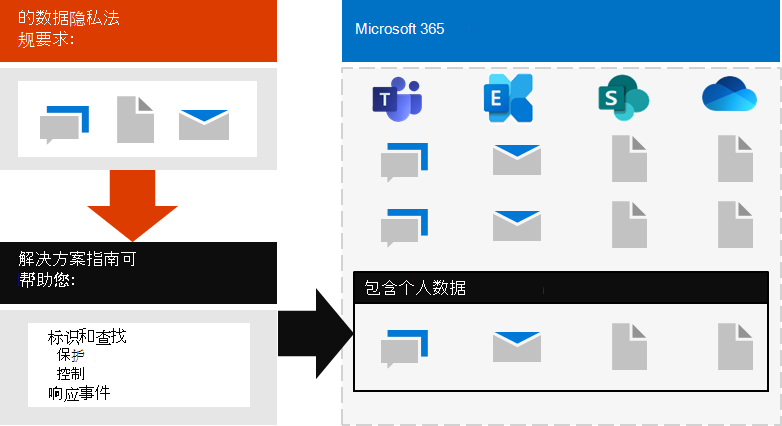

# 为 Microsoft 365 中的数据隐私法规部署信息保护Deploy information protection for data privacy regulations with Microsoft 365

您的组织可能受区域数据隐私法规的约束，这些法规要求您保护、管理和提供对存储在 IT 基础结构中的个人信息（包括内部部署和云中的个人信息）的权限和控制。Your organization may be subject to regional data privacy regulations that require you to protect, manage, and provide rights and control over personal information stored in your IT infrastructure, including both on-premises and in the cloud. 数据隐私法规的最佳示例是欧盟的一般数据保护法规（GDPR）。The best example of a data privacy regulation is the European Union's General Data Protection Regulation (GDPR). 如果不遵守数据隐私法规，可能会导致巨额罚款。Failure to comply with data privacy regulations can result in substantial fines.

Microsoft 365 中的数据类型示例包括 Microsoft 团队中的聊天会话、Exchange 中的电子邮件以及 SharePoint 和 OneDrive 中的文件。Examples of the types of data in Microsoft 365 include chat sessions in Microsoft Teams, emails in Exchange, and files in SharePoint and OneDrive. 此解决方案提供了有关如何识别、查找、保护、管理和响应 Microsoft 365 服务中存储的个人数据的数据隐私事件的指南，这些数据受数据隐私法规约束。This solution provides guidance on how to identify, locate, protect, govern, and respond to data privacy incidents for personal data stored in Microsoft 365 services that is subject to data privacy regulations.

此外，还提供了针对你的数据隐私需求使用 Microsoft 365 标识、设备和威胁防护控制的其他信息。Additional information is also provided on the use of Microsoft 365 identity, device, and threat protection controls for your data privacy needs. 

若要符合保护信息以实现与数据隐私法规遵从性的标准，请使用以下 Microsoft 365 功能和功能。To meet the criteria for protecting information for compliance with data privacy regulations, use these Microsoft 365 capabilities and features.

| 功能或特性Capability or feature | 说明Description | 许可Licensing |
|:-------|:-----|:-------|
| 合规性管理器Compliance Manager | 使用 Microsoft 服务信任门户中基于工作流的风险评估工具来管理与 Microsoft 云服务相关的法规合规性活动。Manage regulatory compliance activities related to Microsoft cloud services with this workflow-based risk assessment tool in the Microsoft Service Trust Portal. | Microsoft 365 E3 和 E5Microsoft 365 E3 and E5 |
| 合规性分数（预览版）Compliance Score (preview) | 在 Microsoft 365 合规中心中查看当前合规配置和改进建议的总体分数。See an overall score of your current compliance configuration and recommendations for improving it in the Microsoft 365 Compliance Center. | Microsoft 365 E3 和 E5Microsoft 365 E3 and E5 |
| Office 高级威胁防护 (ATP)Office Advanced Threat Protection (ATP) | 保护你的 Microsoft 365 应用和数据（例如电子邮件、Office 文档和协作工具）免受攻击。Protect your Microsoft 365 apps and data—such as email messages, Office documents, and collaboration tools—from attack. | Microsoft 365 E3 和 E5Microsoft 365 E3 and E5 | 
| 敏感度标签Sensitivity labels | 通过在电子邮件、文件或站点上放置具有不同保护级别的标签，可以在不影响用户工作效率和协作能力的情况下对组织的数据进行分类和保护。Classify and protect your organization's data without hindering the productivity of users and their ability to collaborate by placing labels with various levels of protection on email, files, or sites. | Microsoft 365 E3 和 E5Microsoft 365 E3 and E5 |
| 数据丢失防护 (DLP)Data Loss Protection (DLP) | 在内部和外部检测、警告和阻止有风险的、无意或不适当的共享，例如包含个人信息的数据共享。Detect, warn, and block risky, inadvertent, or inappropriate sharing, such as sharing of data containing personal information, both internally and externally. | Microsoft 365 E3 和 E5Microsoft 365 E3 and E5 | 
| 数据保留标签和策略Data retention labels and policies | 实施信息治理控制，例如将数据保留多长时间以及对客户个人数据存储的要求，以符合组织的政策或数据法规。Implement information governance controls, such as how long to keep data and requirements on the storage of personal data on customers, to comply with your organization's policies or data regulations. | Microsoft 365 E3 和 E5Microsoft 365 E3 and E5 |
| 电子邮件加密Email encryption | 在组织内部和外部的人员之间发送和接收加密的电子邮件，其中包含受监管的数据，例如客户的个人数据。Send and receive encrypted email messages between people inside and outside your organization that contains regulated data, such as personal data on customers. | Microsoft 365 E3 和 E5Microsoft 365 E3 and E5 |
||||

## 本解决方案中指南的组织结构Organization of the guidance in this solution

为了帮助您了解可用于识别、管理、控制和监视个人数据受一种或多种与隐私相关的法规约束的 Microsoft 365 工具，本指南分为几节。To help you understand the Microsoft 365 tools available to identify, manage, control, and monitor personal data subject to one or more privacy-related regulations, this guidance is organized into sections.
 

这两个部分分别对应于本解决方案中的一篇文章。Each of these sections correspond to a separate article in this solution.

>[!Note]
>如果您已熟悉您的数据隐私义务并正针对现有计划执行，您可能希望将重点放在阻止、保护、保留和调查指南中。If you are already familiar with your data privacy obligations and are executing against an existing plan, you may want to focus on the Prevent, Protect, Retain, and Investigate guidance.

>[!Important]
>遵循本指南并不一定会使您符合任何数据隐私法规，尤其要考虑功能上下文之外所需的步骤数。Following this guidance will not necessarily make you compliant with any data privacy regulation, especially considering the number of steps required that are outside the context of the features. 您有责任确保您的合规性并咨询您的法律和合规性团队，或者从第三方（具体符合合规性）中寻求指导和建议。You are responsible for ensuring your compliance and to consult your legal and compliance teams or to seek guidance and advice from third parties that specialize in compliance.
>

## Plan：评估数据隐私风险并确定敏感项目Plan: Assess data privacy risks and identify sensitive items 

评估您的组织所依赖的数据隐私法规和风险是开始实施改进（包括通过 Microsoft 365 配置实现的）之前需要执行的重要第一步。Assessing data privacy regulations and risks that your organization is subject to is a key first step to take before starting to implement improvements, including those achievable through Microsoft 365 configuration. 这可能包括您的组织需要遵守的管理法规控制和在 Microsoft 365 环境中出现的特定敏感信息类型的总体准备情况评估或标识。This may include an overall readiness assessment or identification of particular sensitive information types that are subject to regulatory controls your organization needs to comply with, as well as the occurrence of them in your Microsoft 365 environment.

有关详细信息，请参阅[评估数据隐私风险和标识敏感项目](information-protection-deploy-assess.md)。For more information, see [Assess data privacy risks and identify sensitive items](information-protection-deploy-assess.md).

## 跟踪：使用合规性分数和合规性管理器Track: Use Compliance Score and Compliance Manager 

合规性分数和合规性管理器提供了 Microsoft 365 合规性管理中心和服务信任门户中提供的一组集成工具。Compliance Score and Compliance Manager provide an integrated set of tools available in the Microsoft 365 Compliance admin center and Services Trust Portal. 此外，这些工具还提供了内置的功能，可以跟踪和管理整体以及与您所受到的多个数据隐私保护法规相关的整体改进措施。Together, these tools provide you with a built-in ability to track and manage improvement actions overall as well as those related to multiple data privacy regulations to which you are subjected.

这些工具还允许您利用特定于每个法规的内置评估模板，您可以在其中跟踪选定的每个评估模板的操作项，并查看特定的规章控件，并将它们与特定操作相关联。The tools also allow you to leverage built in assessment templates specific to each regulation, where you can track action items for each assessment template selected, as well as view specific regulatory controls, and relate them to specific actions.

有关详细信息，请参阅[使用合规性分数和合规性管理器管理改进操作](information-protection-deploy-compliance.md)。For more information, see [Use Compliance Score and Compliance Manager to manage improvement actions](information-protection-deploy-compliance.md).

## 阻止：对数据隐私法规使用标识、设备和威胁防护Prevent: Use identity, device, and threat protection for data privacy regulation

Microsoft 365 提供了大量标识、设备和威胁防护功能，可用于帮助遵守数据隐私法规遵从性。Microsoft 365 provides a number of identity, device, and threat protection capabilities that you can use to help comply with data privacy regulatory compliance. 

有关详细信息，请参阅[对数据隐私法规使用标识、设备和威胁防护](information-protection-deploy-identity-device-threat.md)。For more information, see [Use identity, device, and threat protection for data privacy regulation](information-protection-deploy-identity-device-threat.md).

本文简要介绍了在这些领域中通常要调用的数据隐私法规，并提供了相关 Microsoft 365 解决方案的列表，并提供了可帮助您满足任何实现要求的详细信息的链接。This article briefly describes what the data privacy regulations generally call for in these areas and provides a listing of related Microsoft 365 solutions, with links to more information to help you address any implementation requirements. 

## 保护受数据隐私法规制约的信息Protect information subject to data privacy regulation

数据隐私规章规定了许多可在您的环境中使用的个人信息保护控件，其中包括40个在 GDPR、加利福尼亚州消费者保护法（CCPA）、HIPAA-高科技（美国卫生保健隐私保护法案）和巴西数据保护法案（LGPD）中的四个数据隐私规章中保护信息控制。Data privacy regulations dictate a number of personal information protection controls that can be employed in your environment, including more than forty Protect Information controls across just the four data privacy regulations in our sample set of GDPR, California Consumer Protection Act (CCPA), HIPAA-HITECH (United States health care privacy act), and the Brazil Data Protection Act (LGPD).

有关详细信息，请参阅[保护受组织中数据隐私法规制约的信息](information-protection-deploy-protect-information.md)。For more information, see [Protect information subject to data privacy regulation in your organization](information-protection-deploy-protect-information.md).

本文介绍了可用于为组织中的数据隐私提供寻址信息保护需求的主要控件方案。This article lays out the main control schemes that can be used for addressing information protection needs for data privacy in your organization.

## 保留：管理受数据隐私法规约束的信息Retain: Govern information subject to data privacy regulation

数据隐私管理法规要求在您的环境中可采用的个人信息治理控制措施，包括 GDPR、CCPA、HIPAA-高科技和 LGPD 的示例集中四个数据隐私法规的四个以上的控制措施。Data privacy regulations call for personal information governance controls that can be employed in your environment, including more than twenty-four controls across the four data privacy regulations in our sample set of GDPR, CCPA, HIPAA-HITECH, and LGPD.

有关详细信息，请参阅[管理组织中的数据隐私法规所依据的信息](information-protection-deploy-govern.md)。For more information, see [Govern information subject to data privacy regulation in your organization](information-protection-deploy-govern.md).

尽管在故意保留、删除和存档等信息管理方面，数据保密法规可能不 &mdash; 明确，但 &mdash; 本文还介绍了主要控件方案，您可以对组织中的数据隐私使用地址信息治理需求。While the data privacy regulations can be vague regarding information governance&mdash;such as purposeful retention, deletion and archiving&mdash;this article lays out the primary control schemes that you can use address information governance needs for data privacy in your organization.

## 调查：监视和响应数据隐私法规的主题Investigate: Monitor and respond subject to data privacy regulation

有 Microsoft 365 功能可帮助您在您的组织中监视、调查数据隐私事件并在 operationalize 相关功能时对其做出响应。There are Microsoft 365 features available to help you monitor, investigate, and respond to data privacy incidents in your organization as you operationalize related capabilities. 

对于每个以上的过程、过程和其他文档来说，向管理法规遵守合规性可能非常重要。Having processes, procedures, and other documentation for each of these can be important to demonstrate compliance to regulatory bodies.

有关详细信息，请参阅[监视和响应组织中的数据隐私事件](information-protection-deploy-monitor-respond.md)。For more information, see [Monitor and respond to data privacy incidents in your organization](information-protection-deploy-monitor-respond.md).
