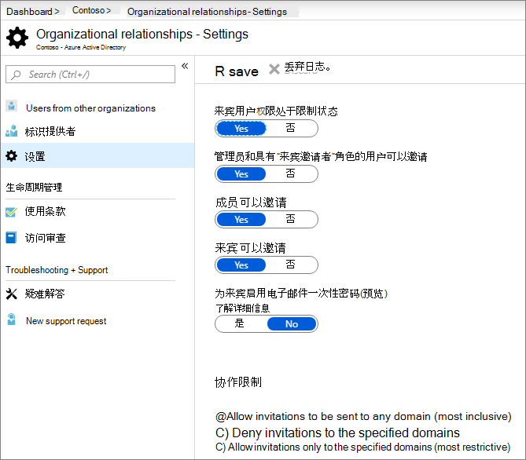
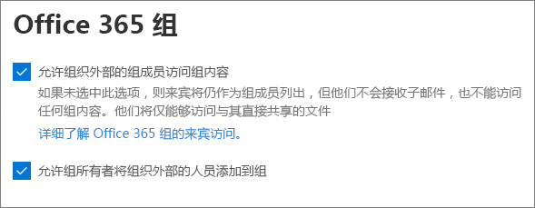
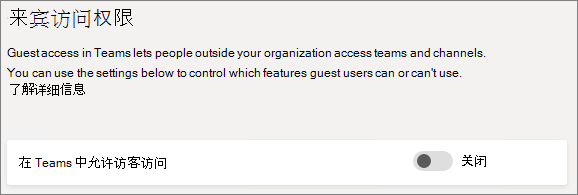
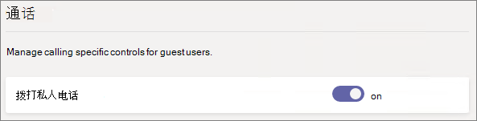
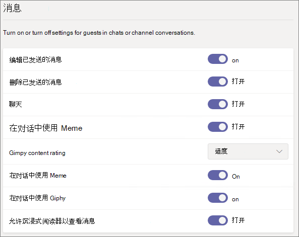
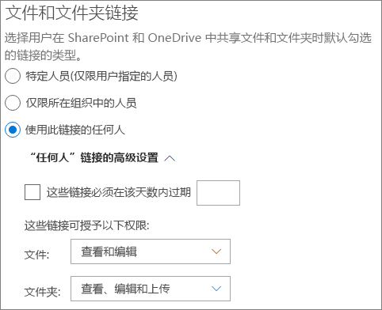
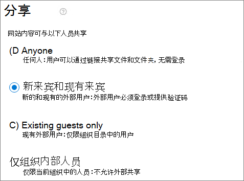

# Microsoft 365 来宾共享设置参考

本文提供了可能影响 Microsoft 365 工作负载的组织外人员共享的各种设置参考：Teams、Microsoft 365 组、SharePoint 和 OneDrive。 这些设置位于 Azure Active Directory、Microsoft 365、Teams 和 SharePoint 管理中心。

## Azure Active Directory

**管理员角色：** 全局管理员

Azure Active Directory 是 Microsoft 365 使用的目录服务。 Azure Active Directory 组织关系设置直接影响 Teams、Microsoft 365 组、SharePoint 和 OneDrive 中的共享。

> [!NOTE]
> 仅当已配置 [Azure AD B2B 的 SharePoint 和 OneDrive 集成（预览）](/sharepoint/sharepoint-azureb2b-integration-preview)时，这些设置才会影响 SharePoint。 下表假定已对此进行了配置。

### 外部协作设置

**导航：**[Azure Active Directory 管理中心](https://aad.portal.azure.com) > Azure Active Directory > 外部标识 > 外部协作设置

| 设置 | 默认值 | 说明 |
|:-----|:-----|:-----|
|来宾用户访问|来宾用户对目录对象的属性和成员资格具有受限访问权限|确定[来宾在 Azure Active Directory 中拥有的权限](/azure/active-directory/fundamentals/users-default-permissions)。|
|来宾邀请设置|组织中的任何人都可以邀请来宾用户（包括来宾和非管理员）|确定来宾、成员和管理员是否可以邀请来宾加入组织。 
 此设置会影响 Microsoft 365 共享体验，例如 Teams 和 SharePoint。|
|通过用户流启用来宾自助注册|不支持|确定你是否可以创建用户流来允许某人注册你创建的应用并创建新的来宾帐户。|
|协作限制|允许向任何域发送邀请|此设置允许你为共享指定允许或阻止的域列表。 如果指定了允许的域，则只能将共享邀请发送到这些域。 如果指定了拒绝的域，则不能将共享邀请发送到这些域。 
 此设置会影响 Microsoft 365 共享体验，例如 Teams 和 SharePoint。 你可以通过使用 SharePoint 或 Teams 中的域筛选功能来更精确地允许或阻止域。|

这些设置会影响邀请用户加入目录的方式。 它们不会影响与目录中已有的来宾进行共享。

### 跨租户访问设置

**导航：**[Azure Active Directory管理中心](https://aad.portal.azure.com)> Azure Active Directory >"默认设置"选项卡>跨租户访问设置 >>外部标识

默认设置适用于除具有组织特定设置的所有外部Azure AD组织。 可以在"**组织设置**"选项卡上配置特定组织的设置。 (B2B 协作) 和 [B2B 直接连接用户Azure AD](/azure/active-directory/external-identities/b2b-direct-connect-overview)有单独的设置。

**入站访问设置**

入站访问设置控制来自外部Azure AD组织的用户是否可以访问组织中的资源。

| 设置 | 默认值 | 说明 |
|:-----|:-----|:-----|
|B2B 协作 - 外部用户和组|全部允许|确定可以向其他Azure AD组织中的人员授予以来宾身份访问组织中资源的权限。|
|B2B 协作 - 应用程序|所有允许的|确定可向组织中来宾授予访问权限的应用。|
|B2B 直接连接 - 外部用户和组|全部阻止|确定是否可以通过 B2B 直接连接向其他Azure AD组织中的人员授予对组织中资源的访问权限。|
|B2B 直接连接 - 应用程序|全部阻止|确定可向组织中 B2B 直接连接用户授予其访问权限的应用。|
|信任设置|Disabled|确定当来自这些组织的人访问你的资源时，条件访问策略是否会接受来自其他Azure AD组织的声明。|

**出站访问设置**

出站访问设置控制用户是否可以访问外部组织中的资源。

| 设置 | 默认值 | 说明 |
|:-----|:-----|:-----|
|B2B 协作 - 外部用户和组|全部允许|确定可以授予组织中哪些用户以来宾身份访问其他Azure AD组织中的资源。|
|B2B 协作 - 应用程序|所有允许的|确定用户可以作为来宾访问的其他Azure AD组织中的应用。|
|B2B 直接连接 - 外部用户和组|全部阻止|确定可以通过 B2B 直接连接授予组织中哪些用户对其他Azure AD组织中的资源的访问权限。|
|B2B 直接连接 - 应用程序|全部阻止|确定可以通过 B2B 直接连接向用户授予访问权限的其他Azure AD组织中的应用。|

## Microsoft 365

**管理员角色：** 全局管理员

Microsoft 365 管理中心具有用于共享和 Microsoft 365 组的组织级别设置。

### 共享

**导航：** [Microsoft 365 管理中心](https://admin.microsoft.com) > **设置** > **组织设置** > <a href="https://go.microsoft.com/fwlink/p/?linkid=2072756" target="_blank">**安全性和隐私** 选项卡</a> > **共享**。

| 设置 | 默认值 | 说明 |
|:-----|:-----|:-----|
|允许用户将新的来宾添加到组织|打开|设置为“**是**”时，Azure AD 成员可以通过 Azure AD 来邀请来宾；设置为“**否**”时，则不能邀请。 设置为“**是**”时，Microsoft 365 组成员可以在所有者批准的情况下邀请来宾；设置为“**否**”时，Microsoft 365 组成员也可以在所有者批准的情况下邀请来宾，但所有者必须是全局管理员才能批准。 
 请注意，“**成员可以邀请**”是指 Azure AD 中的成员（与来宾相对），而不是 Microsoft 365 中的网站或组成员。 
 这与 Azure Active Directory 组织关系设置中的“**成员可以邀请**”设置相同。|

### Microsoft 365 组

**导航：** [Microsoft 365 管理中心](https://admin.microsoft.com) > **设置** > **组织设置** > Microsoft 365 组

| 设置 | 默认值 | 说明 |
|:-----|:-----|:-----|
|允许组织外部的组成员访问组内容|打开|设置为“**打开**”时，来宾可以访问组内容；设置为“**关闭**”时，则不能访问。 对于来宾与 Microsoft 365 组或 Teams 进行交互的任何情况，此设置应为“**打开**”。|
|允许组所有者将组织外部的人员添加到组|打开|设置为“**打开**”时，Microsoft 365 组或 Teams 的所有者可邀请新来宾加入组。 设置为“**关闭**”时，则不能。 对于将来宾添加到组的任何情况，此设置应为“**打开**”。|

这些设置均为组织级别的设置。有关如何使用 PowerShell 在组级别更改这些设置的信息，请参阅[创建针对特定组的设置](/azure/active-directory/users-groups-roles/groups-settings-cmdlets#create-settings-for-a-specific-group)。

## Teams

必须将 Teams 主来宾访问开关“**在 Teams 中允许访客访问**”设置为“**打开**”，这样才能使其他来宾设置可用。

**管理员角色：** Teams 服务管理员

### 来宾访问

**导航：**[Teams 管理中心](https://admin.teams.microsoft.com) > **组织范围设置** > <a href="https://go.microsoft.com/fwlink/p/?linkid=2173122" target="_blank">**来宾访问**</a>

| 设置 | 默认值 | 说明 |
|:-----|:-----|:-----|
|在 Teams 中允许访客访问|打开|打开或关闭整个 Teams 的来宾访问。 更改后，此设置可能需要 24 小时才能生效。|

### 来宾呼叫

**导航：**[Teams 管理中心](https://admin.teams.microsoft.com) > **组织范围设置** > <a href="https://go.microsoft.com/fwlink/p/?linkid=2173122" target="_blank">**来宾访问**</a>

| 设置 | 默认值 | 说明 |
|:-----|:-----|:-----|
|拨打私人电话|打开|设置为“**打开**”时，来宾可以在 Teams 中进行对等呼叫；设置为“**关闭**”时，则不能执行此操作。|

### 来宾会议

**导航：**[Teams 管理中心](https://admin.teams.microsoft.com) > **组织范围设置** > <a href="https://go.microsoft.com/fwlink/p/?linkid=2173122" target="_blank">**来宾访问**</a>

| 设置 | 默认值 | 说明 |
|:-----|:-----|:-----|
|允许 IP 视频|打开|设置为“**打开**”时，来宾可以在电话和会议中使用视频；设置为“**关闭**”时，则不能执行此操作。|
|屏幕共享模式|整个屏幕|设置为“**已禁用**”时，来宾无法在 Teams 中共享其屏幕。 设置为“**单个应用程序**”时，来宾只能在其屏幕上共享一个应用程序。 设置为“**整个屏幕**”时，来宾可以选择共享应用程序或其整个屏幕。|
|允许立即开会|打开|设置为“**打开**”时，来宾可以使用 Teams 中的“立即开会”功能；设置为“**关闭**”时，则不能使用该功能。|

### 来宾消息传递

**导航：**[Teams 管理中心](https://admin.teams.microsoft.com) > **组织范围设置** > <a href="https://go.microsoft.com/fwlink/p/?linkid=2173122" target="_blank">**来宾访问**</a>

| 设置 | 默认值 | 说明 |
|:-----|:-----|:-----|
|编辑已发送的消息|打开|设置为“**打开**”时，来宾可以编辑他们之前发送的消息；设置为“**关闭**”时，则无法执行此操作。|
|删除已发送的消息|打开|设置为“**打开**”时，来宾可以删除他们之前发送的消息；设置为“**关闭**”时，则无法执行此操作。|
|聊天|打开|设置为“**打开**”时，来宾可以使用 Teams 中的聊天功能；设置为“**关闭**”时，则不能使用该功能。|
|在对话中使用 Giphy|打开|设置为“**打开**”时，来宾可以在对话中使用 Giphy；设置为“**关闭**”时，则不能使用它。|
|Giphy 内容评级|适度|设置为“**允许所有内容**”时，无论内容评级如何，来宾都可以在聊天中插入所有 Giphy。 设置为“**适度**”时，来宾可以在聊天中插入 Giphys，但会适度限制成人内容。 设置为“**严格**”时，来宾可以在聊天中插入 Giphys，但会限制插入成人内容。|
|在对话中使用 Meme|打开|设置为“**打开**”时，来宾可以在对话中使用 Meme；设置为“**关闭**”时，则不能使用它。|
|对话中的用户贴纸|打开|设置为“**打开**”时，来宾可以在对话中使用贴纸；设置为“**关闭**”时，则不能使用它。|
|允许沉浸式阅读器以查看消息|打开|设置为“**打开**”时，来宾可以在沉浸式阅读器中查看消息；设置为“**关闭**”时，则无法执行此操作。|

## SharePoint 和 OneDrive（组织级别）

**管理员角色：** SharePoint 管理员

这些设置会影响组织中的所有网站。 它们不会直接影响 Microsoft 365 组或 Teams，但建议使这些设置与 Microsoft 365 组和 Teams 的设置保持一致，以避免用户体验问题。 （例如，如果在 Teams 而非 SharePoint 中允许来宾共享，则 Teams 中的来宾将无法访问“文件”选项卡，因为 Teams 文件存储在 SharePoint 中。）

### SharePoint 和 OneDrive 共享设置

由于 OneDrive 是 SharePoint 中的网站层次结构，因此组织级别共享设置将直接影响 OneDrive，如同影响其他 SharePoint 网站一样。

**导航：** SharePoint 管理中心 >“**策略**” > <a href="https://go.microsoft.com/fwlink/?linkid=2185222" target="_blank">“**共享**”</a>

| 设置 | 默认值 | 说明 |
|:-----|:-----|:-----|
|SharePoint|任何人|指定 SharePoint 网站允许的最宽松共享权限。|
|OneDrive|任何人|指定 OneDrive 网站允许的最宽松共享权限。 此设置不能比 SharePoint 设置更宽松。|

### SharePoint 和 OneDrive 高级共享设置

**导航：** SharePoint 管理中心 >“**策略**” > <a href="https://go.microsoft.com/fwlink/?linkid=2185222" target="_blank">“**共享**”</a>

| 设置 | 默认值 | 说明 |
|:-----|:-----|:-----|
|按域限制外部共享|关闭|此设置允许你为共享指定允许或阻止的域列表。 如果指定了允许的域，则只能将共享邀请发送到这些域。 如果指定了拒绝的域，则不能将共享邀请发送到这些域。 
 此设置会影响组织中的所有 SharePoint 和 OneDrive 网站。|
|仅允许特定安全组中的用户在外部共享|关闭|如果想要在 SharePoint 和 OneDrive 中限制可与来宾进行共享的人员，则可以通过将共享限制为指定安全组中的人员来实现这一点。 这些设置不会影响通过 Microsoft 365 组或 Teams 进行共享。 尽管只能由指定安全组中的人员来共享文档和文件夹，但通过组或团队邀请的来宾还有权访问关联的网站。 
 对于每个指定的组，可以选择哪些用户可以与"任何人"链接共享。|
|来宾必须使用发送共享邀请的同一帐户登录|关闭|阻止来宾使用与接收邀请的电子邮件地址不同的地址来兑换网站共享邀请。 
 [Azure AD B2B 的 SharePoint 和 OneDrive 集成（预览版）](/sharepoint/sharepoint-azureb2b-integration-preview)不使用此设置，因为所有来宾都将根据接收邀请的电子邮件地址添加到目录中。备选电子邮件地址无法用于访问网站。|
|允许来宾共享不属于他们的项目|打开|设置为“**打开**”时，来宾可以与其他用户或来宾共享不属于他们的项目；设置为“**关闭**”时，则无法执行此操作。 来宾始终可以共享其拥有完全控制权的项目。|
|使用验证码的人员必须在此天数后重新进行身份验证|关闭|此设置允许你要求使用一次性密码进行身份验证的用户需在一定天数后重新进行身份验证。|
|对网站或 OneDrive 的来宾访问权限将在此天数后自动过期|打开|如果你的管理员设置了来宾访问过期时间，则你邀请访问该网站或者与其共享文件和文件夹的每位来宾只能在特定天数内获得访问权限。有关详细信息，请访问 [管理网站的来宾过期时间](https://support.microsoft.com/en-us/office/manage-guest-expiration-for-a-site-25bee24f-42ad-4ee8-8402-4186eed74dea)

### SharePoint 和 OneDrive 文件和文件夹链接设置

在 SharePoint 和 OneDrive 中共享文件和文件夹时，系统会向共享收件人发送一个具有该文件或文件夹权限的链接，而不是授予对文件或文件夹本身的直接访问权限。 提供了多种类型的链接，你可以选择在共享文件或文件夹时向用户显示的默认链接类型。 你还可以为“*任何人*”链接设置权限和到期选项。

**导航：** SharePoint 管理中心 >“**策略**” > <a href="https://go.microsoft.com/fwlink/?linkid=2185222" target="_blank">“**共享**”</a>

| 设置 | 默认值 | 说明 |
|:-----|:-----|:-----|
|文件和文件夹链接|使用此链接的任何人|指定用户共享文件或文件夹时默认显示的共享链接。 如果需要，用户可以在共享前更改此选项。 如果将默认设置设为“**使用此链接的任何人**”并且指定的网站不允许“*任何人*”共享，则“**仅限组织中的人员**”将显示为该网站的默认设置。|
|这些链接必须在该天数内过期|关闭（无过期期限）|指定“*任何人*”链接在创建后的多少天内过期。 无法续订已过期的链接。 如果需要在过期后继续共享，请创建新链接。|
|文件权限|查看和编辑|指定创建“*任何人*”链接时向用户提供的文件权限级别。 如果已选择“**查看**”，则用户只能创建具有查看权限的“*任何人*”文件链接。 如果已选择“**查看和编辑**”，则用户可以在创建链接时选择查看权限或查看和编辑权限。|
|文件夹权限|查看、编辑和上传|指定创建“*任何人*”链接时向用户提供的文件夹权限级别。 如果已选择“**查看**”，则用户只能创建具有查看权限的“*任何人*”文件夹链接。 如果已选择“**查看、编辑和上传**”，则用户可以在创建链接时选择查看权限或查看、编辑和上传权限。|

## SharePoint（网站级别）

**管理员角色：** SharePoint 管理员

由于这些设置取决于 SharePoint 的组织范围设置，如果组织级别设置发生更改，则网站的有效共享设置可能会随之更改。 如果你在此处选择设置，并且组织级别随后设置为更严格的值，则此网站将以这一更严格的值运行。 例如，如果你选择“**任何人**”，并且组织级别设置随后设为“**新来宾和现有来宾**”，则此网站将仅允许新来宾和现有来宾进行共享。 如果组织级别设置随后设置回“**任何人**”，则此网站将再次允许使用“*任何人*”链接。

### 网站共享

可为 SharePoint 中的每个网站设置来宾共享权限。 此设置适用于网站共享以及文件和文件夹共享。 （“*任何人*”共享不可用于网站共享。 如果你选择“**任何人**”，则用户可以使用“*任何人*”链接来共享文件和文件夹，并且网站本身可以与新来宾和现有来宾共享。）

如果网站应用了敏感度标签，则该标签可能会控制外部共享设置。 有关详细信息，请参阅[使用敏感度标签保护 Microsoft Teams、Microsoft 365 组和 SharePoint 网站中的内容](../compliance/sensitivity-labels-teams-groups-sites.md)。

> [!NOTE]
> 只能使用 [Set-SPOSite](/powershell/module/sharepoint-online/set-sposite) PowerShell cmdlet 更改频道网站的共享设置。

**导航：**“SharePoint 管理中心”><a href="https://go.microsoft.com/fwlink/?linkid=2185220" target="_blank">“**活动站点**”</a>> 选择站点 >“**策略**”选项卡 >“**编辑外部共享**”

| 设置 | 默认值 | 说明 |
|:-----|:-----|:-----|
|网站内容可与以下人员共享|因网站类型而异（参见下表）|指示此网站允许的外部共享类型。 此处提供的选项取决于 SharePoint 的组织级别共享设置。|

### 网站文件和文件夹链接设置

你可以为每个网站设置链接类型和权限的默认值，以及“*任何人*”链接的到期设置。 在网站级别进行设置时，这些设置会覆盖组织级别的设置。 请注意，如果在组织级别禁用“*任何人*”链接，则“*任何人*”将不会是网站级别的可用链接类型。

**导航：**“SharePoint 管理中心”><a href="https://go.microsoft.com/fwlink/?linkid=2185220" target="_blank">“**活动站点**”</a>> 选择站点 >“**策略**”选项卡 >“**编辑外部共享**”

| 设置 | 默认值 | 说明 |
|:-----|:-----|:-----|
|按域限制共享|关闭|此设置允许你为共享指定允许或阻止的域列表。 如果指定了允许的域，则只能将共享邀请发送到这些域。 如果指定了拒绝的域，则不能将共享邀请发送到这些域。 
 此设置不能用于覆盖在组织或 Azure AD 级别设置的域限制。|
|默认共享链接类型|与组织级别设置相同|此设置允许你指定在此网站中显示给用户的默认共享链接。 “*与组织级别设置相同*”选项由组织和网站共享设置的组合进行定义。|
|“任何人”链接的高级设置|与组织级别设置相同|指定在为此网站中某个文件创建“*任何人*”链接后经过多少天到期。 无法续订已过期的链接。 如果需要在过期后继续共享，请创建新链接。|
|默认链接权限|与组织级别设置相同|此设置允许你为此网站中文件的共享链接指定默认权限（“查看”或“编辑”）。|

### 默认网站共享设置

下表显示了每种网站类型的默认共享设置。

| 网站类型 | 默认共享设置 |
|:-----|:-----|
|经典|**仅组织内部人员**|
|OneDrive|**任何人**|
|与组连接的网站（包括 Teams）|**新来宾和现有来宾** — 如果 Microsoft 365 组设置“允许组所有者将组织外部的人员添加到组”设置为“打开”；否则为“仅现有来宾”|
|通信|**仅组织内部人员**|
|不含组的新式网站 (#STS3 TeamSite)|**仅组织内部人员**|

> [!NOTE]
> 根通信站点 (tenant-name.sharepoint.com) 具有“**任何人**”这一默认共享设置。

## 另请参阅

[SharePoint 和 OneDrive 外部共享概述](/sharepoint/external-sharing-overview)

[Microsoft Teams 中的来宾访问](/MicrosoftTeams/guest-access)

[将来宾添加到 Microsoft 365 组](https://support.office.com/article/bfc7a840-868f-4fd6-a390-f347bf51aff6)
