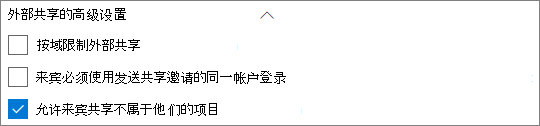
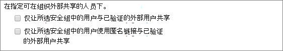

# Microsoft 365 来宾共享设置参考Microsoft 365 guest sharing settings reference

本文提供了可能影响 Microsoft 365 工作负载的组织外人员共享的各种设置参考：Teams、Microsoft 365 组、SharePoint 和 OneDrive。This article provides a reference for the various settings that can affect sharing with people outside your organization for the Microsoft 365 workloads: Teams, Microsoft 365 Groups, SharePoint, and OneDrive. 这些设置位于 Azure Active Directory、Microsoft 365、Teams 和 SharePoint 管理中心。These settings are located in the Azure Active Directory, Microsoft 365, Teams, and SharePoint admin centers.

## Azure Active DirectoryAzure Active Directory

**管理员角色：** 全局管理员**Admin role:** Global administrator

Azure Active Directory 是 Microsoft 365 使用的目录服务。Azure Active Directory is the directory service used by Microsoft 365. Azure Active Directory 组织关系设置直接影响 Teams、Microsoft 365 组、SharePoint 和 OneDrive 中的共享。The Azure Active Directory Organizational relationships settings directly affect sharing in Teams, Microsoft 365 Groups, SharePoint, and OneDrive.

> [!NOTE]
> 仅当已配置 [Azure AD B2B 的 SharePoint 和 OneDrive 集成（预览）](/sharepoint/sharepoint-azureb2b-integration-preview)时，这些设置才会影响 SharePoint。These settings only affect SharePoint when [SharePoint and OneDrive integration with Azure AD B2B](/sharepoint/sharepoint-azureb2b-integration-preview) has been configured. 下表假定已对此进行了配置。The table below assumes that this has been configured.

### 组织关系设置Organizational relationships settings

**导航：**[Azure Active Directory 管理中心](https://aad.portal.azure.com) > Azure Active Directory > 外部标识 > 外部协作设置**Navigation:** [Azure Active Directory admin center](https://aad.portal.azure.com) > Azure Active Directory > External Identities > External collaboration settings

| 设置Setting | 默认值Default | 说明Description |
|:-----|:-----|:-----|
|来宾用户权限处于限制状态Guest users permissions are limited|是Yes|此设置会影响来宾可以执行的目录任务。This setting affects the directory tasks that a guest can perform.|
|管理员和具有“来宾邀请者”角色的用户可以邀请Admins and users in the guest inviter role can invite|是Yes|设置为“**是**”时，管理员可以通过 Azure AD 和 Microsoft 365 共享体验（如 Teams 和 SharePoint）邀请来宾；设置为“**否**”时，则不能邀请。When set to **Yes**, admins can invite guests via Azure AD and via  Microsoft 365 sharing experiences such as Teams and SharePoint; when set to **No**, they cannot.|
|成员可以邀请Members can invite|是Yes|设置为“**是**”时，Azure AD 成员可以通过 Azure AD 来邀请来宾；设置为“**否**”时，则不能邀请。When set to **Yes**, Azure AD members can invite guests via Azure AD; when set to **No**, they cannot. 设置为“是”时，Microsoft 365 组成员可以在所有者批准的情况下邀请来宾；设置为“否”时，Microsoft 365 组成员也可以在所有者批准的情况下邀请来宾，但这些所有者必须是全局管理员才能批准。When set to **Yes**, Microsoft 365 Group members can invite guests with owner approval; when set to **No**, Microsoft 365 Group members can invite guests with owner approval but owners must be global administrators to approve.   请注意，“**成员可以邀请**”是指 Azure AD 中的成员（与来宾相对），而不是 Microsoft 365 中的网站或组成员。Note that **Members can invite** refers to members in Azure AD (as opposed to guests) and not to site or group members in  Microsoft 365.   这与 Microsoft 365 安全和隐私中的“**允许用户将新的来宾添加到组织**”设置相同。This is identical to the **Let users add new guests to the organization** setting in Microsoft 365 Security & privacy.|
|来宾可以邀请Guests can invite|是Yes|设置为“**是**”时，目录中的来宾可以邀请其他来宾协作处理 Azure AD 资源以及 SharePoint 和 OneDrive 中的文件和文件夹；设置为“**否**”时，则不能邀请。When set to **Yes**, guests in the directory can invite other guests to collaborate on Azure AD resources and on files and folders in SharePoint and OneDrive; when set to **No**, they cannot.   请注意，必须在 SharePoint 管理中心启用“**允许外部用户通过键入精确的电子邮件地址匹配项在目录中查找用户帐户**”，以便来宾与其他来宾共享文件和文件夹。Note that **Allow external users to find user accounts in the directory by typing in exact email address matches** must be turned on in the SharePoint admin center for guests to share files and folders with other guests.|
|为来宾启用电子邮件一次性密码(预览)Enable Email One-Time Passcode for guests (Preview)|否No|设置为“**是**”时，没有 MSA 或工作或学校帐户的来宾可以 [使用一次性密码对 Azure AD 进行身份验证](/azure/active-directory/b2b/one-time-passcode)；设置为“**否**”时，用户需要创建 Microsoft 帐户才能进行身份验证。When set to **Yes**, guests without an MSA or a work or school account can [authenticate with Azure AD using a one-time passcode](/azure/active-directory/b2b/one-time-passcode); when set to **No**, users will need to create a Microsoft account in order to authenticate. 必须将此设置设为“**是**”，这样“[Azure AD B2B 的 SharePoint 和 OneDrive 集成（预览）](/sharepoint/sharepoint-azureb2b-integration-preview)”才能工作。This setting must be set to **Yes** for [SharePoint and OneDrive integration with Azure AD B2B (Preview)](/sharepoint/sharepoint-azureb2b-integration-preview) to work.|
|协作限制Collaboration restrictions|允许向任何域发送邀请Allow invitations to be sent to any domain|此设置允许你为共享指定允许或阻止的域列表。This setting allows you to specify a list of allowed or blocked domains for sharing. 如果指定了允许的域，则只能将共享邀请发送到这些域。When allowed domains are specified, then sharing invitations can only be sent to those domains. 如果指定了拒绝的域，则不能将共享邀请发送到这些域。When denied domains are specified, then sharing invitations cannot be sent to those domains.   此设置会影响 Microsoft 365 共享体验，例如 Teams 和 SharePoint。This setting affects  Microsoft 365 sharing experiences such as Teams and SharePoint. 你可以通过使用 SharePoint 或 Teams 中的域筛选功能来更精确地允许或阻止域。You can allow or block domains at a more granular level by using domain filtering in SharePoint or Teams.|

这些设置会影响邀请用户加入目录的方式。These settings affect how users are invited to the directory. 它们不会影响与目录中已有的来宾进行共享。They do not affect sharing with guests who are already in the directory.

## Microsoft 365Microsoft 365

**管理员角色：** 全局管理员**Admin role:** Global administrator

Microsoft 365 管理中心具有用于共享和 Microsoft 365 组的组织级别设置。The Microsoft 365 admin center has organization-level settings for sharing and for Microsoft 365 Groups.

### 共享Sharing

**导航：**[Microsoft 365 管理中心](https://admin.microsoft.com) > 设置 > 组织设置 >“安全和隐私”选项卡 > 共享**Navigation:** [Microsoft 365 admin center](https://admin.microsoft.com) > Settings > Org Settings > Security & privacy tab > Sharing

| 设置Setting | 默认值Default | 说明Description |
|:-----|:-----|:-----|
|允许用户将新的来宾添加到组织Let users add new guests to the organization|打开On|设置为“**是**”时，Azure AD 成员可以通过 Azure AD 来邀请来宾；设置为“**否**”时，则不能邀请。When set to **Yes**, Azure AD members can invite guests via Azure AD; when set to **No**, they cannot. 设置为“是”时，Microsoft 365 组成员可以在所有者批准的情况下邀请来宾；设置为“否”时，Microsoft 365 组成员也可以在所有者批准的情况下邀请来宾，但这些所有者必须是全局管理员才能批准。When set to **Yes**, Microsoft 365 Group members can invite guests with owner approval; when set to **No**, Microsoft 365 Group members can invite guests with owner approval but owners must be global administrators to approve.   请注意，“**成员可以邀请**”是指 Azure AD 中的成员（与来宾相对），而不是 Microsoft 365 中的网站或组成员。Note that **Members can invite** refers to members in Azure AD (as opposed to guests) and not to site or group members in  Microsoft 365.   这与 Azure Active Directory 组织关系设置中的“**成员可以邀请**”设置相同。This is identical to the **Members can invite** setting in Azure Active Directory Organizational relationships settings.|

### Microsoft 365 组Microsoft 365 Groups

**导航：**[Microsoft 365 管理中心](https://admin.microsoft.com) > 设置 > 设置 > Microsoft 365 组**Navigation:** [Microsoft 365 admin center](https://admin.microsoft.com) > Settings > Settings > Microsoft 365 Groups

| 设置Setting | 默认值Default | 说明Description |
|:-----|:-----|:-----|
|允许组织外部的组成员访问组内容Let group members outside your organization access group content|打开On|设置为“**打开**”时，来宾可以访问组内容；设置为“**关闭**”时，则不能访问。When set to **On**, guests can access groups content; when set to **Off**, they can't. 对于来宾与 Microsoft 365 组或 Teams 进行交互的任何情况，此设置应为“**打开**”。This setting should be **On** for any scenario where guests are interacting with Microsoft 365 Groups or Teams.|
|允许组所有者将组织外部的人员添加到组Let group owners add people outside your organization to groups|打开On|设置为“打开”时，Microsoft 365 组或 Teams 的所有者可邀请新来宾加入组。When **On**, Owners of Microsoft 365 Groups or Teams can invite new guests to the group. 设置为“**关闭**”时，所有者只能邀请目录中已有的来宾。When **Off**, owners can only invite guests who are already in the directory.|

这些设置均为组织级别的设置。These settings are at the organization level. 有关如何使用 PowerShell 在组级别更改这些设置的信息，请参阅[创建针对特定组的设置](/azure/active-directory/users-groups-roles/groups-settings-cmdlets#create-settings-for-a-specific-group)。See [Create settings for a specific group](/azure/active-directory/users-groups-roles/groups-settings-cmdlets#create-settings-for-a-specific-group) for information about how to change these settings at the group level by using PowerShell.

## TeamsTeams

必须将 Teams 主来宾访问开关“**在 Teams 中允许访客访问**”设置为“**打开**”，这样才能使其他来宾设置可用。The Teams master guest access switch, **Allow guest access in Teams**, must be **On** for the other guest settings to be available.

**管理员角色：** Teams 服务管理员**Admin role:** Teams service administrator

### 来宾访问Guest access

**导航：**[Teams 管理中心](https://admin.teams.microsoft.com) > 组织范围的设置 > 来宾访问**Navigation:** [Teams admin center](https://admin.teams.microsoft.com) > Org-wide settings > Guest access

| 设置Setting | 默认值Default | 说明Description |
|:-----|:-----|:-----|
|在 Teams 中允许访客访问Allow guest access in Teams|关闭Off|打开或关闭整个 Teams 的来宾访问。Turns guest access on or off for Teams overall. 更改后，此设置可能需要 24 小时才能生效。This setting can take 24 hours to take effect once changed.|

### 来宾呼叫Guest calling

**导航：**[Teams 管理中心](https://admin.teams.microsoft.com) > 组织范围的设置 > 来宾访问**Navigation:** [Teams admin center](https://admin.teams.microsoft.com) > Org-wide settings > Guest access

| 设置Setting | 默认值Default | 说明Description |
|:-----|:-----|:-----|
|拨打私人电话Make private calls|打开On|设置为“**打开**”时，来宾可以在 Teams 中进行对等呼叫；设置为“**关闭**”时，则不能执行此操作。When **On**, guests can make peer-to-peer calls in Teams; when **Off**, they can't.|

### 来宾会议Guest meeting

**导航：**[Teams 管理中心](https://admin.teams.microsoft.com) > 组织范围的设置 > 来宾访问**Navigation:** [Teams admin center](https://admin.teams.microsoft.com) > Org-wide settings > Guest access

| 设置Setting | 默认值Default | 说明Description |
|:-----|:-----|:-----|
|允许 IP 视频Allow IP video|打开On|设置为“**打开**”时，来宾可以在电话和会议中使用视频；设置为“**关闭**”时，则不能执行此操作。When **On**, guests can use video in their calls and meetings; when **Off**, they can't.|
|屏幕共享模式Screen sharing mode|整个屏幕Entire screen|设置为“**已禁用**”时，来宾无法在 Teams 中共享其屏幕。When **Disabled**, guests can't share their screens in Teams. 设置为“**单个应用程序**”时，来宾只能在其屏幕上共享一个应用程序。When set to **Single application**, guests can only share a single application on their screen. 设置为“**整个屏幕**”时，来宾可以选择共享应用程序或其整个屏幕。When set to **Entire screen**, guests can choose to share an application or their entire screen.|
|允许立即开会Allow Meet Now|打开On|设置为“**打开**”时，来宾可以使用 Teams 中的“立即开会”功能；设置为“**关闭**”时，则不能使用该功能。When **On**, guests can use the Meet Now feature in Teams; when **Off**, they can't.|

### 来宾消息传递Guest messaging

**导航：**[Teams 管理中心](https://admin.teams.microsoft.com) > 组织范围的设置 > 来宾访问**Navigation:** [Teams admin center](https://admin.teams.microsoft.com) > Org-wide settings > Guest access

| 设置Setting | 默认值Default | 说明Description |
|:-----|:-----|:-----|
|编辑已发送的消息Edit sent messages|打开On|设置为“**打开**”时，来宾可以编辑他们之前发送的消息；设置为“**关闭**”时，则无法执行此操作。When **On**, guests can edit messages they previously sent; when **Off**, they can't.|
|删除已发送的消息Delete sent messages|打开On|设置为“**打开**”时，来宾可以删除他们之前发送的消息；设置为“**关闭**”时，则无法执行此操作。When **On**, guests can delete messages they previously sent; when **Off**, they can't.|
|聊天Chat|打开On|设置为“**打开**”时，来宾可以使用 Teams 中的聊天功能；设置为“**关闭**”时，则不能使用该功能。When **On**, guests can use chat in Teams; when **Off**, they can't.|
|在对话中使用 GiphyUse Giphys in conversations|打开On|设置为“**打开**”时，来宾可以在对话中使用 Giphy；设置为“**关闭**”时，则不能使用它。When **On**, guests can use Giphys in conversations; when **Off**, they can't.|
|Giphy 内容评级Giphy content rating|适度Moderate|设置为“**允许所有内容**”时，无论内容评级如何，来宾都可以在聊天中插入所有 Giphys。When set to **Allow all content**, guests will can insert all Giphys in chats, regardless of the content rating. 设置为“**适度**”时，来宾可以在聊天中插入 Giphys，但会适度限制成人内容。When set to **Moderate** guests can insert Giphys in chats, but will be moderately restricted from adult content. 设置为“**严格**”时，来宾可以在聊天中插入 Giphys，但会限制插入成人内容。When set to **Strict** guests can insert Giphys in chats, but will be restricted from inserting adult content.|
|在对话中使用 MemeUse Memes in conversations|打开On|设置为“**打开**”时，来宾可以在对话中使用 Meme；设置为“**关闭**”时，则不能使用它。When **On**, guests can use memes in conversations; when **Off**, they can't.|
|对话中的用户贴纸User stickers in conversations|打开On|设置为“**打开**”时，来宾可以在对话中使用贴纸；设置为“**关闭**”时，则不能使用它。When **On**, guests can use stickers in conversations; when **Off**, they can't.|
|允许沉浸式阅读器以查看消息Allow immersive reader for viewing messages|打开On|设置为“**打开**”时，来宾可以在沉浸式阅读器中查看消息；设置为“**关闭**”时，则无法执行此操作。When **On**, guests can view messages in Immersive Reader; when **Off**, they can't.|

## SharePoint 和 OneDrive（组织级别）SharePoint and OneDrive (organization-level)

**管理员角色：** SharePoint 管理员**Admin role:** SharePoint administrator

这些设置会影响组织中的所有网站。These settings affect all of the sites in the organization. 它们不会直接影响 Microsoft 365 组或 Teams，但建议使这些设置与 Microsoft 365 组和 Teams 的设置保持一致，以避免用户体验问题。They do not affect Microsoft 365 Groups or Teams directly, however we recommend that you align these settings with the settings for Microsoft 365 Groups and Teams to avoid user experience issues. （例如，如果在 Teams 而非 SharePoint 中允许来宾共享，则 Teams 中的来宾将无法访问“文件”选项卡，因为 Teams 文件存储在 SharePoint 中。）(For example, if guest sharing is allowed in Teams but not SharePoint, then guests in Teams will not have access to the Files tab because Teams files are stored in SharePoint.)

### SharePoint 和 OneDrive 共享设置SharePoint and OneDrive sharing settings

由于 OneDrive 是 SharePoint 中的网站层次结构，因此组织级别共享设置将直接影响 OneDrive，如同影响其他 SharePoint 网站一样。Because OneDrive is a hierarchy of sites within SharePoint, the organization-level sharing settings directly affect OneDrive just as they do other SharePoint sites.

**导航：** SharePoint 管理中心 > 共享**Navigation:** SharePoint admin center > Sharing

| 设置Setting | 默认值Default | 说明Description |
|:-----|:-----|:-----|
|SharePointSharePoint|任何人Anyone|指定 SharePoint 网站允许的最宽松共享权限。Specifies the most permissive sharing permissions allowed for SharePoint sites.|
|OneDriveOneDrive|任何人Anyone|指定 OneDrive 网站允许的最宽松共享权限。Specifies the most permissive sharing permissions allowed for OneDrive sites. 此设置不能比 SharePoint 设置更宽松。This setting cannot be more permissive than the SharePoint setting.|

### SharePoint 和 OneDrive 高级共享设置SharePoint and OneDrive advanced sharing settings

**导航：** SharePoint 管理中心 > 共享**Navigation:** SharePoint admin center > Sharing

| 设置Setting | 默认值Default | 说明Description |
|:-----|:-----|:-----|
|按域限制外部共享Limit external sharing by domain|关闭Off|此设置允许你为共享指定允许或阻止的域列表。This setting allows you to specify a list of allowed or blocked domains for sharing. 如果指定了允许的域，则只能将共享邀请发送到这些域。When allowed domains are specified, then sharing invitations can only be sent to those domains. 如果指定了拒绝的域，则不能将共享邀请发送到这些域。When denied domains are specified, then sharing invitations cannot be sent to those domains.   此设置会影响组织中的所有 SharePoint 和 OneDrive 网站。This setting affects all SharePoint and OneDrive sites in the organization.|
|来宾必须使用发送共享邀请的同一帐户登录Guests must sign in using the same account to which sharing invitations are sent|关闭Off|阻止来宾使用与接收邀请的电子邮件地址不同的地址来兑换网站共享邀请。Prevents guests from redeeming site sharing invitations using a different email address than the invitation was sent to.  [Azure AD B2B 的 SharePoint 和 OneDrive 集成（预览）](/sharepoint/sharepoint-azureb2b-integration-preview)不使用此设置，因为所有来宾都将根据接收邀请的电子邮件地址添加到目录中。[SharePoint and OneDrive integration with Azure AD B2B (Preview)](/sharepoint/sharepoint-azureb2b-integration-preview) does not use this setting because all guests are added to the directory based on the email address that the invitation was sent to. 备选电子邮件地址无法用于访问网站。Alternate email addresses cannot be used to access the site.|
|允许来宾共享不属于他们的项目Allow guests to share items they don't own|打开On|设置为“**打开**”时，来宾可以与其他用户或来宾共享不属于他们的项目；设置为“**关闭**”时，则无法执行此操作。When **On**, guests can share items that they don't own with other users or guests; when **Off** they cannot. 来宾始终可以共享其拥有完全控制权的项目。Guests can always share items for which they have full control.|

### SharePoint 和 OneDrive 文件和文件夹链接设置SharePoint and OneDrive file and folder link settings

在 SharePoint 和 OneDrive 中共享文件和文件夹时，系统会向共享收件人发送一个具有该文件或文件夹权限的链接，而不是授予对文件或文件夹本身的直接访问权限。When files and folders are shared in SharePoint and OneDrive, sharing recipients are sent a link with permissions to the file or folder rather than being granted direct access to the file or folder themselves. 提供了多种类型的链接，你可以选择在共享文件或文件夹时向用户显示的默认链接类型。Several types of links are available, and you can choose the default link type presented to users when they share a file or folder. 你还可以为“*任何人*”链接设置权限和到期选项。You can also set permissions and expiration options for *Anyone* links.

**导航：** SharePoint 管理中心 > 共享**Navigation:** SharePoint admin center > Sharing

| 设置Setting | 默认值Default | 说明Description |
|:-----|:-----|:-----|
|文件和文件夹链接File and folder links|使用此链接的任何人Anyone with the link|指定用户共享文件或文件夹时默认显示的共享链接。Specifies which sharing link is shown by default when a user shares a file or folder. 如果需要，用户可以在共享前更改此选项。Users can change the option before sharing if they want. 如果将默认设置设为“**使用此链接的任何人**”并且指定的网站不允许“*任何人*”共享，则“**仅限组织中的人员**”将显示为该网站的默认设置。If the default is set to **Anyone with the link** and *Anyone* sharing is not allowed for a given site, then **Only people in your organization** will be shown as the default for that site.|
|这些链接必须在该天数内过期These links must expire within this many days|关闭（无过期期限）Off (no expiration)|指定“*任何人*”链接在创建后的多少天内过期。Specifies the number of days after an *Anyone* link is created that it expires. 无法续订已过期的链接。Expired links cannot be renewed. 如果需要在过期后继续共享，请创建新链接。Create a new link if you need to continue sharing past the expiration.|
|文件权限File permissions|查看和编辑View and edit|指定创建“*任何人*”链接时向用户提供的文件权限级别。Specifies the file permission levels available to users when creating an *Anyone* link. 如果已选择“**查看**”，则用户只能创建具有查看权限的“*任何人*”文件链接。If **View** is selected, then users can only create *Anyone* file links with view permissions. 如果已选择“**查看和编辑**”，则用户可以在创建链接时选择查看权限或查看和编辑权限。If **View, and edit** is selected, then users can choose between view and view and edit permissions when they create the link.|
|文件夹权限Folder permissions|查看、编辑和上传View, edit, and upload|指定创建“*任何人*”链接时向用户提供的文件夹权限级别。Specifies the folder permission levels available to users when creating an *Anyone* link. 如果已选择“**查看**”，则用户只能创建具有查看权限的“*任何人*”文件夹链接。If **View** is selected, then users can only create *Anyone* folder links with view permissions. 如果已选择“**查看、编辑和上传**”，则用户可以在创建链接时选择查看权限或查看、编辑和上传权限。If **View, edit, and upload** is selected, then users can choose between view and view, edit, and upload permissions when they creat the link.|

### SharePoint 和 OneDrive 安全组设置SharePoint and OneDrive security group settings

如果想要在 SharePoint 和 OneDrive 中限制可与来宾进行共享的人员，则可以通过将共享限制为指定安全组中的人员来实现这一点。If you want to limit who can share with guests in SharePoint and OneDrive, you can do so by limiting sharing to people in specified security groups. 这些设置不会影响通过 Microsoft 365 组或 Teams 进行共享。These settings do not affect sharing via Microsoft 365 Groups or Teams. 尽管只能由指定安全组中的人员来共享文档和文件夹，但通过组或团队邀请的来宾还有权访问关联的网站。Guests invited via a group or team would also have access to the associated site, though document and folder sharing could only be done by people in the specified security groups.

**导航：** SharePoint 管理中心 > 共享 > 将外部共享的范围限制到特定安全组**Navigation:** SharePoint admin center > Sharing > Limit external sharing to specific security groups

| 设置Setting | 默认值Default | 说明Description |
|:-----|:-----|:-----|
|仅让所选安全组中的用户与已验证的外部用户共享Let only users in selected security groups share with authenticated external users|关闭Off|设置为“**打开**”时，只有指定安全组中的人员才能与组织外部的人员共享。When **On**, only the people in the specified security groups can share with people outside the organization. 仅提供“*特定人员*”链接。Only *Specific people* links are available. 除非“**仅让所选安全组中的用户使用匿名链接与已验证的外部用户共享**”也设置为“**打开**”，才会有效禁用“*任何人*”链接。*Anyone* sharing is effectively disabled unless **Let only users in selected security groups share with authenticated external users and using anonymous links** is also **On**|
|仅让所选安全组中的用户使用匿名链接与已验证的外部用户共享Let only users in selected security groups share with authenticated external users and using anonymous links|关闭Off|设置为“**打开**”时，只有指定安全组中的人员才能与来宾共享。When **On**, only the people in the specified security groups can share with guests. 提供“*任何人*”和“*特定人员*”链接。Both *Anyone* and *Specific people* links are available.|

可同时使用这两个设置。Both of these settings can be used at the same time. 如果用户位于为这两个设置指定的安全组中，则以更高权限级别为准（“*任何人*”加“*特定用户*”）。If a user is in security groups specified for both settings, then the greater permission level prevails (*Anyone* plus *Specific user*). 支持嵌套安全组。Nested security groups are supported.

## SharePoint（网站级别）SharePoint (site level)

**管理员角色：** SharePoint 管理员**Admin role:** SharePoint administrator

由于这些设置取决于 SharePoint 的组织范围设置，如果组织级别设置发生更改，则网站的有效共享设置可能会随之更改。Because these settings are subject to the organization-wide settings for SharePoint, the effective sharing setting for the site may change if the organization-level setting changes. 如果你在此处选择设置，并且组织级别随后设置为更严格的值，则此网站将以这一更严格的值运行。If you choose a setting here and the organization-level is later set to a more restrictive value, then this site will operate at that more restrictive value. 例如，如果你选择“**任何人**”，并且组织级别设置随后设为“**新来宾和现有来宾**”，则此网站将仅允许新来宾和现有来宾进行共享。For example, if you choose **Anyone** and the organization-level setting is later set to **New and existing guests**, then this site will only allow new and existing guests. 如果组织级别设置随后设置回“**任何人**”，则此网站将再次允许使用“*任何人*”链接。If the organization-level setting is then set back to **Anyone**, this site would again allow *Anyone* links.

### 网站共享Site sharing

可为 SharePoint 中的每个网站设置来宾共享权限。You can set guest sharing permissions for each site in SharePoint. 此设置适用于网站共享以及文件和文件夹共享。This setting applies to both site sharing and file and folder sharing. （“*任何人*”共享不可用于网站共享。(*Anyone* sharing is not available for site sharing. 如果你选择“**任何人**”，则用户可以使用“*任何人*”链接来共享文件和文件夹，并且网站本身可以与新来宾和现有来宾共享。）If you choose **Anyone**, users will be able to share files and folders by using *Anyone* links, and the site itself with new and existing guests.)

如果网站应用了敏感度标签，则该标签可能会控制外部共享设置。If the site has a sensitivity label applied, that label may control the external sharing settings. 有关详细信息，请参阅[使用敏感度标签保护 Microsoft Teams、Microsoft 365 组和 SharePoint 网站中的内容](../compliance/sensitivity-labels-teams-groups-sites.md)。For more information, see [Use sensitivity labels to protect content in Microsoft Teams, Microsoft 365 groups, and SharePoint sites](../compliance/sensitivity-labels-teams-groups-sites.md).

**导航：** SharePoint 管理中心 > 活动站点 > 选择站点 >“策略”选项卡 > 编辑外部共享**Navigation:** SharePoint admin center > Active sites > select the site > Policies tab > Edit External sharing

| 设置Setting | 默认值Default | 说明Description |
|:-----|:-----|:-----|
|网站内容可与以下人员共享Site content can be shared with|因网站类型而异（参见下表）Varies by site type (see the table below)|指示此网站允许的外部共享类型。Indicates the type of external sharing allowed for this site. 此处提供的选项取决于 SharePoint 的组织级别共享设置。Options available here are subject to the organization-level sharing settings for SharePoint.|

### 网站文件和文件夹链接设置Site file and folder link settings

你可以为每个网站设置链接类型和权限的默认值，以及“*任何人*”链接的到期设置。You can set defaults for link type and permissions, and expiration settings for *Anyone* links for each site. 在网站级别进行设置时，这些设置会覆盖组织级别的设置。When set at the site level, these settings override the organization-level settings. 请注意，如果在组织级别禁用“*任何人*”链接，则“*任何人*”将不会是网站级别的可用链接类型。Note that if *Anyone* links are disabled at the organization level, *Anyone* will not be an available link type at the site level.

**导航：** SharePoint 管理中心 > 活动站点 > 选择站点 >“策略”选项卡 > 编辑外部共享**Navigation:** SharePoint admin center > Active sites > select the site > Policies tab > Edit External sharing

| 设置Setting | 默认值Default | 说明Description |
|:-----|:-----|:-----|
|按域限制共享Limit sharing by domain|关闭Off|此设置允许你为共享指定允许或阻止的域列表。This setting allows you to specify a list of allowed or blocked domains for sharing. 如果指定了允许的域，则只能将共享邀请发送到这些域。When allowed domains are specified, then sharing invitations can only be sent to those domains. 如果指定了拒绝的域，则不能将共享邀请发送到这些域。When denied domains are specified, then sharing invitations cannot be sent to those domains.   此设置不能用于覆盖在组织或 Azure AD 级别设置的域限制。This setting cannot be used to override domain restrictions set at the organization or Azure AD level.|
|默认共享链接类型Default sharing link type|与组织级别设置相同Same as organization-level setting|此设置允许你指定在此网站中显示给用户的默认共享链接。This setting allows you to specify the default sharing link presented to users in this site. “*与组织级别设置相同*”选项由组织和网站共享设置的组合进行定义。The *Same as organization-level setting* option is defined by a combination of organization and site sharing settings.|
|“任何人”链接的高级设置Advanced settings for Anyone links|与组织级别设置相同Same as organization-level setting|指定在为此网站中某个文件创建“*任何人*”链接后经过多少天到期。Specifies the number of days after an *Anyone* link is created for a file in this site that it expires. 无法续订已过期的链接。Expired links cannot be renewed. 如果需要在过期后继续共享，请创建新链接。Create a new link if you need to continue sharing past the expiration.|
|默认链接权限Default link permission|与组织级别设置相同Same as organization-level setting|此设置允许你为此网站中文件的共享链接指定默认权限（“查看”或“编辑”）。This setting allows you to specify the default permission (View or Edit) for sharing links created for files in this site.|

### 默认网站共享设置Default site sharing settings

下表显示了每种网站类型的默认共享设置。The table below shows the default sharing setting for each site type.

| 网站类型Site type | 默认共享设置Default sharing setting |
|:-----|:-----|
|经典Classic|**仅组织内部人员****Only people in your organization**|
|OneDriveOneDrive|**任何人****Anyone**|
|与组连接的网站（包括 Teams）Group-connected sites (including Teams)|**新来宾和现有来宾** — 如果 Microsoft 365 组设置“允许组所有者将组织外部的人员添加到组”设置为“打开”；否则为“仅现有来宾”**New and existing guests** if the Microsoft 365 Groups setting **Let group owners add people outside the organization to groups** is **On**; otherwise **Existing guests only**|
|通信Communication|**仅组织内部人员****Only people in your organization**|
|不含组的新式网站 (#STS3 TeamSite)Modern sites with no group (#STS3 TeamSite)|**仅组织内部人员****Only people in your organization**|

> [!NOTE]
> 根通信站点 (tenant-name.sharepoint.com) 具有“**任何人**”这一默认共享设置。The root communication site (tenant-name.sharepoint.com) has a default sharing setting of **Anyone**.

## 另请参阅See also

[SharePoint 和 OneDrive 外部共享概述SharePoint and OneDrive external sharing overview](/sharepoint/external-sharing-overview)

[Microsoft Teams 中的来宾访问Guest access in Microsoft Teams](/MicrosoftTeams/guest-access)

[将来宾添加到 Microsoft 365 组Adding guests to Microsoft 365 Groups](https://support.office.com/article/bfc7a840-868f-4fd6-a390-f347bf51aff6)
