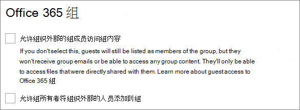
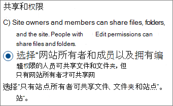
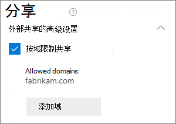
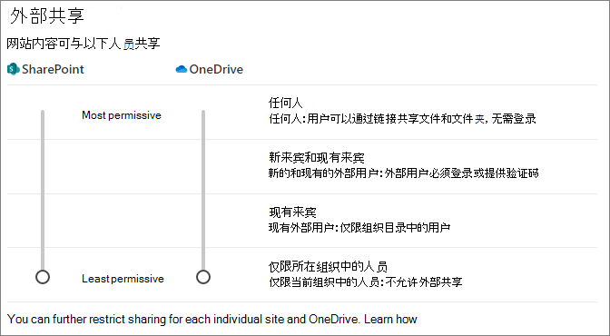
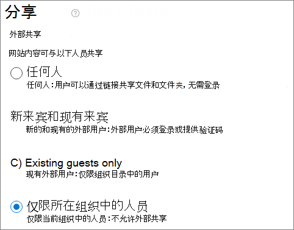
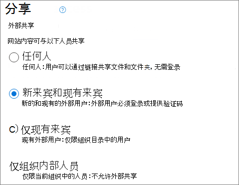

# 限制 Microsoft 365 中的共享

虽然无法完全禁用内部共享，也无法删除网站中的“共享”按钮，但可通过多种方式来限制 Microsoft 365 中的共享，以满足组织的需求。

下表列出了共享文件的方法。 有关详细信息，请单击“**共享方法**”列中的链接。

|共享方法|说明|限制选项|
|:-------------|:----------|:-------------|
|[Microsoft 365 组或团队](#microsoft-365-group-or-team)|如果被授予对 Microsoft Teams 团队或 Microsoft 365 组的访问权限，可以有权编辑关联的 SharePoint 网站中的文件。|如果组或团队是专用的，则用于加入团队的共享邀请将会转到所有者那里以供其审批。 管理员可通过禁用来宾访问来阻止组织外部人员的访问。|
|[SharePoint 网站](#sharepoint-site)|可向用户授予对 SharePoint 网站的“所有者”、“成员”或“访问者”访问权限，他们将拥有对网站中文件的相应访问权限级别。|可限制网站权限，以便只有网站所有者可以共享网站。|
|[与特定人员共享](#sharing-with-specific-people)|网站成员和拥有编辑权限的人员可以提供对文件和文件夹的直接权限，或通过使用*特定人员*链接进行共享。|可限制网站权限，以便只有网站所有者可以共享文件和文件夹。 在这种情况下，网站成员提供的直接访问和*特定人员*链接共享将会转到网站所有者那里以供其审批。|
|[SharePoint 来宾共享](#sharepoint-guest-sharing)|SharePoint 网站所有者和成员可与组织外部的人员共享文件和文件夹。|可针对整个组织或单个网站禁用来宾共享。|
|[*你组织中的人员*共享链接](#people-in-your-organization-sharing-links)|SharePoint 网站所有者和成员可以使用*你组织中的人员*链接（可用于组织内的所有人）来共享文件。|可在网站级别禁用*你组织中的人员*链接。|
|[电子邮件](#email)|有权访问文件的人员可通过电子邮件将其发送给其他人。|管理员可以使用敏感度标签对文件进行加密，以防止有人与未经授权的人员共享这些文件。|
|[下载或文件复制](#download-or-file-copy)|有权访问文件的人员可以下载或复制该文件，并与 Microsoft 365 范围之外的其他人共享。|管理员可以使用敏感度标签对文件进行加密，以防止有人与未经授权的人员共享这些文件。|

虽然可使用本文中介绍的管理员控制措施来限制组织内的共享，但我们强烈建议考虑使用 Microsoft 365 中提供的安全和合规性功能，以创建安全的共享环境。 有关信息，请参阅[使用 Microsoft 365 在 SharePoint 中进行文件协作](https://docs.microsoft.com/sharepoint/deploy-file-collaboration)和[用于高度管控数据的 Teams](https://docs.microsoft.com/microsoft-365/enterprise/secure-teams-highly-regulated-data-scenario)。

若要了解组织中如何使用共享，请[运行文件和文件夹共享报告](https://docs.microsoft.com/sharepoint/sharing-reports)。

## Microsoft 365 组或团队

若要限制 Microsoft 365 组或 Microsoft Teams 团队中的共享，请务必将组或团队设为私人。 组织内部人员可以随时加入公共组或团队。 除非组或团队是专用的，否则无法在组织内限制团队或其文件的共享。

### 来宾共享

如果想要阻止 Teams 中的来宾访问，可在 Teams 管理中心内关闭来宾共享。

关闭 Teams 的来宾共享
1. 在 Teams 管理中心中，展开“**组织范围的设置**”，然后单击“**来宾访问**”。
2. 关闭“**在 Teams 中允许访客访问**”。
3. 单击“**保存**”。

若要阻止 Microsoft 365 组中的来宾访问，可以在 Microsoft 365 管理中心内禁用组来宾访问设置。

禁用 Microsoft 365 组中的来宾共享的具体步骤
1. 在 Microsoft 365 管理中心中，单击“**设置**”，然后单击“**设置**”。
2. 在“服务”**** 选项卡上，单击“Microsoft 365 组”****。
3. 取消选中“**允许组织外部的组成员访问组内容**”和“**允许组所有者将组织外部的人员添加到组**”复选框。
4. 单击“**保存更改**”。

    

> [!NOTE]
> 如果想要阻止特定组或团队的来宾共享，可使用 Microsoft PowerShell 来执行此操作。 有关详细信息，请参阅[阻止特定组中的来宾用户](https://docs.microsoft.com/office365/admin/create-groups/manage-guest-access-in-groups?view=o365-worldwide#block-guest-users-from-a-specific-group)。

可通过在 Azure Active Directory 中允许或阻止域，将来宾共享限制为指定域的用户。 如果已启用 [Azure AD B2B 的 SharePoint 和 OneDrive 集成](https://docs.microsoft.com/sharepoint/sharepoint-azureb2b-integration-preview)，该操作还会影响 SharePoint 中的来宾共享。

仅允许向指定域发出共享邀请
1. 在 Azure Active Directory 中的“概述”页面上，单击“**组织关系**”。
2. 单击“**设置**”。
3. 在“**协作限制**”下，选择“**拒绝向指定域发出邀请**”或“**仅允许向指定域发出邀请**”，然后键入要使用的域。
4. 单击“**保存**”。

    

## SharePoint 网站

你可以将 SharePoint 网站共享的执行者限制为仅限网站所有者。 这将防止网站成员共享网站。 请注意，如果网站连接到了 Microsoft 365 组，组成员可以邀请其他人加入此组，这些用户将拥有网站访问权限。

将网站共享的执行者限制为所有者
1. 在网站中，单击齿轮图标，然后单击“**网站权限**”。
2. 在“**共享设置**”下，单击“**更改共享设置**”。
3. 选择“**网站所有者和成员以及拥有编辑权限的人员可共享文件和文件夹，但只有网站所有者才可共享网站**”。
4. 单击“**保存**”。

    

可通过关闭访问请求来阻止不是网站成员的用户请求访问。

关闭访问请求
1. 在网站中，单击齿轮图标，然后单击“**网站权限**”。
2. 在“**共享设置**”下，单击“**更改共享设置**”。
3. 关闭“**允许访问请求**”，然后单击“**保存**”。

可通过为相应网站允许或阻止域，将网站共享限制为指定域。

按域限制网站共享
1. 在 SharePoint 管理中心中的“**网站**”下，单击“**活动站点**”。
2. 单击要配置的网站。
3. 在“**策略**”选项卡的“**外部共享**”下，单击“**编辑**”。
4. 在“**外部共享的高级设置**”下，选中“**按域限制共享**”。
5. 添加你想要允许或阻止的域，然后单击“**保存**”。
6. 单击“**保存**”。

    

## 与特定人员共享

如果你想限制网站或其内容的共享，可以将网站配置为仅允许网站所有者共享文件、文件夹和该网站。 进行此配置后，当网站成员尝试使用*特定人员*链接共享文件或文件夹时，该尝试将会转到网站所有者那里以供其审批。

将网站、文件和文件夹共享的执行者限制为所有者
1. 在网站中，单击齿轮图标，然后单击“**网站权限**”。
2. 在“**共享设置**”下，单击“**更改共享设置**”。
3. 选择“**只有站点所有者可共享文件、文件夹和站点**”。
4. 单击“**保存**”。

    

## SharePoint 来宾共享

如果想要阻止与组织外部的人员共享 SharePoint 或 OneDrive 文件和文件夹，可针对整个组织或单个网站关闭来宾共享。

针对组织关闭 SharePoint 来宾共享
1. 在 SharePoint 管理中心中的“**策略**”下，单击“**共享**”。
2. 在“**外部共享**”下，将 SharePoint 滑块向下拖动到“**仅限组织中的人员**”。
3. 单击“**保存**”。

    

针对网站关闭来宾共享
1. 在 SharePoint 管理中心中的“**网站**”下，单击“**活动站点**”。
2. 单击要配置的网站。
3. 在“**策略**”选项卡的“**外部共享**”下，单击“**编辑**”。
4. 在“**外部共享**”下，选择“**仅限组织中的人员**”，然后单击“**保存**”。

    

如果想要允许与组织外部的人员共享，但要确保每个人都进行身份验证，可以针对整个组织或单个网站禁用*任何人*（匿名共享）链接。

在组织级别关闭*任何人*链接
1. 在 SharePoint 管理中心中的“**策略**”下，单击“**共享**”。
2. 在“**外部共享**”下，将 SharePoint 滑块向下拖动到“**新来宾和现有来宾**”。
3. 单击“**保存**”。

    

针对某个网站关闭*任何人*链接
1. 在 SharePoint 管理中心中的“**网站**”下，单击“**活动站点**”。
2. 单击要配置的网站。
3. 在“**策略**”选项卡的“**外部共享**”下，单击“**编辑**”。
4. 在“**外部共享**”下，选择“**新来宾和现有来宾**”，然后单击“**保存**”。

    

## *你组织中的人员*共享链接

默认情况下，网站的成员可以使用*你组织中的人员*链接来与组织中的其他人共享文件和文件夹。 你可以使用 PowerShell 禁用*你组织中的人员*链接：

`Set-SPOSite -Identity <site> -DisableCompanyWideSharingLinks`

例如：

`Set-SPOSite -Identity https://contoso.sharepoint.com -DisableCompanyWideSharingLinks`

## 电子邮件

可通过加密防止不必要的电子邮件共享。 这将防止电子邮件被转发或与未经授权的用户共享。 你可以使用敏感度标签来启用电子邮件加密。 有关详细信息，请参阅[使用敏感度标签中的加密限制对内容的访问](https://docs.microsoft.com/microsoft-365/compliance/encryption-sensitivity-labels)。

## 下载或文件复制

有权访问 Microsoft 365 中的文件和文件夹的用户可以下载文件并将其复制到外部媒体。 若要减少不必要的文件共享的风险，可使用敏感度标签对内容进行加密。

## 另请参阅

[Microsoft 365 来宾共享设置参考](microsoft-365-guest-settings.md)
