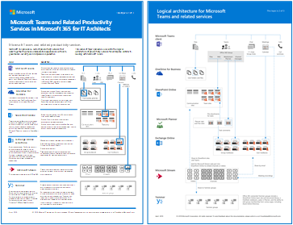
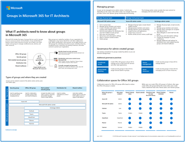
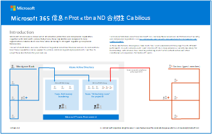
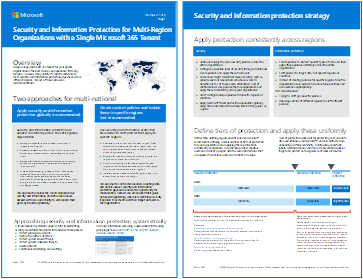
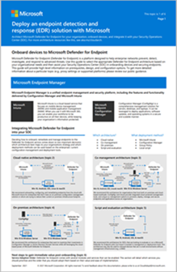
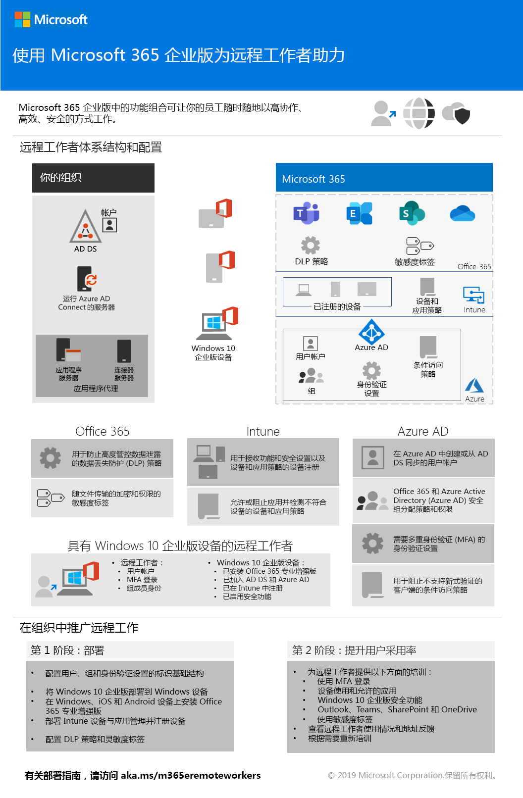

# Microsoft 365 生产力插图

企业Microsoft 365系列提供了实现 Microsoft 365 功能的指南，尤其是跨技术（包括Teams图表）的功能。

## 面向 IT 架构师的 Microsoft 365 中的 Microsoft Teams 和相关生产力服务
Microsoft 365 中生产力服务的逻辑体系结构，以 Microsoft Teams 为主导。

| Item | 说明 |
|:-----|:-----|
|   [PDF](https://github.com/MicrosoftDocs/microsoft-365-docs/raw/public/microsoft-365/downloads/msft-m365-teams-logical-architecture.pdf) \| [Visio](https://github.com/MicrosoftDocs/microsoft-365-docs/raw/public/microsoft-365/downloads/msft-m365-teams-logical-architecture.vsdx)   2021 年 1 月更新   |Microsoft 提供了一系列生产力服务，这些服务协同工作，提供数据治理、安全性和符合性相关功能的协作体验。    此系列图示展示了企业架构师生产力服务的逻辑体系结构，以 Microsoft Teams 为主导。|

## 公司与 Microsoft 365 通信 — Contoso 案例研究
员工参与度是任何组织的工作场所满意度、保留率和工作效率的重要参与者。 跨Microsoft 365，有多种方法可以沟通和吸引受众。 

了解 (使用的方法) 组合，以及何时使用它们取决于受众和组织的通信文化。 

| Item | 说明 |
|:-----|:-----|
|   [PDF](https://download.microsoft.com/download/0/3/4/034fbee5-ecf4-4559-86d3-815e898f21ea/contoso-corporate-communication-poster.pdf) \| [Visio](https://download.microsoft.com/download/0/3/4/034fbee5-ecf4-4559-86d3-815e898f21ea/contoso-corporate-communication-poster.vsdx)   2022 年 1 月更新   |此海报说明了 Contoso 如何跨热门通信方案使员工了解情况并让他们参与。 Contoso 使用各种 M365 应用，包括新产品/服务 Viva Connections。  **相关解决方案指南**   <ul><li>[组织通信：指南、方法和产品](/sharepoint/corporate-communications-overview)|

## 面向 IT 架构师的 Microsoft 365 中的组
此图包括 IT 架构师有关组Microsoft 365的信息。 若要了解如何配置和管理 Microsoft 365 组和团队，以在组织中进行协作，请参阅使用 Microsoft 365 设置安全协作[和](/microsoft-365/solutions/setup-secure-collaboration-with-teams)[什么是协作治理？。](/microsoft-365/solutions/collaboration-governance-overview)

| Item | 说明 |
|:-----|:-----|
|   [PDF](https://github.com/MicrosoftDocs/microsoft-365-docs/raw/public/microsoft-365/downloads/msft-m365-groups.pdf) \| [Visio](https://github.com/MicrosoftDocs/OfficeDocs-Enterprise/raw/live/Enterprise/downloads/msft-m365-groups.vsdx)   2020 年 5 月更新|这些图示详细介绍了不同类型的组，如何创建和管理这些组，以及一些治理建议。|

## 迁移到 Microsoft 365

Microsoft 提供了用于将本地网络文件共享和 SharePoint Server 网站迁移到 Microsoft 365，强调在迁移过程中保护和确保内容的安全性。 这组插图演示了可用于将内容移动到 SharePoint、Teams 和 OneDrive 的各种方法，以及数据在过程中如何流动。

| Item | 说明 |
|:-----|:-----|
| 
 [PDF](https://download.microsoft.com/download/0/5/b/05b7fb7c-1557-4ebb-9036-c5fc3a4cd94c/m365-migration-posters-mm-spmt.pdf)\|[Visio](https://download.microsoft.com/download/0/5/b/05b7fb7c-1557-4ebb-9036-c5fc3a4cd94c/m-365-migration-posters-mm-spmt.vsdx) 
 2021 年 3 月更新 |包括： <ul><li> 文件共享迁移</li><li>SharePoint Server 迁移</li></ul> 
 有关详细信息，请参阅[将内容迁移到Microsoft 365。](/sharepointmigration/migrate-to-sharepoint-online)|

## Microsoft 365信息保护和合规性功能

Microsoft 365包括一组广泛的信息保护和合规性功能。 这些功能与 Microsoft 的生产力工具一起旨在帮助组织实时协作，同时遵守严格的法规合规性框架。

这组插图使用监管最严格的行业之一金融服务，演示如何应用这些功能来解决常见的法规要求。 可随时根据自己的使用情况来修改这些插图。

| 项目 | 说明 |
|:-----|:-----|
|   英语：[以 PDF 格式下载](https://download.microsoft.com/download/3/a/6/3a6ab1a3-feb0-4ee2-8e77-62415a772e53/m365-compliance-illustrations.pdf)  \| [以 Visio 格式下载](https://download.microsoft.com/download/3/a/6/3a6ab1a3-feb0-4ee2-8e77-62415a772e53/m365-compliance-illustrations.vsdx)   日语：[以 PDF 格式下载](https://download.microsoft.com/download/6/f/1/6f1a7d0e-dd8e-442e-b073-8e94327ae4f8/m365-compliance-illustrations.pdf)  \| [以 Visio 格式下载](https://download.microsoft.com/download/6/f/1/6f1a7d0e-dd8e-442e-b073-8e94327ae4f8/m365-compliance-illustrations.vsdx)   2020 年 11 月更新|包括： <ul><li>  Microsoft 信息保护和数据丢失防护</li><li>保留策略和保留标签 </li><li>信息屏障</li><li>通信合规性</li><li>内部风险</li><li>第三方数据摄取</li>|

## 多区域组织安全和信息保护
具有单个租户的多区域组织的安全和信息Microsoft 365保护

| Item | 说明 |
|:-----|:-----|
|   [PDF](https://github.com/MicrosoftDocs/microsoft-365-docs/raw/public/microsoft-365/downloads/msft-security-info-protect-multi-region.pdf) \| [Visio](https://github.com/MicrosoftDocs/microsoft-365-docs/raw/public/microsoft-365/downloads/msft-security-info-protect-multi-region.vsdx) 2020 年 3 月更新 |出于多种原因，使用单一 Microsoft 365 租户，为全球组织提供最佳选择和体验。 但是，许多架构师都在为如何满足不同地区的安全性和信息保护目标而苦恼。 这组主题提供了建议。 |

## Microsoft Defender for Endpoint 部署策略

根据你的环境，某些工具更适合某些体系结构。

| Item | 说明 |
|:-----|:-----|
|  [PDF](https://download.microsoft.com/download/5/6/0/5609001f-b8ae-412f-89eb-643976f6b79c/mde-deployment-strategy.pdf)  \| [Visio](https://download.microsoft.com/download/5/6/0/5609001f-b8ae-412f-89eb-643976f6b79c/mde-deployment-strategy.vsdx)  2021 年 9 月更新| 体系结构资料有助于规划如下体系结构的部署： <ul><li> 云-本机 </li><li> 协同管理 </li><li> 本地</li><li>评估和本地载入</li>

<!--

## Zero Trust identity and device protection for Microsoft 365

Recommended Zero Trust capabilities for protecting identities and devices that access Microsoft 365, other SaaS services, and on-premises applications published with Azure AD Application Proxy.

| Item | Description |
|:-----|:-----|
|    [View as a PDF](../downloads/MSFT_cloud_architecture_identity&device_protection.pdf) \| [Download as a PDF](https://github.com/MicrosoftDocs/microsoft-365-docs/raw/public/microsoft-365/downloads/MSFT_cloud_architecture_identity&device_protection.pdf)  \| [Download as a Visio](https://github.com/MicrosoftDocs/microsoft-365-docs/raw/public/microsoft-365/downloads/MSFT_cloud_architecture_identity&device_protection.vsdx)   Updated November 2021|It's important to use consistent levels of protection across your data, identities, and devices. This model shows you which Zero Trust capabilities are comparable with more information on capabilities to protect identities and devices.    |

--> 

##Advanced eDiscovery体系结构Microsoft 365

Advanced eDiscovery端到端工作流和数据流，Microsoft 365多地理位置环境中。

| Item | 说明 |
|:-----|:-----|
|   [以图像视图](../media/solutions-architecture-center/m365-advanced-ediscovery-architecture.png) \|[以 PDF 格式下载](https://download.microsoft.com/download/d/1/c/d1ce536d-9bcf-4d31-b75b-fcf0dc560665/m365-advanced-ediscovery-architecture.pdf) \|[下载为Visio](https://download.microsoft.com/download/d/1/c/d1ce536d-9bcf-4d31-b75b-fcf0dc560665/m365-advanced-ediscovery-architecture.vsdx)     更新时间：2020年 10 月|包括： <ul><li>  单个环境中端到端工作流</li><li>多地理位置环境中Microsoft 365端到端工作流 </li><li>支持 EDRM 工作流的端到端数据流</li> |

## Microsoft 电话解决方案

当你开始在 Microsoft 云中使用 Teams 时，Microsoft 支持多种选项。此海报可帮助你确定哪种 Microsoft 电话解决方案（云端的电话系统或本地企业语音）适合你组织中的用户，以及你的组织如何连接到公用电话交换网 (PSTN)。

| Item | 说明 |
|:-----|:-----|
|   [PDF](https://download.microsoft.com/download/4/3/5/435cd4e9-ca56-4fd1-acb6-d1fda7952320/microsoft-voice-solutions.pdf) \| [Visio](https://download.microsoft.com/download/7/5/c/75c13012-e20c-48bd-a6dd-ea49d1a3420d/microsoft-voice-solutions.vsdx)  2021 年 3 月更新 | 有关详细信息，请参阅规划[语音Teams解决方案](/microsoftteams/cloud-voice-landing-page)。|

## 设置混合作业的基础结构

借助 Microsoft 365 和其他 Microsoft 云技术，你可以为工作人员提供安全访问组织的本地和基于云的信息、工具和资源。

  
[PDF](https://download.microsoft.com/download/9/b/b/9bb5fa79-74e9-497b-87c5-4021e53d9fc2/hybrid-worker-infrastructure.pdf)  | [PowerPoint](https://download.microsoft.com/download/9/b/b/9bb5fa79-74e9-497b-87c5-4021e53d9fc2/hybrid-worker-infrastructure.pptx)  
2021 年 6 月更新

有关详细信息，请参阅此海报文章：使用 Microsoft 365[设置混合工作的基础结构](empower-people-to-work-remotely.md)。

## Microsoft Teams安全隔离

使用 Microsoft 365，可以在 Microsoft Teams 中配置专用团队，并使用 SharePoint 网站安全设置和唯一的敏感度标签加密文件，以便只有团队成员可以解密文件。

  
[PDF](https://github.com/MicrosoftDocs/microsoft-365-docs/raw/public/microsoft-365/downloads/team-security-isolation-poster.pdf)  | [PowerPoint](https://download.microsoft.com/download/8/0/5/8057fc16-c044-40b6-a652-7ed555ba2895/team-security-isolation-poster.pptx)  
2020 年 8 月更新

有关详细信息，请参阅此海报文章： [使用安全隔离配置团队](secure-teams-security-isolation.md)。

## 另请参阅

[SharePoint、Exchange、Skype for Business 和 Lync 的体系结构模型](../enterprise/architectural-models-for-sharepoint-exchange-skype-for-business-and-lync.md)

[云采用测试实验室指南 (TLG)](../enterprise/cloud-adoption-test-lab-guides-tlgs.md)
