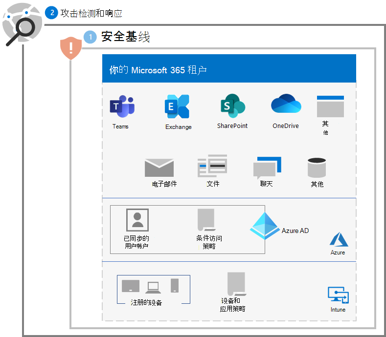
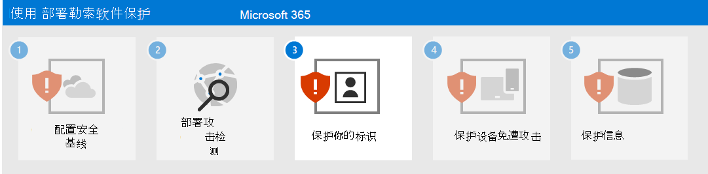

# 步骤 2. 部署攻击检测和响应

在 Microsoft 365 租户中进行勒索软件攻击检测和响应时，强烈建议采用的第一步是 [设置试用环境](/microsoft-365/security/defender/eval-overview) 来评估 Microsoft 365 Defender 的特性和功能。

有关详细信息，请参阅下列资源。

| 功能 | 说明 | 从何处开始？ | 如何将其用于检测和响应 |
|:-------|:-----|:-------|:-------|
| [Microsoft 365 Defender](/microsoft-365/security/defender) | 合并信号并将功能整合到单个解决方案中。    支持安全专业人员汇集威胁信号，并确定威胁的完整范围和影响。    自动执行操作，以防止或停止攻击并自我修复受影响的邮箱、终结点和用户标识。 | [入门](/microsoft-365/security/defender/get-started) | [事件响应](/microsoft-365/security/defender/incidents-overview) |
| [Microsoft Defender for Identity](/defender-for-identity/what-is) |  使用你的本地 Active Directory 域服务 (AD DS) 信号通过基于云的安全接口来识别、检测和调查针对组织的高级威胁、身份盗用和恶意内部行为。 | [概述](/defender-for-identity/what-is) | [使用Microsoft Defender for Identity 门户](/defender-for-identity/workspace-portal) |
| [Microsoft Defender for Office 365](/microsoft-365/security/office-365-security) | 保护你的组织免受电子邮件、链接 (URL) 和协作工具带来的恶意威胁。    防范恶意软件、网络钓鱼、欺骗和其他攻击类型。 | [概述](/microsoft-365/security/office-365-security/overview) | [威胁搜寻](/microsoft-365/security/office-365-security/threat-hunting-in-threat-explorer) |
| [Microsoft Defender for Endpoint](/microsoft-365/security/defender-endpoint) | 支持跨终结点（设备）检测和响应高级威胁。 | [概述](/microsoft-365/security/defender-endpoint/microsoft-defender-endpoint)  | [终结点检测和响应](/microsoft-365/security/defender-endpoint/overview-endpoint-detection-response) |
| [Azure Active Directory (Azure AD) 标识保护](/azure/active-directory/identity-protection/) | 自动检测和修正基于标识的风险并调查这些风险。 | [概述](/azure/active-directory/identity-protection/overview-identity-protection) | [调查风险](/azure/active-directory/identity-protection/howto-identity-protection-investigate-risk) |
| [Microsoft Defender for Cloud Apps](/cloud-app-security) | 用于发现、调查和治理跨所有 Microsoft 和第三方云服务的云访问安全代理。 | [概述](/cloud-app-security/what-is-cloud-app-security) | [调查](/cloud-app-security/investigate) |

>[!Note]
>所有这些服务都需要使用具有 Microsoft 365 E5 安全加载项的 Microsoft 365 E5 或 Microsoft 365 E3。
>

使用这些服务检测和响应来自勒索软件攻击者的以下常见威胁：

- 凭据盗窃

   - Azure AD 标识保护
   - Defender for Identity
   - Defender for Office 365

- 设备泄漏

   - Defender for Endpoint
   - Defender for Office 365

- 特权提升

   - Azure AD 标识保护
   - Defender for Cloud Apps

- 恶意应用行为

   - Defender for Cloud Apps

- 数据外泄、删除或上传

   - Defender for Office 365
   - 包含 [异常检测策略](/cloud-app-security/anomaly-detection-policy#ransomware-activity) 的 Defender for Cloud Apps

以下服务使用 Microsoft 365 Defender 及其门户（https://security.microsoft.com) 作为常见威胁收集和分析点：

- Defender for Identity
- Defender for Office 365
- Defender for Endpoint
- Defender for Cloud Apps

Microsoft 365 Defender 将威胁信号合并到警报中，并将连接的警报合并到事件中，以便安全分析师可以更快地检测、调查和修正勒索软件攻击的阶段。

## 生成的配置

步骤 1 和 2 是对你的租户的勒索软件保护。

## 后续步骤

继续执行 [步骤 3](ransomware-protection-microsoft-365-identities.md) 来保护 Microsoft 365 租户中的标识。
