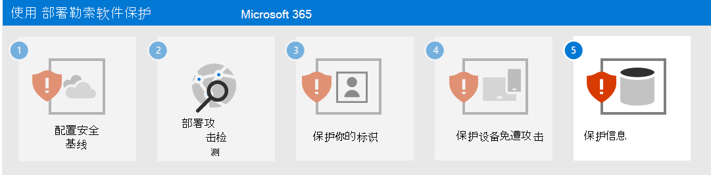

# 步骤 4. 保护设备

为了帮助保护设备免受勒索软件攻击的初始访问部分：

- 将 [Intune](/mem/intune/fundamentals/what-is-intune) 部署为移动设备管理 (MDM) 和移动应用管理 (MAM) 服务提供商，并注册组织拥有的设备。
- 执行[通用标识和设备访问策略](/microsoft-365/security/office-365-security/identity-access-policies) ，验证用户帐户凭据以及设备运行状况和合规性要求。
- 在 Microsoft Defender for Endpoint 和 Microsoft 365 Defender 中启用[网络保护](/microsoft-365/security/defender-endpoint/network-protection)。
- 在 Microsoft Defender SmartScreen 中配置[站点和下载检查](/windows/security/threat-protection/microsoft-defender-smartscreen/microsoft-defender-smartscreen-available-settings)以及[应用和文件检查](/windows/security/threat-protection/microsoft-defender-smartscreen/microsoft-defender-smartscreen-available-settings)以阻止或发出警告。
- 启用 [Microsoft Defender 防病毒扫描已下载文件和附件](/microsoft-365/security/defender-endpoint/configure-advanced-scan-types-microsoft-defender-antivirus)。
- 在 Microsoft Defender for Endpoint 和 Microsoft 365 Defender 中将 **远程桌面安全级别** 设置为 **TLS**。

## Windows 10 设备

若要帮助抵御来自 Windows 10 设备的横向移动攻击，请执行以下操作：

- [打开 Microsoft Defender 防火墙](https://support.microsoft.com/windows/turn-microsoft-defender-firewall-on-or-off-ec0844f7-aebd-0583-67fe-601ecf5d774f)。
- [更新 Microsoft Defender 防病毒定义](/en-us/microsoft-365/security/defender-endpoint/manage-updates-baselines-microsoft-defender-antivirus)。

若要降低攻击的影响，请：

- 对勒索软件使用[高级保护](/Microsoft-365/security/defender-endpoint/attack-surface-reduction#use-advanced-protection-against-ransomware)。

若要帮助防止攻击者规避安全防御措施，请执行以下操作：

- 保持打开 Microsoft Defender 防病毒中的[云传递保护](/microsoft-365/security/defender-endpoint/enable-cloud-protection-microsoft-defender-antivirus)。
- 保持打开 Microsoft Defender 防病毒中的[实时行为监视](/microsoft-365/security/defender-endpoint/configure-real-time-protection-microsoft-defender-antivirus)。
- 启用[实时保护](/microsoft-365/security/defender-endpoint/configure-real-time-protection-microsoft-defender-antivirus)。
- 启用 [Microsoft Defender for Endpoint 中的防篡改保护](/microsoft-365/security/defender-endpoint/prevent-changes-to-security-settings-with-tamper-protection)，防止对安全设置进行恶意更改。

若要帮助防止攻击者在攻击过程中执行代码，请执行以下操作：

- 启用 [Microsoft Defender 防病毒](/mem/intune/user-help/turn-on-defender-windows)。
- [阻止从 Office 宏进行的 Win32 API 调用](/microsoft-365/security/defender-endpoint/attack-surface-reduction-rules#block-win32-api-calls-from-office-macros)。
- 使用[此过程](https://www.microsoft.com/microsoft-365/blog/2010/02/16/migrating-excel-4-macros-to-vba/)将所有需要 Excel 4.0 宏的旧工作簿迁移到更新的 VBA 宏格式。
- [禁用未签名的宏](https://support.microsoft.com/topic/enable-or-disable-macros-in-office-files-12b036fd-d140-4e74-b45e-16fed1a7e5c6)。 确保对具有业务需求的所有内部宏都进行签名，并利用[受信任的位置](/deployoffice/security/designate-trusted-locations-for-files-in-office)来确保未知宏不会在你的环境中运行。
- 通过确保运行时宏扫描已启用[反恶意软件扫描接口](https://www.microsoft.com/security/blog/2021/03/03/xlm-amsi-new-runtime-defense-against-excel-4-0-macro-malware/) (AMSI) 来停止恶意 XLM 或 VBA 宏。 如果 **宏运行时扫描作用域** 的组策略设置设为 **为所有文件启用** 或 **为低信任文件启用**，则此功能（默认启用）处于启用状态。 获取最新的组策略模板文件。

## 对用户和更改管理的影响

在实施这些保护时，请对以下内容执行更改管理：

- [通用标识和设备访问策略](/microsoft-365/security/office-365-security/identity-access-policies)可以拒绝具不符合要求的设备的用户访问。
- 下载文件可能会在下载前警告用户，否则可能会被阻止。
- 某些 Office、Excel 4.0、XLM 或 VBA 宏可能不再运行。

## 生成的配置

步骤 1-4 是对你的租户提供的勒索软件保护。

## 后续步骤

继续执行[步骤 5](ransomware-protection-microsoft-365-information.md) 来保护 Microsoft 365 租户中的信息。 
