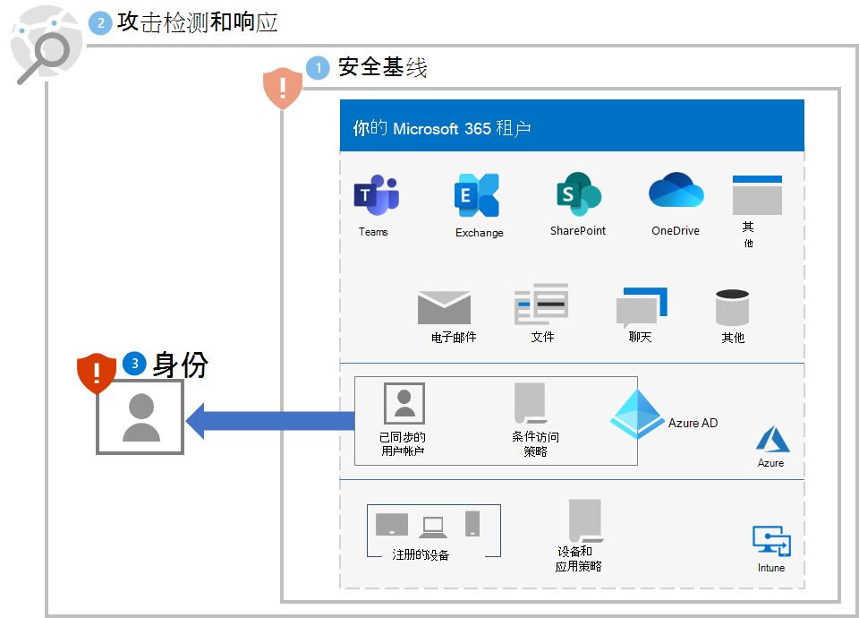
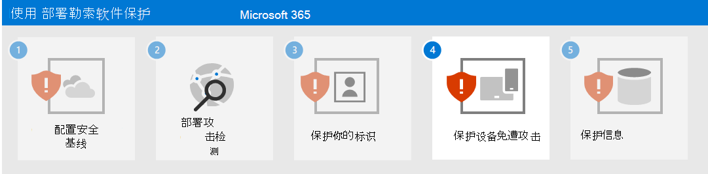

# 第 3 步。 保护身份

使用以下部分保护你的组织免受凭据泄露，这通常是更大规模的勒索软件攻击的第一阶段。

## 提升登录安全性

对 Azure Active Directory (Azure AD) 中的用户帐户使用[无密码身份验证](/azure/active-directory/authentication/howto-authentication-passwordless-deployment)。

在过渡到无密码身份验证期间，请对仍使用密码身份验证的用户帐户使用以下最佳做法：

- 使用 [Azure AD 密码保护](/azure/active-directory/authentication/concept-password-ban-bad) 阻止已知弱密码和自定义密码。
- 使用 Azure AD 密码保护将已知弱密码和自定义密码阻止扩展到[本地 Active Directory 域服务 (AD DS)](/azure/active-directory/authentication/concept-password-ban-bad-on-premises)。
- 允许用户使用[自助密码重置 (SSPR)](/azure/active-directory/authentication/concept-sspr-howitworks)更改自己的密码。 

接下来，实施 [通用身份和设备访问策略](/microsoft-365/security/office-365-security/identity-access-policies)。 这些策略为访问 Microsoft 365 云服务提供了更高的安全性。 

针对用户登录，这些策略包括：

- 要求优先级帐户使用 MFA (立即)，并最终推广到所有用户帐户。
- 要求高风险登录使用 MFA。
- 要求具有高风险登录的高风险用户更改其密码。

## 防止特权提升

请使用这些最佳做法：

- 实施[最小特权](/windows-server/identity/ad-ds/plan/security-best-practices/implementing-least-privilege-administrative-models)原则，并按[提高登录安全性](#increase-sign-in-security)中所述，对仍使用密码登录的用户帐户使用密码保护。 
- 避免使用域范围的管理员级别服务帐户。 
- 限制本地管理权限，以限制远程访问特洛伊木马程序 (RAT) 和其他不需要的应用程序。
- 在允许访问管理门户之前，使用 Azure AD 条件访问显式验证用户和工作站的信任。 请参阅 Microsoft Azure 门户的[此示例](/azure/active-directory/conditional-access/howto-conditional-access-policy-azure-management)。
- 启用本地管理员密码管理。
- 确定高特权帐户登录和公开凭据的地方。 工作站上不应存在高特权帐户。
- 禁用密码和凭据的本地存储。

## 对用户和变更管理的影响

你必须使组织中的用户了解：

- 更强的密码的新要求。
- 登录过程的更改，例如要求使用 MFA 和 MFA 辅助身份验证方法注册。
- 使用 SSPR 进行密码维护。 例如，不再呼叫支持人员进行密码重置。
- 对确定存在风险的登录提示要求使用 MFA 或更改密码。

## 生成的配置

步骤 1-3 是对你的租户的勒索软件保护。

## 后续步骤

继续执行[步骤 4](ransomware-protection-microsoft-365-devices.md)来保护你的 Microsoft 365 租户的设备(终结点)。 
