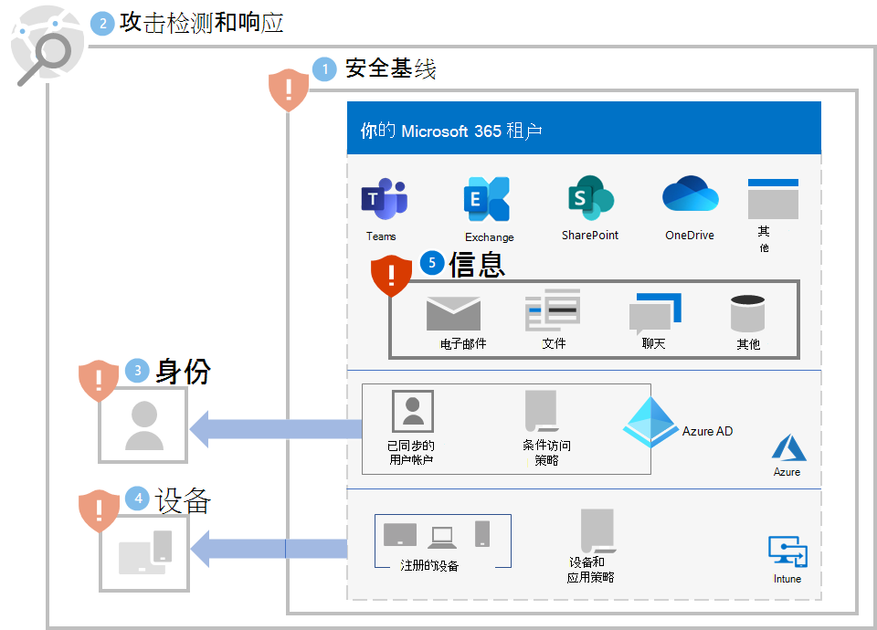

# 步骤 5. 保护信息

由于勒索软件攻击者还将查看位于文件、数据库和其他类型服务器上的本地数据，因此保护该数据的最佳方法之一是将其迁移到 Microsoft 365 租户。 迁移完成后，可通过内置的缓解和恢复功能（如 [版本控制、回收站和文件还原](ransomware-protection-microsoft-365.md#ransomware-mitigation-and-recovery-capabilities-provided-with-microsoft-365)）对其进行保护。

要在 Microsoft 365 租户中提供敏感信息的其他保护，请执行以下操作：

- 定位敏感信息。
- 实施严格的权限并消除广泛的访问权限（例如，具有写入、编辑和删除功能的用户过多）。
- 保护敏感信息。

>[!Note]
>有关 Microsoft 365 租户中信息保护的详细部署指南，请参阅 [部署数据隐私法规的信息保护](information-protection-deploy.md)。 尽管这些指南适用于数据隐私法规，但大部分内容也适用于勒索软件保护。
>

## 定位敏感信息

第一个任务是 [识别租户中敏感信息的类型和位置](/microsoft-365/compliance/information-protection#know-your-data)，其中可能包含以下类型：

- 敏感
- 专有或知识产权
- 受监管，此类区域性法规指定个人身份信息保护 (PII)
- IT 恢复计划

对于每种类型的敏感信息，请确定以下内容：

- 组织对信息的使用
- 如果该信息被控制用于勒索，其货币值的相对度量值（如高、中、低）
- 其当前位置，例如 OneDrive 或 SharePoint 文件夹或协作地点（如 Microsoft Teams 团队）
- 当前权限，包括：

   - 有权访问它的用户帐户

   - 允许对每个有权访问它的帐户执行的操作

## 对具有敏感信息的位置实施严格权限

在 Microsoft 365 租户中使用严格权限是位置和通信场所的最小特权原则，在 Microsoft 365 中通常是 OneDrive 文件夹、SharePoint 网站和文件夹以及团队。 

虽然可以更轻松地创建具有广泛访问权限的文件存储位置或团队（例如组织中每个人的默认设置），但对于敏感信息，允许的用户帐户和允许的操作必须限制为满足协作和业务要求所需的最低设置。

勒索软件攻击者渗透到你的租户后，他们尝试通过破解在租户内具有广泛权限范围的用户帐户的凭据来提升其特权，例如管理员角色帐户或有权访问敏感信息的用户帐户。 

根据这种典型的攻击者行为，攻击者有两个难度级别：

- **低：** 攻击者可以使用低权限帐户并发现敏感信息，因为该账户在整个租户内都具有广泛的访问权限。
- **较高：** 攻击者不能使用低权限账户并发现敏感信息，因为权限严格。他们必须通过确定并破解有权访问具有敏感信息位置的帐户的凭据来提升其权限，但之后可能只能执行有限的操作。

对于敏感信息，必须尽可能提高其难度级别。

可以通过以下步骤确保租户中的严格权限：

1. 从 [定位敏感信息](#locate-your-sensitive-information) 的工作中，查看敏感信息位置的权限。 
2. 在满足协作和业务要求的同时，对敏感信息实施严格权限，并通知受影响的用户。
3. 为用户执行更改管理，以便使用严格的权限创建和维护敏感信息的未来位置。
4. 审核和监视敏感信息的位置，以确保未授予广泛权限。

请参阅 [设置与 Microsoft 365 和 Microsoft Teams 的安全协作](setup-secure-collaboration-with-teams.md)，以获取详细的指南。 具有敏感信息严格权限的通信和协作场所的一个示例是 [具有安全隔离的团队](/microsoft-365/solutions/secure-teams-security-isolation)。

## 保护敏感信息

要保护敏感信息，以防勒索软件攻击者有权访问，请执行以下操作：

- 使用 [受控文件夹访问权限](/windows/security/threat-protection/microsoft-defender-atp/controlled-folders) 提高未经授权的应用程序修改受控文件夹中数据的难度。

- 使用 [Microsoft 信息保护](/microsoft-365/compliance/information-protection) 和敏感度标签，并将其应用于敏感信息。 可以将敏感度标签配置为使用已定义用户账户和允许操作作为额外的加密和权限。 使用此类型的敏感度标签标记的文件（从租户外泄）将仅可由标签中定义的用户帐户使用。

- 使用 Microsoft 365 [数据丢失防护 (DLP)](/microsoft-365/compliance/dlp-learn-about-dlp) 根据内部和外部敏感度标签来检测、警告和阻止对包含个人或机密信息的数据进行有风险、无意或不当共享。

- 使用 [ Microsoft Cloud App Security](/cloud-app-security/what-is-cloud-app-security) 阻止下载敏感信息（例如，文件）。 还可以使用 [云应用安全异常检测策略](/cloud-app-security/anomaly-detection-policy#ransomware-activity) 来检测高速文件上传或文件删除活动。

## 对用户和更改管理的影响

对广泛权限的管理更改可能导致拒绝用户访问或无法执行某些操作。

此外，为了保护 Microsoft 365 租户中的敏感信息，请训练用户：

- 创建具有严格权限的通信和协作场所（访问权限的最小用户帐户集以及每个用户账户的最小允许操作集）。 
- 将适当的敏感度标签应用于敏感信息。
- 使用受控文件夹访问。

## 生成的配置

步骤 1-5 是对你的租户提供的勒索软件保护。

## 其他勒索软件资源

来自 Microsoft 的关键信息：

- [日趋严重的勒索软件威胁](https://blogs.microsoft.com/on-the-issues/2021/07/20/the-growing-threat-of-ransomware/)，2021 年 7 月 20 日 Microsoft 关于问题的博客文章
- [人工操作的勒索软件](/security/compass/human-operated-ransomware)
- [快速防范勒索软件和勒索](/security/compass/protect-against-ransomware)
- [2021 Microsoft 数字防御报告](https://www.microsoft.com/security/business/microsoft-digital-defense-report)（请参阅第 10-19 页）
- Microsoft 365 Defender 门户的 **威胁分析** 节点中的 **勒索软件：普遍且持续的威胁** 报告（请参阅这些 [许可要求](/microsoft-365/security/defender/prerequisites#licensing-requirements)）

Microsoft 365：

- [使用 Azure 和 Microsoft 365 最大化勒索软件复原能力](https://azure.microsoft.com/resources/maximize-ransomware-resiliency-with-azure-and-microsoft-365/)
- [从勒索软件攻击中恢复](/microsoft-365/security/office-365-security/recover-from-ransomware)
- [恶意软件和勒索软件防护](/compliance/assurance/assurance-malware-and-ransomware-protection)
- [保护你的 Windows 10 电脑免受勒索软件攻击](https://support.microsoft.com//windows/protect-your-pc-from-ransomware-08ed68a7-939f-726c-7e84-a72ba92c01c3)
- [在 SharePoint Online 中处理勒索软件](/sharepoint/troubleshoot/security/handling-ransomware-in-sharepoint-online)

Microsoft 365 Defender：

- [使用高级搜寻查找勒索软件](/microsoft-365/security/defender/advanced-hunting-find-ransomware)

Microsoft Azure：

- [针对勒索软件攻击的 Azure 防御](https://azure.microsoft.com/resources/azure-defenses-for-ransomware-attack/)
- [使用 Azure 和 Microsoft 365 最大化勒索软件复原能力](https://azure.microsoft.com/resources/maximize-ransomware-resiliency-with-azure-and-microsoft-365/)
- [备份和还原计划以防范勒索软件](/security/compass/backup-plan-to-protect-against-ransomware)
- [使用 Microsoft Azure 备份帮助防范勒索软件](https://www.youtube.com/watch?v=VhLOr2_1MCg)（26 分钟视频）
- [从系统性标识泄露中恢复](/azure/security/fundamentals/recover-from-identity-compromise)
- [Azure Sentinel 中的高级多阶段攻击检测](/azure/sentinel/fusion#ransomware)
- [Azure Sentinel 中勒索软件融合检测](https://techcommunity.microsoft.com/t5/azure-sentinel/what-s-new-fusion-detection-for-ransomware/ba-p/2621373)

Microsoft Cloud App Security：

-  [在 Cloud App Security 中创建异常检测策略](/cloud-app-security/anomaly-detection-policy)

Microsoft 安全团队博客文章：

- [防范和从勒索软件中恢复的 3 个步骤（2021 年 9 月）](https://www.microsoft.com/security/blog/2021/09/07/3-steps-to-prevent-and-recover-from-ransomware/)
- [通过了解网络安全风险以增强恢复能力：第 4 部分 - 浏览当前威胁（2021 年 5 月）](https://www.microsoft.com/security/blog/2021/05/26/becoming-resilient-by-understanding-cybersecurity-risks-part-4-navigating-current-threats/)

  请参阅 **勒索软件** 部分。

- [人为操作的勒索软件攻击：可预防的灾难（2020 年 3 月）](https://www.microsoft.com/security/blog/2020/03/05/human-operated-ransomware-attacks-a-preventable-disaster/)

  包括对实际攻击的攻击链分析。

- [勒索软件应对 - 是否支付勒索金额？（2019 年 12 月）](https://www.microsoft.com/security/blog/2019/12/16/ransomware-response-to-pay-or-not-to-pay/)
- [Norsk Hydro 以透明方式应对勒索软件攻击（2019 年 12 月）](https://www.microsoft.com/security/blog/2019/12/17/norsk-hydro-ransomware-attack-transparency/)

