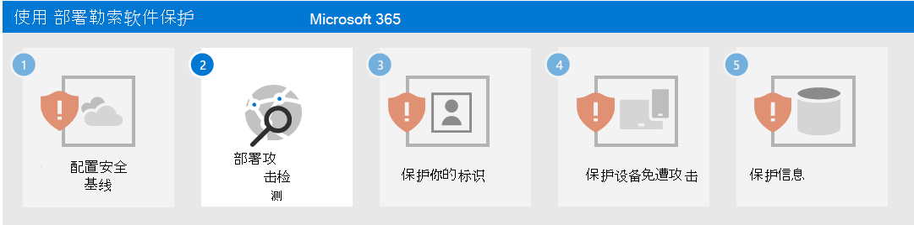

# 步骤 1. 配置安全基线

作为应对勒索软件攻击者的第一步，必须配置以下 Microsoft 定义的安全基线：

- [Microsoft 365 安全中心](#microsoft-365-security-baseline)
- [Exchange 电子邮件管理](#exchange-email-management-baseline)
- [Windows 设备和客户端软件的其他基线](#additional-baselines)

这些基线包含攻击者熟知的配置设置和规则，缺少这些设置和规则会很快被注意到并经常被利用。

## Microsoft 365 安全中心基线

首先，使用 [Microsoft 安全功能分数](/microsoft-365/security/defender/microsoft-secure-score)评估和衡量安全状况，并根据需要按照说明进行改进。

接下来，使用 [攻击面减少规则](/microsoft-365/security/defender-endpoint/attack-surface-reduction-rules-deployment) 帮助阻止可疑活动和易受攻击的内容。这些规则包括阻止：

- 所有 Office 应用程序创建子进程
- 来自电子邮件客户端和 Web 邮件的可执行内容
- 运行可执行文件 (除非其符合传播度、年龄或受信任列表的条件)
- 执行含义可能模糊的脚本
- 启动下载的可执行内容的 JavaScript 或 VBScript
- Office 应用程序创建可执行内容
- Office 应用程序将代码注入其他进程
- Office 通信应用程序创建子进程
- 从 USB 运行的不受信任的和未签名的进程
- 通过 Windows 管理接口 (WMI) 事件订阅持久化
- 从 Windows 本地安全机构子系统 (lsass.exe) 窃取凭据
- 源自 PSExec 和 WMI 命令的进程创建

## Exchange 电子邮件管理基线 

通过以下 Exchange 电子邮件基线设置，帮助阻止对租户始于电子邮件攻击的初始访问：

- 启用 Microsoft Defender 防病毒电子邮件扫描。
- 使用 Microsoft Defender for Office 365 [增强网络钓鱼防护](/microsoft-365/security/office-365-security/anti-phishing-protection)，并涵盖新威胁和多态变体。
- 检查你的 Office 365 电子邮件筛选设置，以确保阻止欺骗性电子邮件、垃圾邮件和带恶意软件的电子邮件。 使用 Defender for Office 365 增强网络钓鱼防护，并涵盖新威胁和多态变体。 将 Defender for Office 365 配置为[单击时重新检查链接](/microsoft-365/security/office-365-security/atp-safe-links)并[删除送达的邮件](/microsoft-365/security/office-365-security/zero-hour-auto-purge)，以响应新获取的威胁情报。
- 查看并更新为最新的 [用于 EOP 和 Defender for Office 365 安全性的建议设置](/microsoft-365/security/office-365-security/recommended-settings-for-eop-and-office365-atp)。
- 将 Defender for Office 365 配置为[单击时重新检查链接](/microsoft-365/security/office-365-security/set-up-safe-links-policies)并删除送达的邮件，以响应新获取的威胁情报。

## 其他基线

为以下项目应用 [安全基线](https://techcommunity.microsoft.com/t5/microsoft-security-baselines/bg-p/Microsoft-Security-Baselines)：

- Microsoft Windows 10
- Microsoft 365 企业应用版
- Microsoft Edge

## 对用户和变更管理的影响

作为攻击面减少规则的最佳做法，请打开网络危险和漏洞管理中针对此规则的安全建议，以评估该规则可能对网络产生的影响。 建议详细信息窗格描述了用户影响，可用于确定可以接受在阻止模式下启用规则而不会对用户工作效率产生不利影响的新策略的设备的百分比。

此外，Exchange 电子邮件基线设置可以阻止传入电子邮件并阻止发送电子邮件或单击电子邮件中的链接。 指导员工了解此行为以及采取这些预防措施的原因。

## 生成的配置

下面是此步骤后对你的租户的勒索软件保护。

## 后续步骤

继续执行[步骤 2](ransomware-protection-microsoft-365-attack-detection-response.md)，为你的 Microsoft 365 租户部署攻击检测和响应功能。
