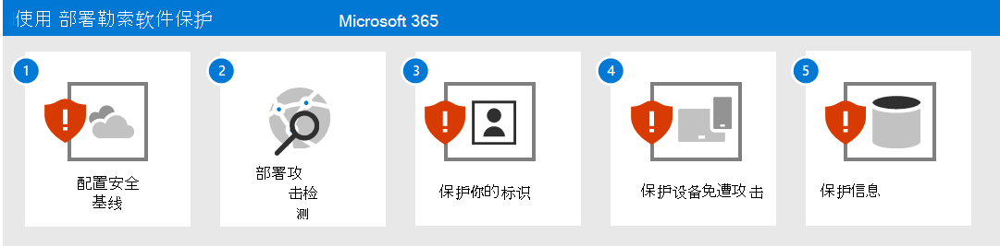
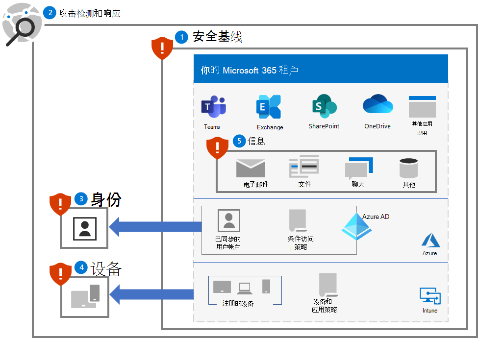
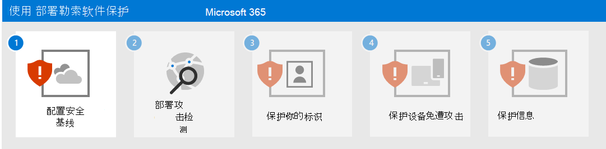

# 为 Microsoft 365 租户部署勒索软件保护

勒索软件是一种勒索攻击，可销毁或加密文件和文件夹，从而阻止访问关键数据。 商品勒索软件通常像病毒一样传播并感染设备，而且仅需要进行恶意软件修正。 人为操作的勒索软件是网络罪犯进行主动攻击的结果，其将侵入组织的本地或云 IT 基础结构、提升其特权，以及将勒索软件部署到关键数据。

攻击完成后，攻击者会从向受害者索取金钱，以交换已删除的文件、加密文件的解密密钥，或承诺不将敏感数据释放到暗网或公共 Internet。 人为操作的勒索软件还可用于关闭关键计算机或流程，如工业生产所需的计算机或流程，使正常的业务运营停止，直到支付勒索金额并修复损坏，或者由组织自行修复损害。

人为操作的勒索软件攻击对于各种规模的企业来说都可能是灾难性的，并且难以清理，需要彻底清除入侵者才能抵御未来攻击。 与商品勒索软件不同，人为操作的勒索软件可以在首次勒索请求后继续威胁企业运营。

>[!Note]
>对 Microsoft 365 租户的勒索软件攻击假定攻击者具有租户的有效用户帐户凭据，并且有权访问用户帐户有权访问的所有文件和资源。 没有任何有效用户帐户凭据的攻击者必须对由 Microsoft 365 默认加密和增强加密的静态数据进行解密。 有关详细信息，请参阅 [加密和密钥管理概述](/compliance/assurance/assurance-encryption)。 
>

有关 Microsoft 产品的勒索软件保护详细信息，请参阅以下 [其他勒索软件资源](#additional-ransomware-resources)。

## 云安全是一项合作关系

Microsoft 云服务的安全性是你与 Microsoft 之间的合作关系：

- Microsoft 云服务以信任和安全为基础。 Microsoft 提供有助于保护数据和应用程序的安全控件和功能。
- 你的数据和身份为个人所有，并且你负责对这些数据和身份、本地资源安全性和所控制的云组件安全性进行保护。

通过结合这些功能和责任，我们可以提供针对勒索软件攻击的最佳保护。

## 与 Microsoft 365 一起提供的勒索软件缓解和恢复功能

一个侵入 Microsoft 365 租户的勒索软件攻击者可以通过以下行为对组织进行勒索：

- 删除文件或电子邮件
- 就地加密文件
- 将文件复制到租户外部（数据外泄）

但是，Microsoft 365 联机服务具有许多内置功能和控件，可保护客户数据免受勒索软件攻击。 以下各节提供了摘要。 有关 Microsoft 如何保护客户数据的详细信息，请参阅[Microsoft 365 中的恶意软件和勒索软件保护](/compliance/assurance/assurance-malware-and-ransomware-protection)。

>[!Note]
>对 Microsoft 365 租户的勒索软件攻击假定攻击者具有租户的有效用户帐户凭据，并且有权访问用户帐户有权访问的所有文件和资源。 没有任何有效用户帐户凭据的攻击者必须对由 Microsoft 365 默认加密和增强加密的静态数据进行解密。 有关详细信息，请参阅 [加密和密钥管理概述](/compliance/assurance/assurance-encryption)。 
>

### 删除文件或电子邮件

SharePoint 和 OneDrive for Business 中的文件受到以下保护：

- 版本控制 

   Microsoft 365 默认保留文件的至少 500 个版本，并可以配置为保留更多版本。 

   若要最大程度地减轻安全和支持人员的负担，请培训用户如何[还原以前版本的文件](https://support.microsoft.com/office/restore-a-previous-version-of-an-item-or-file-in-sharepoint-f66dbda0-81f4-4d1e-b08c-793265c58934)。

- 回收站

   如果勒索软件创建文件的新加密副本并删除旧文件，则客户有 93 天的时间从回收站还原该文件。 93 天后，Microsoft 仍可在 14 天内恢复数据。 
  
   若要最大程度地减轻安全和支持人员的负担，请培训用户如何[从回收站还原文件](https://support.microsoft.com/en-us/office/restore-deleted-items-from-the-site-collection-recycle-bin-5fa924ee-16d7-487b-9a0a-021b9062d14b)。

- [文件还原](https://techcommunity.microsoft.com/t5/microsoft-onedrive-blog/announcing-new-onedrive-for-business-feature-files-restore/ba-p/147436)

   适用于 SharePoint 和 OneDrive 的完整自助式恢复解决方案，允许管理员和最终用户从过去 30 天内的任何时间点还原文件。

   要最大程度地减轻安全和 IT 支持人员的负担，请对用户进行有关[文件还原](https://techcommunity.microsoft.com/t5/microsoft-onedrive-blog/announcing-new-onedrive-for-business-feature-files-restore/ba-p/147436) 的培训。

对于 OneDrive 和 SharePoint 文件，如果你受到大规模攻击，Microsoft 可以回退到最多 14 天内的上一时间点。

电子邮件受到以下保护：

- [单个项目恢复](/exchange/recipients-in-exchange-online/manage-user-mailboxes/enable-or-disable-single-item-recovery) 和邮箱数据保留，可以在意外或恶意提前删除时恢复邮箱中的项目。 默认情况下，你可以回退 14 天内删除的邮件，并可配置为最多 30 天内的邮件。

- [数据保留策略](/exchange/security-and-compliance/messaging-records-management/retention-tags-and-policies) 允许你在配置的保留期内保留电子邮件的不可变副本。

### 就地加密文件

如前文所述，SharePoint 和 OneDrive for Business 中的文件可以通过以下保护免受恶意加密：

- 版本控制
- 回收站
- 保存保留库

有关其他详细信息，请参阅[处理 Microsoft 365 中的数据损坏](/compliance/assurance/assurance-dealing-with-data-corruption)。

### 将文件复制到租户外部 

你可以通过以下方式阻止勒索软件攻击者将文件复制到租户外部：

- [数据丢失防护 （DLP）](/microsoft-365/compliance/dlp-learn-about-dlp) 策略

    检测、警告和阻止有风险的、无意的或不适当的对包含以下内容的数据的共享：

    - 个人信息，例如个人标识信息 （PII），以符合区域隐私法规。

    - 基于敏感度标签的机密组织信息。

- [Microsoft Cloud App Security](/cloud-app-security/what-is-cloud-app-security)

    阻止下载敏感信息，如文件。 

    还可以将会话策略用于[ Microsoft Cloud App Security 条件访问应用程序控件](/cloud-app-security/tutorial-dlp#how-to-discover-and-protect-sensitive-information-in-your-organization)，以实时监视用户和应用程序之间的信息流。

## 此解决方案中的内容

此解决方案将逐步部署 Microsoft 365 保护和缓解功能、配置和持续运营，以最大限度地降低勒索软件攻击者使用 Microsoft 365 租户中的关键数据来对组织进行勒索的能力。

此部署中的步骤如下所述：

1. [配置安全基线](ransomware-protection-microsoft-365-security-baselines.md)
2. [部署攻击检测和响应](ransomware-protection-microsoft-365-attack-detection-response.md)
3. [保护身份](ransomware-protection-microsoft-365-identities.md)
4. [保护设备](ransomware-protection-microsoft-365-devices.md)
5. [保护信息](ransomware-protection-microsoft-365-information.md)

下面是为 Microsoft 365 租户部署的解决方案的五个步骤。

## Microsoft 365 特性和功能

若要保护你的 Microsoft 365 租户免受勒索软件攻击，请使用这些 Microsoft 365 特性和功能，以执行解决方案中的这些步骤。

### 1. 安全基线

| 功能或特性 | 说明 | 帮助... | 颁发许可 |
|:-------|:-----|:-------|:-------|
| Microsoft 安全功能分数 |  衡量 Microsoft 365 租户的安全状态 | 评估安全配置并建议改进。 | Microsoft 365 E3 或 Microsoft 365 E5 |
| 攻击面减少规则 | 使用各种配置设置减少组织受到网络攻击的漏洞 | 阻止可疑活动和易受攻击的内容。 | Microsoft 365 E3 或 Microsoft 365 E5 |
| Exchange 电子邮件设置 |  启用减少组织面对基于电子邮件攻击漏洞的服务 | 阻止通过网络钓鱼和其他基于电子邮件的攻击对租户的初始访问。  | Microsoft 365 E3 或 Microsoft 365 E5 |
| Microsoft Windows、Microsoft Edge 和 Microsoft 365 企业应用版设置 | 提供广为人知且经过充分测试的行业标准安全配置 | 阻止通过 Windows、Edge 和 Microsoft 365 企业应用版进行的攻击。 | Microsoft 365 E3 或 Microsoft 365 E5 |
|

### 2. 检测和响应

| 功能或特性 | 说明 | 帮助检测和响应... | 颁发许可 |
|:-------|:-----|:-------|:-------|
| Microsoft 365 Defender | 合并信号并将功能整合到一个解决方案中    支持安全专业人员汇集威胁信号，并确定威胁的完整范围和影响    自动执行操作，以防止或停止攻击并自我修复受影响的邮箱、终结点和用户身份 | 事件是组合起来的构成的攻击的警报和数据。 | Microsoft 365 E5 或使用 Microsoft 365 E5 安全性加载项的 Microsoft 365 E3 |
| Microsoft Defender for Identity |  通过基于云的安全接口使用你的本地 Active Directory 域服务 (AD DS)信号来识别、检测和调查针对组织的高级威胁、被盗用的身份和恶意内部行为 | AD DS 帐户的凭据泄露。 | Microsoft 365 E5 或使用 Microsoft 365 E5 安全性加载项的 Microsoft 365 E3 |
| Microsoft Defender for Office 365 | 保护你的组织免受电子邮件、链接 (URL) 和协作工具带来的恶意威胁。    防范恶意软件、网络钓鱼、欺骗和其他攻击类型 | 网络钓鱼攻击。 | Microsoft 365 E5 或使用 Microsoft 365 E5 安全性加载项的 Microsoft 365 E3 |
| Microsoft Defender for Endpoint | 启用跨终结点(设备)对高级威胁的检测和响应  | 恶意软件安装和设备入侵。 | Microsoft 365 E5 或使用 Microsoft 365 E5 安全性加载项的 Microsoft 365 E3 |
| Azure Active Directory (Azure AD) 身份保护 | 自动检测和修正基于身份的风险并调查这些风险 | Azure AD 帐户的凭据泄露和特权提升。 | Microsoft 365 E5 或使用 Microsoft 365 E5 安全性加载项的 Microsoft 365 E3 |
| Microsoft Cloud App Security | 跨所有 Microsoft 和第三方云服务进行发现、调查和治理的云访问安全代理 | 横向移动和数据外泄。 | Microsoft 365 E5 或使用 Microsoft 365 E5 安全性加载项的 Microsoft 365 E3 |
|

### 3. 身份

| 功能或特性 | 说明 | 有助于防止... | 颁发许可 |
|:-------|:-----|:-------|:-------|
|Azure AD 密码保护|阻止来自常用列表和自定义条目的密码。|云或本地用户帐户密码确定。|Microsoft 365 E3 或 Microsoft 365 E5|
|通过条件访问强制执行 MFA|通过条件访问策略基于用户的登录属性要求使用 MFA。|凭据泄露和访问。|Microsoft 365 E3 或 Microsoft 365 E5|
|通过基于风险的条件访问强制执行 MFA|通过 Azure AD 身份保护基于用户登录的风险要求使用 MFA。 |凭据泄露和访问。|Microsoft 365 E5 或使用 Microsoft 365 E5 安全性加载项的 Microsoft 365 E3|
|

### 4. 设备

对于设备和应用管理：

| 功能或特性 | 说明 | 有助于防止... | 颁发许可 |
|:-------|:-----|:-------|:-------|
| Microsoft Intune | 管理设备和在设备上运行的应用程序  | 设备或应用泄露和访问。 | Microsoft 365 E3 或 E5 |
|  |  |  |  |

对于 Windows 10 设备：

| 功能或特性 | 说明 | 帮助... | 颁发许可 |
|:-------|:-----|:-------|:-------|
| Microsoft Defender 防火墙 | 提供基于主机的防火墙。  | 阻止来自入站且未经请求的网络流量的攻击。 | Microsoft 365 E3 或 Microsoft 365 E5 |
| Microsoft Defender 防病毒 | 使用机器学习、大数据分析、深度威胁防御研究和 Microsoft 云基础结构为设备(终结点)提供反恶意软件保护。 | 阻止恶意软件的安装和运行。 | Microsoft 365 E3 或 Microsoft 365 E5 |
| Microsoft Defender SmartScreen | 防范网络钓鱼或恶意软件网站和应用程序，以及下载潜在恶意文件。 | 在检查网站、下载、应用和文件时阻止或发出警告。 | Microsoft 365 E3 或 Microsoft 365 E5 |
| Microsoft Defender for Endpoint | 有助于防止、检测、调查和响应跨设备(终结点)的高级威胁。 | 防止网络篡改。 | Microsoft 365 E5 或使用 Microsoft 365 E5 安全性加载项的 Microsoft 365 E3 |
|  |  |  |  |

### 5. 信息

| 功能或特性 | 说明 | 帮助... | 颁发许可 |
|:-------|:-----|:-------|:-------|
| 文件夹限制访问 | 通过对照已知的受信任应用列表检查应用来保护你的数据 | 防止勒索软件更改或加密文件。 | Microsoft 365 E3 或 Microsoft 365 E5 |
| Microsoft 信息保护 | 允许将敏感度标签应用于可勒索的信息 | 阻止使用已外泄的信息。 | Microsoft 365 E3 或 Microsoft 365 E5 |
| 数据丢失防护 (DLP) | 防止用户以不当方式共享敏感数据，从而保护敏感数据并降低风险 | 防止数据外泄。 | Microsoft 365 E3 或 Microsoft 365 E5 |
| Microsoft Cloud App Security | 用于发现、调查和治理的云访问安全代理 | 检测横向移动并防止数据外泄。 | Microsoft 365 E5 或使用 Microsoft 365 E5 安全性加载项的 Microsoft 365 E3 |
|

## 对用户和变更管理的影响

为 Microsoft 365 租户部署其他安全功能并实施要求和安全策略可能会影响用户。 

例如，你可以实施一个新的安全策略，要求用户为特定用途创建新团队时使用列表中的用户帐户作为成员，而不是更轻松地为组织中所有用户创建团队。 这有助于防止勒索软件攻击者探索攻击者入侵的用户帐户不可用的团队，并在后续攻击中以该团队的资源为目标。

此基础解决方案将确定新配置或建议的安全策略何时会影响你的用户，以便你可以执行所需的变更管理。

## 后续步骤

使用以下步骤为 Microsoft 365 租户部署全面保护：

1. [配置安全基线](ransomware-protection-microsoft-365-security-baselines.md)
2. [部署攻击检测和响应](ransomware-protection-microsoft-365-attack-detection-response.md)
3. [保护身份](ransomware-protection-microsoft-365-identities.md)
4. [保护设备](ransomware-protection-microsoft-365-devices.md)
5. [保护信息](ransomware-protection-microsoft-365-information.md)

## 其他勒索软件资源

来自 Microsoft 的关键信息：

- [日趋严重的勒索软件威胁](https://blogs.microsoft.com/on-the-issues/2021/07/20/the-growing-threat-of-ransomware/)，2021 年 7 月 20 日 Microsoft 关于问题的博客文章
- [人工操作的勒索软件](/security/compass/human-operated-ransomware)
- [快速防范勒索软件和勒索](/security/compass/protect-against-ransomware)
- [2021 Microsoft 数字防御报告](https://www.microsoft.com/security/business/microsoft-digital-defense-report)（请参阅第 10-19 页）
- [勒索软件：Microsoft 365 Defender 门户中的一份持续威胁](https://security.microsoft.com/threatanalytics3/05658b6c-dc62-496d-ad3c-c6a795a33c27/overview)分析报告

Microsoft 365：

- [使用 Azure 和 Microsoft 365 最大化勒索软件复原能力](https://azure.microsoft.com/resources/maximize-ransomware-resiliency-with-azure-and-microsoft-365/)
- [从勒索软件攻击中恢复](/microsoft-365/security/office-365-security/recover-from-ransomware)
- [恶意软件和勒索软件防护](/compliance/assurance/assurance-malware-and-ransomware-protection)
- [保护你的 Windows 10 电脑免受勒索软件攻击](https://support.microsoft.com//windows/protect-your-pc-from-ransomware-08ed68a7-939f-726c-7e84-a72ba92c01c3)
- [在 SharePoint Online 中处理勒索软件](/sharepoint/troubleshoot/security/handling-ransomware-in-sharepoint-online)
- Microsoft 365 Defender 门户中[勒索软件的威胁分析报告](https://security.microsoft.com/threatanalytics3?page_size=30&filters=tags%3DRansomware&ordering=-lastUpdatedOn&fields=displayName,alertsCount,impactedEntities,reportType,createdOn,lastUpdatedOn,tags,flag)

Microsoft 365 Defender：

- [使用高级搜寻查找勒索软件](/microsoft-365/security/defender/advanced-hunting-find-ransomware)

Microsoft Azure：

- [针对勒索软件攻击的 Azure 防御](https://azure.microsoft.com/resources/azure-defenses-for-ransomware-attack/)
- [使用 Azure 和 Microsoft 365 最大化勒索软件复原能力](https://azure.microsoft.com/resources/maximize-ransomware-resiliency-with-azure-and-microsoft-365/)
- [备份和还原计划以防范勒索软件](/security/compass/backup-plan-to-protect-against-ransomware)
- [使用 Microsoft Azure 备份帮助防范勒索软件](https://www.youtube.com/watch?v=VhLOr2_1MCg)（26 分钟视频）
- [从系统性标识泄露中恢复](/azure/security/fundamentals/recover-from-identity-compromise)
- [Azure Sentinel 中的高级多阶段攻击检测](/azure/sentinel/fusion#ransomware)
- [Azure Sentinel 中勒索软件融合检测](https://techcommunity.microsoft.com/t5/azure-sentinel/what-s-new-fusion-detection-for-ransomware/ba-p/2621373)

Microsoft Cloud App Security：

-  [在 Cloud App Security 中创建异常检测策略](/cloud-app-security/anomaly-detection-policy)

Microsoft 安全团队博客文章：

- [防范和从勒索软件中恢复的 3 个步骤（2021 年 9 月）](https://www.microsoft.com/security/blog/2021/09/07/3-steps-to-prevent-and-recover-from-ransomware/)
- [通过了解网络安全风险以增强恢复能力：第 4 部分 - 浏览当前威胁（2021 年 5 月）](https://www.microsoft.com/security/blog/2021/05/26/becoming-resilient-by-understanding-cybersecurity-risks-part-4-navigating-current-threats/)

  请参阅 **勒索软件** 部分。

- [人为操作的勒索软件攻击：可预防的灾难（2020 年 3 月）](https://www.microsoft.com/security/blog/2020/03/05/human-operated-ransomware-attacks-a-preventable-disaster/)

  包括对实际攻击的攻击链分析。

- [勒索软件应对 - 是否支付勒索金额？（2019 年 12 月）](https://www.microsoft.com/security/blog/2019/12/16/ransomware-response-to-pay-or-not-to-pay/)
- [Norsk Hydro 以透明方式应对勒索软件攻击（2019 年 12 月）](https://www.microsoft.com/security/blog/2019/12/17/norsk-hydro-ransomware-attack-transparency/)

