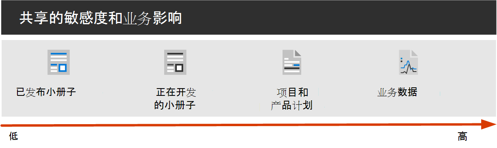
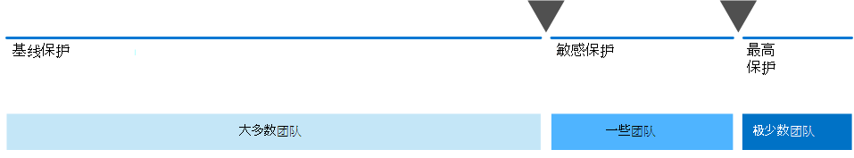

# 设置与 Microsoft 365 和 Microsoft Teams

能够与合适的人员轻松共享信息，同时防止过度共享是组织取得成功的关键。 这包括能够仅与应有权访问敏感数据的人安全地共享敏感数据。 根据项目的不同，这可能包括与组织外部人员共享敏感数据。

此协作解决方案指南包括两个可帮助你的组件：

- 为Microsoft Teams部署具有正确保护级别的项目
- 使用每个项目的适当安全设置配置外部共享

如果通用且易于使用的内容协作工具不可用，用户通常会通过电子邮件进行协作。 这是一种繁琐且容易出错的协作方法，会增加信息共享不当的风险。 如果用户发现共享信息过于困难，他们可能会恢复为使用不受 IT 监管的消费者产品。 这会带来更大的风险。

> [!VIDEO https://www.microsoft.com/videoplayer/embed/RWxMmL?autoplay=false]

使用 Microsoft 365，Teams各种配置部署解决方案，这些配置有助于：

- 保护知识产权
- 实现轻松协作
- 在安全性和可用性之间实现平衡，提高用户满意度并降低卷影 IT 的风险

如果信息共享不当，则大多数组织都有各种信息，其敏感度各不相同，并且对业务的影响也各不相同。 根据给定信息的敏感度，你可能希望允许与以下用户共享：

- 任何 (未经身份验证) 
- 组织内部人员
- 组织内部的特定人员
- 组织内外的特定人员

诸如营销手册这样的信息旨在广泛在组织外部共享。 诸如菜单这样的信息并不用于外部共享，但如果在外部共享，则对业务没有影响。 这些类型的信息几乎不需要保护，或者不需要保护。

这些相同的营销手册在开发中可能只能在组织内部共享。 在这种情况下，网站中的默认共享Teams可能就足够了。

有关正在开发中的新产品的信息可能被视为敏感，即使在组织内部。 在这种情况下，可能适合使用更大程度的保护。 例如，您可以限制特定团队成员对此信息的访问。 根据项目，您可能需要与组织外部人员（如供应商或合作伙伴组织）进行协作。

对于贵组织的成功至关重要的信息，或者具有严格的安全或合规性要求的信息可能需要更高级别的保护。

对于上述所有方案，可以使用 Microsoft Teams来存储、共享和协作处理信息。

若要配置安全协作，请使用Microsoft 365功能。

|产品或组件|功能或特性|许可|
|---|---|---|
|Microsoft Defender for Office 365|保险箱SPO、OneDrive 和 Teams 的附件;保险箱文档;保险箱链接Teams|Microsoft 365E1、E3 和 E5|
|SharePoint|网站和文件共享策略、网站共享权限、共享链接、访问请求、网站来宾共享设置|Microsoft 365E1、E3 和 E5|
|Microsoft Teams|来宾访问、私人团队、私人频道|Microsoft 365E1、E3 和 E5|
|Microsoft 365 合规中心|敏感度标签|Microsoft 365 E3 和 E5|

## 协作管理

Microsoft 365提供了许多用于管理协作解决方案的选项。 我们建议您将此部署内容与协作管理内容 [一起用于](collaboration-governance-overview.md) 为组织创建最佳协作解决方案。

### 将Teams用于所有类型的数据

为了管理对不同敏感信息的访问，我们开发了三种不同保护层[，](configure-teams-three-tiers-protection.md)用于Teams。 您可以自定义这些层中的任一层，以更好地满足需求或业务。

这些层 *（基线*、 *敏感* 和高度 *敏感* ）逐渐增加保护，以帮助防止过度共享和潜在的信息泄露，如下表所示。

|-|基线层|敏感层|高度敏感的层|
|---|---|---|---|
|公共团队或私人团队|两者皆可|Private|Private|
|未经身份验证的共享|Blocked|Blocked|Blocked|
|文件共享|允许|Allowed|只有团队所有者才能共享。|
|团队成员资格|任何人都可以加入公共团队。 加入私人团队需要团队所有者批准。|需要团队所有者批准才能加入。|需要团队所有者批准才能加入。|
|文档加密|||与敏感度标签一起提供|
|来宾共享|允许|允许或阻止|允许或阻止|
|未托管的设备|无限制|仅 Web 访问|Blocked|

配置这些层涉及：

- 配置来宾Teams私人频道的设置
- 为内部和来宾共享、访问请求和共享链接SharePoint团队关联的网站中的设置
- 对于 *敏感和**高度敏感的* 层，配置敏感度标签以对团队进行分类，并控制来宾共享和从非托管设备访问
- 对于 *高度敏感的* 层，配置敏感度标签以加密应用它的文档

从基线层开始，然后根据需要添加使用敏感和高度 *敏感* 层的团队，以帮助保护组织中的信息。  请参阅以下资源以开始：

- [配置具有基线保护的团队](configure-teams-baseline-protection.md)
- [配置具有敏感数据保护的团队](configure-teams-sensitive-protection.md)
- [配置具有高度敏感数据保护的团队](configure-teams-highly-sensitive-protection.md)

如果高度敏感的项目需要额外保护，即使在组织内部也无需共享，可以配置使用自己的敏感度标签加密文件的团队，以便只有团队成员才能读取文件。 有关详细信息 [，请参阅使用安全隔离配置](secure-teams-security-isolation.md) 团队。

### 与组织外部人员共享

你可能需要 [与组织外部人员共享任何敏感度的信息](collaborate-with-people-outside-your-organization.md)。 这包括与单个人员共享单个文档，到与大型合作伙伴组织或世界各地的供应商就主要项目进行协作。 在Microsoft 365中，可以轻松完成此范围的外部共享，并提供适当的安全措施来帮助保护敏感信息。

这些资源将帮助您开始设置环境以与组织外部人员进行协作：

- [协作处理文档](collaborate-on-documents.md) 以共享文件夹的单个文件。
- [在网站中协作](collaborate-in-site.md)，与网站中的来宾SharePoint协作。
- [作为团队协作](collaborate-as-team.md) ，与团队中的来宾协作。

根据所共享信息的敏感度，您可以添加安全措施以帮助防止过度共享。 这些资源将帮助您设置组织所需的保护：

- [有关与未经认证用户共享文件和文件夹的最佳做法](best-practices-anonymous-sharing.md)
- [在与组织外人员共享文件时限制意外公开信息](share-limit-accidental-exposure.md)
- [创建安全的来宾共享环境](create-secure-guest-sharing-environment.md)

如果你与合作伙伴组织有一个主要项目，可以使用 Azure 权利管理来管理为该项目设置的团队中的来自该组织的来宾。 有关详细信息[，请参阅使用托管来宾创建 B2B Extranet。](b2b-extranet.md)

## 管理员培训

Microsoft Learn 中的这些培训模块可帮助你了解 Teams 和 SharePoint 中的协作、管理和标识功能。

### Teams

|培训：|使用 Microsoft Teams 管理团队协作|
|---|---|
||“使用 Microsoft Teams 管理团队协作”介绍了 Microsoft Teams 的特性和功能，它是 Microsoft 365 中的团队协作中心。 你将了解如何使用 Teams 促进组织内的团队合作和通信，无论是在办公场所内还是办公场所外，也无论团队使用何种设备（从桌面设备到平板电脑再到电话），同时利用 Office 365 应用的所有丰富功能。 你将了解 Teams 如何为团队跨应用和设备进行协作提供全面、灵活的环境。 此学习途径可帮助你准备 Microsoft 365 认证：Teams 管理员关联认证。
2 小时 17 分钟 - Learning路径 - 5 个模块|

> [!div class="nextstepaction"]
> [开始>](/learn/modules/m365-teams-collab-prepare-deployment/introduction/)

### SharePoint

|培训：|在 Microsoft 365 中配合使用 SharePoint|
|---|---|
||“使用 Microsoft SharePoint 管理共享内容”介绍 SharePoint 的特性和功能，以及它如何与 Microsoft 365 协同工作。 你将了解 SharePoint 网站的不同类型（包括中心网站）以及信息保护、报告和监视。 还将了解如何使用 SharePoint 文件和文件夹共享来优化协作，如何在外部共享文件，以及如何在 SharePoint 管理中心中管理 SharePoint 网站。 此学习途径可帮助你准备 Microsoft 365 认证：团队合作管理员关联认证。
1 小时 14 分钟 - Learning 路径 - 4 个模块|

> [!div class="nextstepaction"]
> [开始>](/learn/modules/m365-teams-sharepoint-plan-sharepoint/introduction/)

### 信息保护

|培训：|使用 Microsoft 365 保护企业信息|
|---|---|
||保护和保证组织的信息安全以往任何时候都更具挑战性。 使用 Microsoft 365 保护企业信息学习路径介绍如何防止敏感信息被意外过度分享或滥用，如何发现和分类数据，如何使用敏感度标签保护数据，以及如何同时监视和分析敏感信息以防信息丢失。 此学习路径可帮助你准备Microsoft 365认证：安全管理员关联Microsoft 365认证：Enterprise专家认证。
1 小时 - Learning 路径 - 5 个模块|

> [!div class="nextstepaction"]
> [开始>](/learn/modules/m365-security-info-overview/introduction/)

### 身份和访问

|培训：|使用 Azure Active Directory 提供标识和访问保护|
|---|---|
||标识和访问学习路径涵盖了最新的身份和访问技术、用于加强身份验证的工具以及组织内有关身份保护的指南。 Microsoft 访问和身份技术使你能够保护组织的身份（无论是本地身份还是在云中），并使用户能够从任何位置安全地工作。 此学习途径可帮助你准备 Microsoft 365 认证：安全管理员关联与Microsoft 365 认证：企业管理专家认证。
2 小时 52 分钟 - Learning 路径 - 6 个模块|

> [!div class="nextstepaction"]
> [开始>](/learn/modules/m365-identity-overview/introduction/)

## 面向最终用户的培训

这些培训模块可帮助用户使用Teams、组和SharePoint进行Microsoft 365。

|Teams|SharePoint|
|---|---|
| **[设置和自定义团队](https://support.microsoft.com/office/702a2977-e662-4038-bef5-bdf8ee47b17b)**| **[共享和同步](https://support.microsoft.com/office/98cb2ff2-c27e-42ea-b055-c2d895f8a5de)**|
| **[Upload并查找文件](https://support.microsoft.com/office/57b669db-678e-424e-b0a0-15d19215cb12)**||
| **[在团队和频道中协作](https://support.microsoft.com/office/c3d63c10-77d5-4204-a566-53ddcf723b46)**||

## 插图

这些插图将帮助您了解组和团队与 Microsoft 365 中其他服务的交互方式，以及哪些治理和合规性功能可帮助您在组织中管理这些服务。

### 面向 IT 架构师的 Microsoft 365 中的组

对于 Microsoft 365 中的组，IT 架构师需要了解的信息

|**项**|**说明**|
|---|---|
|   [PDF](https://github.com/MicrosoftDocs/microsoft-365-docs/raw/public/microsoft-365/downloads/msft-m365-groups.pdf) \|[Visio](https://github.com/MicrosoftDocs/OfficeDocs-Enterprise/raw/live/Enterprise/downloads/msft-m365-groups.vsdx)   2019 年 6 月更新|这些图示详细介绍了不同类型的组，如何创建和管理这些组，以及一些治理建议。|

### 面向 IT 架构师的 Microsoft 365 中的 Microsoft Teams 和相关生产力服务

Microsoft 365 中生产力服务的逻辑体系结构，以 Microsoft Teams 为主导。

|**项**|**说明**|
|---|---|
|   [PDF](https://github.com/MicrosoftDocs/microsoft-365-docs/raw/public/microsoft-365/downloads/msft-m365-teams-logical-architecture.pdf) \|[Visio](https://github.com/MicrosoftDocs/OfficeDocs-Enterprise/raw/live/Enterprise/downloads/msft-m365-teams-logical-architecture.vsdx)   2019 年 4 月更新|Microsoft 提供了一系列生产力服务，这些服务协同工作，提供数据治理、安全性和符合性相关功能的协作体验。 
此系列图示展示了企业架构师生产力服务的逻辑体系结构，以 Microsoft Teams 为主导。|

## 部署安全协作解决方案

准备好部署此解决方案后，请继续执行以下步骤：

1. 配置[三种不同保护层以用于Teams。](configure-teams-three-tiers-protection.md)
2. 配置用于 [与组织外部人员共享任何敏感度信息的设置](collaborate-with-people-outside-your-organization.md)。

## 另请参阅

[Microsoft 365 安全中心文档](../security/index.yml)

[Microsoft 365 合规性文档](../compliance/index.yml)

[欢迎使用 Microsoft Teams](/MicrosoftTeams/Teams-overview)
