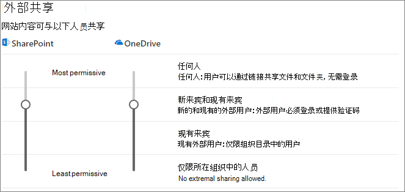

# 在与组织外人员共享文件时限制意外公开信息

与组织外人员共享文件和文件夹时，可通过多种方法来降低意外共享敏感信息的机率。 可从本文中的选项中进行选择，以最好地满足贵组织的需求。

## 对“任何人”链接使用最佳做法

如果贵组织中的人员需要进行未经身份验证共享，但你担心未经身份验证的人员修改内容，请阅读[未经身份验证共享的最佳做法](best-practices-anonymous-sharing.md)，获取有关如何处理贵组织中的未经身份验证共享的指南。

## 关闭“任何人”链接

建议对相应内容保持启用 *“任何人”* 链接，因为它是最简单的共享方法，可帮助降低用户查找超出 IT 部门控制范围的其他解决方案的风险。 可以将“*任何人*”链接转发给其他人，但是文件访问权只可用于拥有该链接的人。

如果始终希望组织外部的人员在访问 SharePoint、组或 Teams 中的内容时进行身份验证，则可以关闭 *任何人* 共享。此操作将阻止用户进行未经身份验证的内容共享。

如果禁用“*任何人*”链接，用户仍然可以使用“*特定人员*”链接与来宾轻松共享。 在这种情况下，需要对所有组织外人员进行身份验证，然后才能访问共享内容。

根据你的需要，可以针对特定网站或整个组织禁用“*任何人*”链接。

关闭组织的 *“任何人”* 链接

1. 在 SharePoint 管理中心的左侧导航栏中，选择“<a href="https://go.microsoft.com/fwlink/?linkid=2185222" target="_blank">**共享**</a>”。
2. 将 SharePoint 外部共享设置设为 **“新来宾和现有来宾”**。

   

3. 单击 **“保存”**。

关闭站点的 *“任何人”* 链接

1. 在 SharePoint 管理中心的左侧导航栏中，展开“**网站**”，然后选择“<a href="https://go.microsoft.com/fwlink/?linkid=2185220" target="_blank">**活动网站**</a>”。
2. 选择要配置的网站。
3. 在功能区中，选择“**共享**”。
4. 确保将共享设置为 **“新来宾和现有来宾”**。

   

5. 如果进行了任何更改，请选择“**保存**”。

## 域筛选

可以使用域允许或拒绝列表来指定用户与组织外部人员共享时可以使用的域。

使用允许列表，可以指定贵组织中用户可与组织外人员共享的域名列表。 阻止与其他域共享。 如果贵组织仅从特定域的列表中与人员进行协作，则可以使用此功能阻止与其他域共享。

使用拒绝列表，可以指定贵组织用户无法与组织外人员共享的域名列表。 禁止共享列出的域名。 如果有竞争对手（例如想要阻止其访问组织中的内容的人员），此功能可能非常有用。

允许列表和拒绝列表仅影响与来宾的共享。 如果尚未禁用用户，用户仍可使用“*任何人*”链接与被禁止域中的人员共享。 若要使用域允许和拒绝列表获得最佳结果，请考虑按上面所述禁用“*任何人*”链接。

设置域允许或拒绝列表

1. 在 SharePoint 管理中心的左侧导航栏中，选择“<a href="https://go.microsoft.com/fwlink/?linkid=2185222" target="_blank">**共享**</a>”
2. 在 **“用于外部共享的高级设置”** 下，选中 **“限制外部共享(按域)”** 复选框。
3. 单击 **“添加域”**。
4. 选择是否要阻止域，键入域，然后单击 **“确定”**。

   

5. 单击 **“保存”**。

如果想要在高于 SharePoint 和 OneDrive 的级别限制按域共享，则可以在 Azure Active Directory 中[允许或阻止来自特定组织的 B2B 用户的邀请](/azure/active-directory/b2b/allow-deny-list)。 （必须配置 [SharePoint 和 OneDrive 与 Azure AD B2B Preview 的集成](/sharepoint/sharepoint-azureb2b-integration-preview)，这些设置才会影响 SharePoint 和 OneDrive。）

## 限制与外部组织人员共享的文件、文件夹和站点至指定安全组。

可以将于组织外人员共享的文件、文件见和站点限定至指定安全组的成员。 如果希望启用外部共享，但有批准工作流或请求流程，则此功能非常有用。 或者，可能需要用户先完成培训课程，然后再将其添加到安全组，并允许外部共享。

限制与安全组成员进行外部共享

1. 在 SharePoint 管理中心的左侧导航栏的“**策略**”下，单击 “<a href="https://go.microsoft.com/fwlink/?linkid=2185222" target="_blank">**共享**</a>”。
2. 在“**外部共享**”下，展开“**更多外部共享设置**”。

3. 选择“**仅允许特定安全组中的用户外部共享**”，然后选择“**管理安全组**”。

    

4. 在“**添加安全组**”框中，输入安全组的名称。将显示安全组框。

5. 在安全组名称旁边的“**共享对象**”下拉菜单中，选择以下任一选项：

    - **仅限经过身份验证的访客**（默认）
    - **任何人**

6. 选择“**保存**”。

请注意，这会影响文件、文件夹和网站，但不会影响 Microsoft 365 组或 Teams。 如果成员邀请来宾加入 Microsoft 365 专用组或 Microsoft Teams 专用团队，邀请会发送给组或团队所有者以供审批。

## 另请参阅

[创建安全的来宾共享环境](create-secure-guest-sharing-environment.md)

[有关与匿名用户共享文件和文件夹的最佳做法](best-practices-anonymous-sharing.md)
