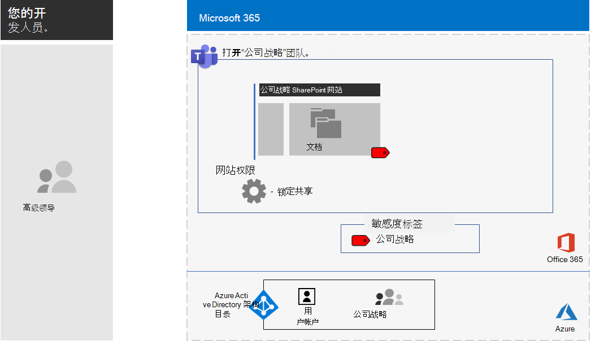

# <a name="configure-a-team-with-security-isolation-in-a-devtest-environment"></a>在开发/测试环境中配置具有安全隔离的团队

本文提供了在开发/测试环境中创建[具有安全隔离的团队](secure-teams-security-isolation.md)的分步式说明。

[公司战略隔离团队的配置。](../media/team-security-isolation-dev-test/team-security-isolation-dev-test-config.png)

在生产中部署此类团队前，可使用此开发/测试环境试验和微调设置以满足你的特定需求。

## <a name="phase-1-build-out-your-microsoft-365-enterprise-test-environment"></a>阶段 1：构建 Microsoft 365 企业版测试环境。

如果只需要测试达到最低要求的轻型敏感和高度敏感团队，请按照[轻型基本配置](../enterprise/lightweight-base-configuration-microsoft-365-enterprise.md)中的说明进行操作。

如果想要在模拟企业中测试敏感和高度敏感的团队，请按照[密码哈希同步](../enterprise/password-hash-sync-m365-ent-test-environment.md)中的说明进行操作。

> [!NOTE]
> 测试具有安全隔离的团队不需要模拟的企业测试环境，该环境中包括连接到 Internet 的模拟内部网和  Active Directory Domain Services (AD DS) 资源林的目录同步。 它在此处作为一个选项提供，以便你可以测试具有安全隔离的团队，并在代表典型组织的环境中对其进行试验。

## <a name="phase-2-create-and-configure-your-azure-active-directory-azure-ad-group-and-users"></a>第 2 阶段：创建和配置你的 Azure Active Directory (Azure AD)  组和用户。

此阶段为虚构组织创建和配置 Azure AD 组和用户。

首先，使用 Azure 门户创建一个安全组。

1. 在浏览器中创建单独的标签页，然后转到 Azure 门户 ([https://portal.azure.com](https://portal.azure.com))。如有需要，请使用 Microsoft 365 E5 试用或付费订阅的全局管理员帐户凭据登录。

2. 在 Azure 门户中，单击“**Azure Active Directory”>“组**”。

3. 在“**组 - 所有组**”边栏选项卡上，单击“**+ 新建组**”。

4. 在“**组**”边栏选项卡上：

  - 在“组类型”中选择“安全性”。

  - 在“**名称**”中键入 **高层管理人员**。

  - 在“**成员身份**”类型中，选择“**已分配**”。

5. 单击“**创建**”，然后关闭“**组**”边栏选项卡。

接下来，配置自动许可，使新的“**高层管理人员**”组的成员可以自动分配 Microsoft 365 E5 许可。

1. 在 Azure 门户中，单击“Azure Active Directory”>“许可证”>“所有产品”。

2. 在列表中，选择“Microsoft 365 企业版 E5”，然后单击“分配”。

3. 在“**分配许可证**”边栏选项卡中，单击“**用户和组**”。

4. 在组列表中，选择“**高层管理人员**”组。

5. 单击“**选择**”，然后单击“**分配**”。

6. 关闭浏览器中的 Azure 门户选项卡。

接下来，[连接到 Azure Active Directory PowerShell for Graph 模块](../enterprise/connect-to-microsoft-365-powershell.md#connect-with-the-azure-active-directory-powershell-for-graph-module)。

填写组织名称、位置和公用密码并从 PowerShell 命令提示符或集成脚本环境 (ISE) 中运行以下命令，创建新的用户帐户并将其添加到相应的高层管理人员组：

```powershell
$orgName="<organization name, such as contoso-test for the contoso-test.onmicrosoft.com trial subscription domain name>"
$location="<the ISO ALPHA2 country code, such as US for the United States>"
$commonPassword="<common password for all the new accounts>"

$PasswordProfile=New-Object -TypeName Microsoft.Open.AzureAD.Model.PasswordProfile
$PasswordProfile.Password=$commonPassword

$groupName="C-Suite"
$userNames=@("CEO","CFO","CIO")
$groupID=(Get-AzureADGroup | Where { $_.DisplayName -eq $groupName }).ObjectID
ForEach ($element in $userNames){
New-AzureADUser -DisplayName $element -PasswordProfile $PasswordProfile -UserPrincipalName ($element + "@" + $orgName + ".onmicrosoft.com") -AccountEnabled $true -MailNickName $element -UsageLocation $location
Add-AzureADGroupMember -RefObjectId (Get-AzureADUser | Where { $_.DisplayName -eq $element }).ObjectID -ObjectId $groupID
}
```

> [!NOTE]
> 此处使用公用密码旨在自动配置开发/测试环境，简化配置过程。 但不建议生产订阅这样做。

请按照以下步骤验证基于组的许可是否正常工作。

1. 登录到 [Microsoft 365 管理中心](https://admin.microsoft.com)。

2. 在浏览器的新“**Microsoft 365 管理中心**”标签页中，单击“**用户**”。

3. 在用户列表中，单击“CEO”。

4. 在列出“**CEO**”用户帐户属性的窗格中，验证是否已向其分配“**Microsoft 365 企业版 E5**”许可证（位于“**产品许可证**”中）。

## <a name="phase-3-create-your-team"></a>阶段 3：创建团队

在此阶段中，可为高级领导团队的成员创建和配置具有安全隔离的团队，以便协作处理公司战略。

首先，在继续执行[本文](../compliance/sensitivity-labels-teams-groups-sites.md)中的步骤之前，先启用敏感度标签来保护 Microsoft Teams、Office 365 组和 SharePoint 网站中的内容。

接下来，创建团队：

1. 在 Teams 中，单击应用程序左侧的“**团队**”，然后在团队列表底部单击“**加入或创建团队**”。
2. 点击“**创建团队**”（第一张卡片，左上角）。
3. 选择“**从头开始构建团队**”。
4. 在“**敏感度**”列表中，保留默认值。
5. 在“**隐私**”下，单击“**专用**”。
6. 键入 **公司战略**，然后单击“**创建**” > “**关闭**”。

接下来，限制公司战略组的所有者建立私人渠道。

1. 在团队中，单击“**更多选项**”，然后单击“**管理团队**”。
2. 在“**设置**”选项卡上，展开“**成员权限**”。
3. 清除“**允许成员创建专用频道**”复选框。

下一步，你需要用以下设置配置灵敏度标签：

- 名称为“公司战略”
- 启用加密
- 公司战略组具有共同创作权限

请按以下步骤操作：

1. 打开Microsoft 365 合规中心，在 **解决方案** 下，选择 <a href="https://go.microsoft.com/fwlink/p/?linkid=2174015" target="_blank">**信息保护**</a>。
1. 单击“**创建标签**”。
1. 为标签名称键入 **公司战略**。
1. 键入 **高级领导公司战略文档** 作为工具提示，然后单击“**下一步**”。
1. 在“**加密**”页面上的“**加密**”下拉列表中，选择“**应用**”。
1. 添加团队权限：<br> a. 单击“**分配权限**”。<br> b. 单击“**添加用户或组**”，选择“**公司战略**”，然后单击“**添加**”。<br> c. 单击“**选择权限**”。<br> d. 从下拉列表中选择“**共同创作**”，然后单击“**保存**”。<br>
1. 单击“**下一步**”。
1. 在“**内容标记**”页面上，单击“**下一步**”。
1. 在“**网站和组设置**”页面上，将“**网站和组设置**”设置为“**开**”。
1. 在“**连接了 Office 365 组的团队网站的隐私**”下拉菜单中，选择“**专用 - 仅成员可访问站点**”。
1. 在“**非托管的设备**”下，选择“**阻止访问**”。
1. 单击“**下一步**”。
1. 在“**Office 应用程序自动标记**”页面上，单击“**下一步**”。
1. 单击“**提交**”，然后单击“**完成**”。

接下来，按照以下步骤发布新标签：

1. 在Microsoft 365 合规中心中，在 <a href="https://go.microsoft.com/fwlink/p/?linkid=2174015" target="_blank">**信息保护**</a>上，选择"**标签策略"** 选项卡。
2. 单击“**发布标签**”。
3. 在“**选择要发布的敏感度标签**”页面上，单击“**选择要发布的敏感度标签**”。
4. 选择“**公司战略**”，然后单击“**添加**”。
5. 单击“**下一步**”。
6. 在“**发布到用户和组**”页面上，单击“**选择用户和组**”。
7. 单击“**添加**”，然后选择“**公司策略**”。
8. 单击“**添加**”，然后单击“**完成**”。
9. 单击“**下一步**”。
10. 在“策略设置”页面上，选中“**用户必须提供理由才可删除标签或设置更低分类标签**”复选框，然后单击“**下一步**”。
11. 为策略名称键入 **公司战略**，然后单击“**下一步**”。
12. 单击“**提交**”，然后单击“**完成**”。

注意，“**公司战略**”标签在发布后可能需要一些时间才可用。

接下来，将新标签应用到“**公司战略**”团队并更新默认共享链接类型，以减少将文件和文件夹意外共享给比预期更多受众的风险。

1. 打开 SharePoint 管理中心，在 **网站** 下，选择 <a href="https://go.microsoft.com/fwlink/?linkid=2185220" target="_blank">**活动网站**</a>。
1. 选择 **公司战略** 站点。
1. 在"**策略**"选项卡上的"**敏感度**"下，选择"**编辑**"。
1. 选择"**公司战略"** 标签，然后选择"**保存**"。
1. 在"**策略**"选项卡上的"**外部共享**"下，选择"**编辑**"。
1. 选择“**仅限组织中的人员**”。
1. 在“**默认共享链接类型**”下，清除“**与组织级别设置相同**”复选框，然后选择“**现有访问权限者**”。
1. 选择“保存”。

接下来，为“**公司战略**”团队配置“仅所有者”站点共享。

1. 在 Teams 中，导航至“**公司战略**”团队的“**常规**”选项卡。
2. 在团队的工具栏中，单击“文件”。
3. 单击省略号，然后单击“在 SharePoint 中打开”。
4. 在基础 SharePoint 网站的工具栏中，依次单击设置图标和“网站权限”。
5. 在“网站权限”窗格的“**网站共享**”下方，单击“**更改成员共享方式**”。
6. 在“**共享权限**”下方，选择“**仅网站所有者可以共享文件、文件夹和网站**”，然后单击“**保存**”。
7. 关闭“**权限**”和“**设置**”窗格。

如果以公司战略组成员身份登录，将在 Word、Excel 和 PowerPoint 的“主页”工具栏中的“**敏感度**”选项中看到“**公司战略**”。 从“**敏感度**”选项中选择“**公司战略**”标签，将标签分配给文件。

下面是公司战略团队的配置结果。



## <a name="next-step"></a>后续步骤

当你准备好进行生产部署时，请参考 [配置说明](secure-teams-security-isolation.md)。
