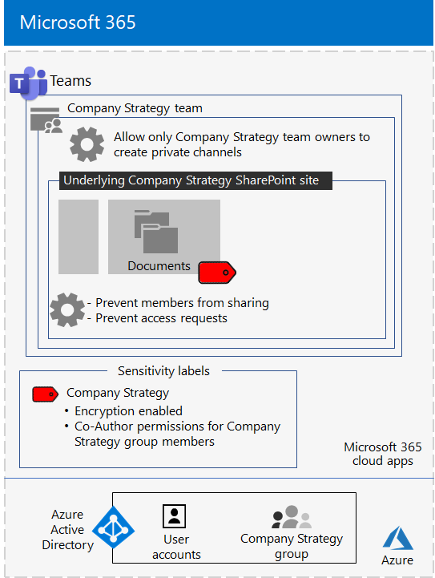

# <a name="configure-a-team-with-security-isolation-in-a-devtest-environment"></a><span data-ttu-id="da122-103">在开发/测试环境中配置具有安全隔离的团队</span><span class="sxs-lookup"><span data-stu-id="da122-103">Configure a team with security isolation in a dev/test environment</span></span>

<span data-ttu-id="da122-104">本文提供了在开发/测试环境中创建[具有安全隔离的团队](secure-teams-security-isolation.md)的分步式说明。</span><span class="sxs-lookup"><span data-stu-id="da122-104">This article provides step-by-step instructions to create a [team with security isolation](secure-teams-security-isolation.md) in a dev/test environment.</span></span>



<span data-ttu-id="da122-106">在生产中部署此类团队前，可使用此开发/测试环境试验和微调设置以满足你的特定需求。</span><span class="sxs-lookup"><span data-stu-id="da122-106">Use this dev/test environment to experiment and fine-tune settings for your specific needs before deploying this type of team in production.</span></span>
  
## <a name="phase-1-build-out-your-microsoft-365-enterprise-test-environment"></a><span data-ttu-id="da122-107">阶段 1：构建 Microsoft 365 企业版测试环境。</span><span class="sxs-lookup"><span data-stu-id="da122-107">Phase 1: Build out your Microsoft 365 Enterprise test environment</span></span>

<span data-ttu-id="da122-108">如果只需要测试达到最低要求的轻型敏感和高度敏感团队，请按照[轻型基本配置](https://docs.microsoft.com/microsoft-365/enterprise/lightweight-base-configuration-microsoft-365-enterprise)中的说明进行操作。</span><span class="sxs-lookup"><span data-stu-id="da122-108">If you just want to test sensitive and highly sensitive teams in a lightweight way with the minimum requirements, follow the instructions in [Lightweight base configuration](https://docs.microsoft.com/microsoft-365/enterprise/lightweight-base-configuration-microsoft-365-enterprise).</span></span>

<span data-ttu-id="da122-109">如果想要在模拟企业中测试敏感和高度敏感的团队，请按照[密码哈希同步](https://docs.microsoft.com/microsoft-365/enterprise/password-hash-sync-m365-ent-test-environment)中的说明进行操作。</span><span class="sxs-lookup"><span data-stu-id="da122-109">If you want to test sensitive and highly sensitive teams in a simulated enterprise, follow the instructions in [Password hash synchronization](https://docs.microsoft.com/microsoft-365/enterprise/password-hash-sync-m365-ent-test-environment).</span></span>

>[!Note]
><span data-ttu-id="da122-110">测试具有安全隔离的团队不需要模拟的企业测试环境，该环境中包括连接到 Internet 的模拟内部网和 Active Directory 域服务 (AD DS) 林的目录同步。</span><span class="sxs-lookup"><span data-stu-id="da122-110">Testing an team with security isolation does not require the simulated enterprise test environment, which includes a simulated intranet connected to the Internet and directory synchronization for an Active Directory Domain Services (AD DS) forest.</span></span> <span data-ttu-id="da122-111">它在此处作为一个选项提供，以便你可以测试具有安全隔离的团队，并在代表典型组织的环境中对其进行试验。</span><span class="sxs-lookup"><span data-stu-id="da122-111">It is provided here as an option so that you can test a team with security isolation and experiment with it in an environment that represents a typical organization.</span></span>
>
    
## <a name="phase-2-create-and-configure-your-azure-active-directory-ad-group-and-users"></a><span data-ttu-id="da122-112">阶段 2：创建和配置 Azure Active Directory (AD) 组和用户</span><span class="sxs-lookup"><span data-stu-id="da122-112">Phase 2: Create and configure your Azure Active Directory (AD) group and users</span></span>

<span data-ttu-id="da122-113">此阶段为虚构组织创建和配置 Azure AD 组和用户。</span><span class="sxs-lookup"><span data-stu-id="da122-113">In this phase, you create and configure an Azure AD group and users for your fictional organization.</span></span>
  
<span data-ttu-id="da122-114">首先，使用 Azure 门户创建一个安全组。</span><span class="sxs-lookup"><span data-stu-id="da122-114">First, create a security group with the Azure portal.</span></span>
  
1. <span data-ttu-id="da122-115">在浏览器中创建单独的选项卡，然后转到 Azure 门户，网址为 [https://portal.azure.com](https://portal.azure.com)。</span><span class="sxs-lookup"><span data-stu-id="da122-115">Create a separate tab in your browser, and then go to the Azure portal at [https://portal.azure.com](https://portal.azure.com).</span></span> <span data-ttu-id="da122-116">如有需要，请使用 Microsoft 365 E5 试用或已付款订阅的全局管理员帐户凭据登录。</span><span class="sxs-lookup"><span data-stu-id="da122-116">If needed, sign in with the credentials of the global administrator account for your Microsoft 365 E5 trial or paid subscription.</span></span>
    
2. <span data-ttu-id="da122-117">在 Azure 门户中，单击“**Azure Active Directory”>“组**”。</span><span class="sxs-lookup"><span data-stu-id="da122-117">In the Azure portal, click **Azure Active Directory > Groups**.</span></span>
    
3. <span data-ttu-id="da122-118">在“**组 - 所有组**”边栏选项卡上，单击“**+ 新建组**”。</span><span class="sxs-lookup"><span data-stu-id="da122-118">On the **Groups - All groups** blade, click **+ New group**.</span></span>
    
4. <span data-ttu-id="da122-119">在“**组**”边栏选项卡上：</span><span class="sxs-lookup"><span data-stu-id="da122-119">On the **Group** blade:</span></span>
    
  - <span data-ttu-id="da122-120">在“组类型”中选择“安全性”\*\*\*\*\*\*\*\*。</span><span class="sxs-lookup"><span data-stu-id="da122-120">Select **Security** in **Group type**.</span></span>
    
  - <span data-ttu-id="da122-121">在“**名称**”中键入**高层管理人员**。</span><span class="sxs-lookup"><span data-stu-id="da122-121">Type **C-Suite** in **Name**.</span></span>
    
  - <span data-ttu-id="da122-122">在“**成员身份**”类型中，选择“**已分配**”。</span><span class="sxs-lookup"><span data-stu-id="da122-122">Select **Assigned** in **Membership type**.</span></span>
      
5. <span data-ttu-id="da122-123">单击“**创建**”，然后关闭“**组**”边栏选项卡。</span><span class="sxs-lookup"><span data-stu-id="da122-123">Click **Create**, and then close the **Group** blade.</span></span>
    
<span data-ttu-id="da122-124">接下来，配置自动许可，使新的“**高层管理人员**”组的成员可以自动分配有 Microsoft 365 E5 许可证。</span><span class="sxs-lookup"><span data-stu-id="da122-124">Next, configure automatic licensing so that members of the new **C-Suite** group is automatically assigned a Microsoft 365 E5 license.</span></span>
  
1. <span data-ttu-id="da122-125">在 Azure 门户中，单击“Azure Active Directory”>“许可证”>“所有产品”\*\*\*\*。</span><span class="sxs-lookup"><span data-stu-id="da122-125">In the Azure portal, click **Azure Active Directory > Licenses > All products**.</span></span>
    
2. <span data-ttu-id="da122-126">在列表中，选择“Microsoft 365 企业版 E5”，然后单击“分配”\*\*\*\*\*\*\*\*。</span><span class="sxs-lookup"><span data-stu-id="da122-126">In the list, select **Microsoft 365 Enterprise E5**, and then click **Assign**.</span></span>
    
3. <span data-ttu-id="da122-127">在“**分配许可证**”边栏选项卡中，单击“**用户和组**”。</span><span class="sxs-lookup"><span data-stu-id="da122-127">In the **Assign license** blade, click **Users and groups**.</span></span>
    
4. <span data-ttu-id="da122-128">在组列表中，选择“**高层管理人员**”组。</span><span class="sxs-lookup"><span data-stu-id="da122-128">In the list of groups, select the **C-Suite** group.</span></span>
    
5. <span data-ttu-id="da122-129">单击“**选择**”，然后单击“**分配**”。</span><span class="sxs-lookup"><span data-stu-id="da122-129">Click **Select**, and then click **Assign**.</span></span>
    
6. <span data-ttu-id="da122-130">关闭浏览器中的 Azure 门户选项卡。</span><span class="sxs-lookup"><span data-stu-id="da122-130">Close the Azure portal tab in your browser.</span></span>
    
<span data-ttu-id="da122-131">接下来，[连接到 Azure Active Directory PowerShell for Graph 模块](https://docs.microsoft.com/office365/enterprise/powershell/connect-to-office-365-powershell#connect-with-the-azure-active-directory-powershell-for-graph-module)。</span><span class="sxs-lookup"><span data-stu-id="da122-131">Next, [connect with the Azure Active Directory PowerShell for Graph module](https://docs.microsoft.com/office365/enterprise/powershell/connect-to-office-365-powershell#connect-with-the-azure-active-directory-powershell-for-graph-module).</span></span>
  
<span data-ttu-id="da122-132">填写组织名称、位置和公用密码并从 PowerShell 命令提示符或集成脚本环境 (ISE) 中运行以下命令，创建新的用户帐户并将其添加到相应的高层管理人员组：</span><span class="sxs-lookup"><span data-stu-id="da122-132">Fill in your organization name, your location, and a common password, and then run these commands from the PowerShell command prompt or Integrated Script Environment (ISE) to create new user accounts and add them to the C-Suite group:</span></span>
  
```powershell
$orgName="<organization name, such as contoso-test for the contoso-test.onmicrosoft.com trial subscription domain name>"
$location="<the ISO ALPHA2 country code, such as US for the United States>"
$commonPassword="<common password for all the new accounts>"

$PasswordProfile=New-Object -TypeName Microsoft.Open.AzureAD.Model.PasswordProfile
$PasswordProfile.Password=$commonPassword

$groupName="C-Suite"
$userNames=@("CEO","CFO","CIO") 
$groupID=(Get-AzureADGroup | Where { $_.DisplayName -eq $groupName }).ObjectID
ForEach ($element in $userNames){ 
New-AzureADUser -DisplayName $element -PasswordProfile $PasswordProfile -UserPrincipalName ($element + "@" + $orgName + ".onmicrosoft.com") -AccountEnabled $true -MailNickName $element -UsageLocation $location 
Add-AzureADGroupMember -RefObjectId (Get-AzureADUser | Where { $_.DisplayName -eq $element }).ObjectID -ObjectId $groupID
}
```

> [!NOTE]
> <span data-ttu-id="da122-133">此处使用公用密码旨在自动配置开发/测试环境，简化配置过程。</span><span class="sxs-lookup"><span data-stu-id="da122-133">The use of a common password here is for automation and ease of configuration for a dev/test environment.</span></span> <span data-ttu-id="da122-134">显然，对于生产订阅，这是非常不鼓励的。</span><span class="sxs-lookup"><span data-stu-id="da122-134">Obviously, this is highly discouraged for production subscriptions.</span></span> 
  
<span data-ttu-id="da122-135">请按照以下步骤验证基于组的许可是否正常工作。</span><span class="sxs-lookup"><span data-stu-id="da122-135">Use these steps to verify that group-based licensing is working correctly.</span></span>
  
1. <span data-ttu-id="da122-136">登录到 [Microsoft 365 管理中心](https://admin.microsoft.com)。</span><span class="sxs-lookup"><span data-stu-id="da122-136">Sign in to the [Microsoft 365 admin center](https://admin.microsoft.com).</span></span>
    
2. <span data-ttu-id="da122-137">在浏览器的新“**Microsoft 365 管理中心**”标签页中，单击“**用户**”。</span><span class="sxs-lookup"><span data-stu-id="da122-137">From the new **Microsoft 365 admin center** tab of your browser, click **Users**.</span></span>
    
3. <span data-ttu-id="da122-138">在用户列表中，单击“CEO”\*\*\*\*。</span><span class="sxs-lookup"><span data-stu-id="da122-138">In the list of users, click **CEO**.</span></span>
    
4. <span data-ttu-id="da122-139">在列出“**CEO**”用户帐户属性的窗格中，验证是否已向其分配“**Microsoft 365 企业版 E5**”许可证（位于“**产品许可证**”中）。</span><span class="sxs-lookup"><span data-stu-id="da122-139">In the pane that lists the properties of the **CEO** user account, verify that it has been assigned the **Microsoft 365 Enterprise E5** license in **Product licenses**.</span></span>
    
## <a name="phase-3-create-your-team"></a><span data-ttu-id="da122-140">阶段 3：创建团队</span><span class="sxs-lookup"><span data-stu-id="da122-140">Phase 3: Create your team</span></span>

<span data-ttu-id="da122-141">在此阶段中，可为高级领导团队的成员创建和配置具有安全隔离的团队，以便协作处理公司战略。</span><span class="sxs-lookup"><span data-stu-id="da122-141">In this phase, you create and configure a team with security isolation for members of the senior leadership team to collaborate on company strategy.</span></span>

<span data-ttu-id="da122-142">首先，在继续执行[本文](https://docs.microsoft.com/microsoft-365/compliance/sensitivity-labels-teams-groups-sites)中的步骤之前，先启用敏感度标签来保护 Microsoft Teams、Office 365 组和 SharePoint 网站中的内容。</span><span class="sxs-lookup"><span data-stu-id="da122-142">First, enable sensitivity labels to protect content in Microsoft Teams, Office 365 groups, and SharePoint sites before you proceed with the steps in [this article](https://docs.microsoft.com/microsoft-365/compliance/sensitivity-labels-teams-groups-sites).</span></span>

<span data-ttu-id="da122-143">接下来，创建团队：</span><span class="sxs-lookup"><span data-stu-id="da122-143">Next, create the team:</span></span>

1. <span data-ttu-id="da122-144">在 Teams 中，单击应用程序左侧的“**团队**”，然后在团队列表底部单击“**加入或创建团队**”。</span><span class="sxs-lookup"><span data-stu-id="da122-144">In Teams, click **Teams** on the left side of the app, then click **Join or create a team** at the bottom of the teams list.</span></span>
2. <span data-ttu-id="da122-145">点击“**创建团队**”（第一张卡片，左上角）。</span><span class="sxs-lookup"><span data-stu-id="da122-145">Click **Create team** (first card, top left corner).</span></span>
3. <span data-ttu-id="da122-146">选择“**从头开始构建团队**”。</span><span class="sxs-lookup"><span data-stu-id="da122-146">Choose **Build a team from scratch**.</span></span>
4. <span data-ttu-id="da122-147">在“**敏感度**”列表中，保留默认值。</span><span class="sxs-lookup"><span data-stu-id="da122-147">In the **Sensitivity** list, keep the default.</span></span>
5. <span data-ttu-id="da122-148">在“**隐私**”下，单击“**专用**”。</span><span class="sxs-lookup"><span data-stu-id="da122-148">Under **Privacy**, click **Private**.</span></span>
6. <span data-ttu-id="da122-149">键入**公司战略**，然后单击“**创建**” > “**关闭**”。</span><span class="sxs-lookup"><span data-stu-id="da122-149">Type **Company Strategy**, and then click **Create** > **Close**.</span></span>

<span data-ttu-id="da122-150">接下来，使用以下设置配置敏感度标签：</span><span class="sxs-lookup"><span data-stu-id="da122-150">Next, you need to configure a sensitivity label with the following settings:</span></span>

- <span data-ttu-id="da122-151">标签名称是“公司战略”</span><span class="sxs-lookup"><span data-stu-id="da122-151">The name of the label is Company Strategy</span></span>
- <span data-ttu-id="da122-152">启用加密</span><span class="sxs-lookup"><span data-stu-id="da122-152">Encryption is enabled</span></span>
- <span data-ttu-id="da122-153">公司战略组具有共同创作权限</span><span class="sxs-lookup"><span data-stu-id="da122-153">The Company Strategy group has Co-Author permissions</span></span>

<span data-ttu-id="da122-154">请按以下步骤操作：</span><span class="sxs-lookup"><span data-stu-id="da122-154">Follow these steps:</span></span>

1. <span data-ttu-id="da122-155">打开 [Microsoft 365 合规中心](https://compliance.microsoft.com)。</span><span class="sxs-lookup"><span data-stu-id="da122-155">Open the [Microsoft 365 compliance center](https://compliance.microsoft.com).</span></span>
2. <span data-ttu-id="da122-156">在“**解决方案**”下，单击“**信息保护**”。</span><span class="sxs-lookup"><span data-stu-id="da122-156">Under **Solutions**, click **Information protection**.</span></span>
3. <span data-ttu-id="da122-157">单击“**创建标签**”。</span><span class="sxs-lookup"><span data-stu-id="da122-157">Click **Create a label**.</span></span>
4. <span data-ttu-id="da122-158">为标签名称键入**公司战略**。</span><span class="sxs-lookup"><span data-stu-id="da122-158">Type **Company Strategy** for the label name.</span></span>
5. <span data-ttu-id="da122-159">键入**高级领导公司战略文档**作为工具提示，然后单击“**下一步**”。</span><span class="sxs-lookup"><span data-stu-id="da122-159">Type **Senior leadership company strategy documents** as the tool tip, and then click **Next**.</span></span>
6. <span data-ttu-id="da122-160">在“**加密**”页面上的“**加密**”下拉列表中，选择“**应用**”。</span><span class="sxs-lookup"><span data-stu-id="da122-160">On the **Encryption** page, in the **Encryption** dropdown, choose **Apply**.</span></span>
7. <span data-ttu-id="da122-161">添加团队权限：</span><span class="sxs-lookup"><span data-stu-id="da122-161">To add the team permissions:</span></span><br>
  <span data-ttu-id="da122-162">a.</span><span class="sxs-lookup"><span data-stu-id="da122-162">a.</span></span> <span data-ttu-id="da122-163">单击“**分配权限**”。</span><span class="sxs-lookup"><span data-stu-id="da122-163">Click **Assign permissions**.</span></span><br>
  <span data-ttu-id="da122-164">b.</span><span class="sxs-lookup"><span data-stu-id="da122-164">b.</span></span> <span data-ttu-id="da122-165">单击“**添加用户或组**”，选择“**公司战略**”，然后单击“**添加**”。</span><span class="sxs-lookup"><span data-stu-id="da122-165">Click **Add users or groups**, select **Company Strategy**, and then click **Add**.</span></span><br>
  <span data-ttu-id="da122-166">c.</span><span class="sxs-lookup"><span data-stu-id="da122-166">c.</span></span> <span data-ttu-id="da122-167">单击“**选择权限**”。</span><span class="sxs-lookup"><span data-stu-id="da122-167">Click **Choose permissions**.</span></span><br>
  <span data-ttu-id="da122-168">d.</span><span class="sxs-lookup"><span data-stu-id="da122-168">d.</span></span> <span data-ttu-id="da122-169">从下拉列表中选择“**共同创作**”，然后单击“**保存**”。</span><span class="sxs-lookup"><span data-stu-id="da122-169">Choose **Co-Author** from the dropdown list, and then click **Save**.</span></span><br>
8. <span data-ttu-id="da122-170">单击“**下一步**”。</span><span class="sxs-lookup"><span data-stu-id="da122-170">Click **Next**.</span></span>
9. <span data-ttu-id="da122-171">在“**内容标记**”页面上，单击“**下一步**”。</span><span class="sxs-lookup"><span data-stu-id="da122-171">On the **Content marking** page, click **Next**.</span></span>
10. <span data-ttu-id="da122-172">在“**网站和组设置**”页面上，将“**网站和组设置**”设置为“**开**”。</span><span class="sxs-lookup"><span data-stu-id="da122-172">On the **Site and group settings** page, set **Site and group settings** to **On**.</span></span>
11. <span data-ttu-id="da122-173">在“**连接了 Office 365 组的团队网站的隐私**”下拉菜单中，选择“**专用 - 仅成员可访问站点**”。</span><span class="sxs-lookup"><span data-stu-id="da122-173">In the **Privacy of Office 365 group-connected team sites** dropdown, choose **Private - only members can access the site**.</span></span>
12. <span data-ttu-id="da122-174">在“**非托管的设备**”下，选择“**阻止访问**”。</span><span class="sxs-lookup"><span data-stu-id="da122-174">Under **Unmanaged devices**, choose **Block access**.</span></span>
13. <span data-ttu-id="da122-175">单击“**下一步**”。</span><span class="sxs-lookup"><span data-stu-id="da122-175">Click **Next**.</span></span>
14. <span data-ttu-id="da122-176">在“**Office 应用程序自动标记**”页面上，单击“**下一步**”。</span><span class="sxs-lookup"><span data-stu-id="da122-176">On the **Auto-labeling for Office apps** page, click **Next**.</span></span>
15. <span data-ttu-id="da122-177">单击“**提交**”，然后单击“**完成**”。</span><span class="sxs-lookup"><span data-stu-id="da122-177">Click **Submit**, and then click **Done**.</span></span>

<span data-ttu-id="da122-178">接下来，按照以下步骤发布新标签：</span><span class="sxs-lookup"><span data-stu-id="da122-178">Next, publish the new label with these steps:</span></span> 

1. <span data-ttu-id="da122-179">在 Microsoft 365 合规中心的“**信息保护**”页面上，选择“**标签策略**”选项卡。</span><span class="sxs-lookup"><span data-stu-id="da122-179">In the Microsoft 365 compliance center, on the **Information protection** page, choose the **Label policies** tab.</span></span>
2. <span data-ttu-id="da122-180">单击“**发布标签**”。</span><span class="sxs-lookup"><span data-stu-id="da122-180">Click **Publish labels**.</span></span>
3. <span data-ttu-id="da122-181">在“**选择要发布的敏感度标签**”页面上，单击“**选择要发布的敏感度标签**”。</span><span class="sxs-lookup"><span data-stu-id="da122-181">On the **Choose sensitivity labels to publish** page, click **Choose sensitivity labels to publish**.</span></span>
4. <span data-ttu-id="da122-182">选择“**公司战略**”，然后单击“**添加**”。</span><span class="sxs-lookup"><span data-stu-id="da122-182">Select **Company Strategy**, and then click **Add**.</span></span>
5. <span data-ttu-id="da122-183">单击“**下一步**”。</span><span class="sxs-lookup"><span data-stu-id="da122-183">Click **Next**.</span></span>
6. <span data-ttu-id="da122-184">在“**发布到用户和组**”页面上，单击“**选择用户和组**”。</span><span class="sxs-lookup"><span data-stu-id="da122-184">On the **Publish to users and groups** page, click **Choose users and groups**.</span></span>
7. <span data-ttu-id="da122-185">单击“**添加**”，然后选择“**公司策略**”。</span><span class="sxs-lookup"><span data-stu-id="da122-185">Click **Add**, and then select **Company Strategy**.</span></span>
8. <span data-ttu-id="da122-186">单击“**添加**”，然后单击“**完成**”。</span><span class="sxs-lookup"><span data-stu-id="da122-186">Click **Add**, and then click **Done**.</span></span>
9. <span data-ttu-id="da122-187">单击“**下一步**”。</span><span class="sxs-lookup"><span data-stu-id="da122-187">Click **Next**.</span></span>
10. <span data-ttu-id="da122-188">在“策略设置”页面上，选中“**用户必须提供理由才可删除标签或设置更低分类标签**”复选框，然后单击“**下一步**”。</span><span class="sxs-lookup"><span data-stu-id="da122-188">On the Policy settings page, select the **Users must provide justification to remove a label or lower classification label** check box, and then click **Next**.</span></span>
11. <span data-ttu-id="da122-189">为策略名称键入**公司战略**，然后单击“**下一步**”。</span><span class="sxs-lookup"><span data-stu-id="da122-189">Type **Company Strategy** for the policy name, and then click **Next**.</span></span>
12. <span data-ttu-id="da122-190">单击“**提交**”，然后单击“**完成**”。</span><span class="sxs-lookup"><span data-stu-id="da122-190">Click **Submit** and then click **Done**.</span></span>

<span data-ttu-id="da122-191">注意，“**公司战略**”标签在发布后可能需要一些时间才可用。</span><span class="sxs-lookup"><span data-stu-id="da122-191">It may take some time for the **Company Strategy** label to become available after it's been published.</span></span>

<span data-ttu-id="da122-192">接下来，将新标签应用到“**公司战略**”团队并更新默认共享链接类型，以减少将文件和文件夹意外共享给比预期更多受众的风险。</span><span class="sxs-lookup"><span data-stu-id="da122-192">Next, apply your new label to the **Company Strategy** team and update the default sharing link type to reduce the risk of accidentally sharing files and folders to a wider audience than intended.</span></span> 

1. <span data-ttu-id="da122-193">打开 [SharePoint 管理中心](https://admin.microsoft.com/sharepoint)。</span><span class="sxs-lookup"><span data-stu-id="da122-193">Open the [SharePoint admin center](https://admin.microsoft.com/sharepoint).</span></span>
2. <span data-ttu-id="da122-194">在“**站点**”下，单击“**活动站点**”。</span><span class="sxs-lookup"><span data-stu-id="da122-194">Under **Sites**, click **Active sites**.</span></span>
3. <span data-ttu-id="da122-195">单击“**公司战略**”站点。</span><span class="sxs-lookup"><span data-stu-id="da122-195">Click the **Company Strategy** site.</span></span>
4. <span data-ttu-id="da122-196">在“**策略**”选项卡的“**敏感度**”下，单击“**编辑**”。</span><span class="sxs-lookup"><span data-stu-id="da122-196">On the **Policies** tab, under **Sensitivity**, click **Edit**.</span></span>
5. <span data-ttu-id="da122-197">选择“**公司战略**”标签，然后单击“**保存**”。</span><span class="sxs-lookup"><span data-stu-id="da122-197">Select the **Company Strategy** label, and then click **Save**.</span></span>
6. <span data-ttu-id="da122-198">在“**策略**”选项卡的“**外部共享**”下，单击“**编辑**”。</span><span class="sxs-lookup"><span data-stu-id="da122-198">On the **Policies** tab, under **External sharing**, click **Edit**.</span></span>
5. <span data-ttu-id="da122-199">选择“**仅限组织中的人员**”。</span><span class="sxs-lookup"><span data-stu-id="da122-199">Choose **Only people in your organization**.</span></span>
6. <span data-ttu-id="da122-200">在“**默认共享链接类型**”下，清除“**与组织级别设置相同**”复选框，然后选择“**现有访问权限者**”。</span><span class="sxs-lookup"><span data-stu-id="da122-200">Under **Default sharing** link type, clear the **Same as organization-level setting** check box, and select **People with existing access**.</span></span>
7. <span data-ttu-id="da122-201">单击“**保存**”。</span><span class="sxs-lookup"><span data-stu-id="da122-201">Click **Save**.</span></span>

<span data-ttu-id="da122-202">接下来，为“**公司战略**”团队配置“仅所有者”站点共享。</span><span class="sxs-lookup"><span data-stu-id="da122-202">Next, configure owners-only site sharing for the **Company Strategy** team.</span></span>

1. <span data-ttu-id="da122-203">在 Teams 中，导航至“**公司战略**”团队的“**常规**”选项卡。</span><span class="sxs-lookup"><span data-stu-id="da122-203">In Teams, navigate to the **General** tab of the **Company Strategy** team.</span></span>
2. <span data-ttu-id="da122-204">在团队的工具栏中，单击“文件”\*\*\*\*。</span><span class="sxs-lookup"><span data-stu-id="da122-204">In the tool bar for the team, click **Files**.</span></span>
3. <span data-ttu-id="da122-205">单击省略号，然后单击“在 SharePoint 中打开”\*\*\*\*。</span><span class="sxs-lookup"><span data-stu-id="da122-205">Click the ellipsis, and then click **Open in SharePoint**.</span></span>
4. <span data-ttu-id="da122-206">在基础 SharePoint 网站的工具栏中，依次单击设置图标和“网站权限”\*\*\*\*。</span><span class="sxs-lookup"><span data-stu-id="da122-206">In the tool bar of the underlying SharePoint site, click the settings icon, and then click **Site permissions**.</span></span>
5. <span data-ttu-id="da122-207">在“网站权限”窗格的“**网站共享**”下方，单击“**更改成员共享方式**”。</span><span class="sxs-lookup"><span data-stu-id="da122-207">In the Site permissions pane, under **Site Sharing**, click **Change how members can share**.</span></span>
6. <span data-ttu-id="da122-208">在“**共享权限**”下方，选择“**仅网站所有者可以共享文件、文件夹和网站**”，然后单击“**保存**”。</span><span class="sxs-lookup"><span data-stu-id="da122-208">Under **Sharing permissions**, choose **Only site owners can share files, folders, and the site**, and then click **Save**.</span></span>
7. <span data-ttu-id="da122-209">关闭“**权限**”和“**设置**”窗格。</span><span class="sxs-lookup"><span data-stu-id="da122-209">Close the **Permissions** and **Settings** panes.</span></span>

<span data-ttu-id="da122-210">如果以公司战略组成员身份登录，将在 Word、Excel 和 PowerPoint 的“主页”工具栏中的“**敏感度**”选项中看到“**公司战略**”。</span><span class="sxs-lookup"><span data-stu-id="da122-210">If you sign in as a member of the Company Strategy group, you will see **Company Strategy** in the **Sensitivity** option in the Home toolbar of Word, Excel, and PowerPoint.</span></span> <span data-ttu-id="da122-211">从“**敏感度**”选项中选择“**公司战略**”标签，将标签分配给文件。</span><span class="sxs-lookup"><span data-stu-id="da122-211">Select the **Company Strategy** label from the **Sensitivity** option to assign the label to a file.</span></span>

<span data-ttu-id="da122-212">下面是公司战略团队的配置结果。</span><span class="sxs-lookup"><span data-stu-id="da122-212">Here is the resulting configuration for the Company Strategy team.</span></span>


<span data-ttu-id="da122-214">团队中的文件可以拥有“公司战略”组中的成员分配的“公司战略敏感度”标签。</span><span class="sxs-lookup"><span data-stu-id="da122-214">Files in the team can have the Company Strategy sensitivity label assigned by the members of the Company Strategy group.</span></span> <span data-ttu-id="da122-215">下面是一个示例。</span><span class="sxs-lookup"><span data-stu-id="da122-215">Here is an example.</span></span>


 
## <a name="next-step"></a><span data-ttu-id="da122-217">后续步骤</span><span class="sxs-lookup"><span data-stu-id="da122-217">Next step</span></span>

<span data-ttu-id="da122-218">准备好进行生产部署时，请参阅[配置具有安全隔离的团队](secure-teams-security-isolation.md)以获取详细的配置信息。</span><span class="sxs-lookup"><span data-stu-id="da122-218">When you are ready for production deployment, see [Configure a team with security isolation](secure-teams-security-isolation.md) for detailed configuration information.</span></span>
