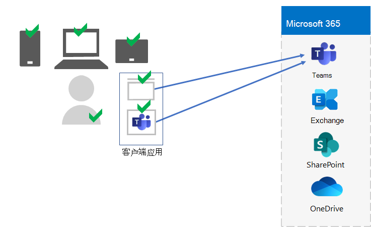

# 步骤 5. 适用于企业租户的 Microsoft 365 设备和应用管理

Microsoft 365 企业版包括以下功能：通过移动设备管理 (MDM) 和移动应用程序管理 (MAM) 帮助管理设备以及在这些设备上使用应用。 你可以管理 iOS、Android、macOS 和 Windows 设备，以保护对组织资源（包括你的数据）的访问。 例如，可以阻止向组织外部人员发送电子邮件，或将组织数据与工作者的个人设备上个人数据隔离开。

下面是验证和管理用户及其设备，以及他们使用本地和云生产力应用（如 Microsoft Teams）的示例。

为了帮助你保护组织的资源，Microsoft 365 企业版包括可帮助管理设备及其访问应用的功能。 设备管理有两个选项：

- Microsoft Intune，它是一款全面的企业设备和应用管理解决方案。
- 基本移动性和安全性，这是所有用于管理组织中设备的 Microsoft 365 产品中包含的 Intune 服务的子集。 有关详细信息，请参阅 [基本移动性和安全性的功能](https://docs.microsoft.com/microsoft-365/admin/basic-mobility-security/capabilities)。

如果你有 Microsoft 365 E3 或 E5，你应该使用 Intune。

## Microsoft Intune

使用 [Microsoft Intune](https://docs.microsoft.com/mem/intune/fundamentals/planning-guide) 使用 MDM 或 MAM 管理对组织的访问权限。 MDM 是用户在 Intune 中"注册"其设备时。 注册设备后，该设备即为托管设备，可以接收组织的策略、规则和设置。 例如，你可以安装特定应用、创建密码策略、安装 VPN 连接等。

拥有自己的个人设备的用户可能不希望注册其设备或由 Intune 和组织的策略进行管理。 但你仍然需要保护组织的资源和数据。 在此方案中，可以使用 MAM 保护应用。 例如，可以使用 MAM 策略，该策略要求用户在访问设备的 SharePoint 时输入 PIN。

你还将确定如何管理个人设备和组织拥有的设备。 你可能希望以不同方式处理设备，具体取决于设备的用途。

## 标识和设备访问配置

Microsoft 为标识和设备访问提供了一组 [配置](../security/office-365-security/microsoft-365-policies-configurations.md) ，以确保员工安全高效。 这些配置包括以下项的使用：

- Azure AD 条件访问策略
- Microsoft Intune 设备合规性应用保护策略
- Azure AD Identity Protection 用户风险策略
- 云应用的其他策略

下面是应用这些设置和策略以验证和限制用户及其设备，以及用户对本地和云生产力应用（如 Microsoft Teams）的使用的示例。

对于设备访问和管理应用，请使用以下文章中的配置：

- [先决条件](../security/office-365-security/identity-access-prerequisites.md)
- [常见标识和设备访问策略](../security/office-365-security/identity-access-policies.md)

## 步骤 5 的结果

对于 Microsoft 365 租户的设备和应用管理，你已确定 Intune 设置和策略，以验证和限制用户及其设备，以及用户对本地和云生产力应用的使用。

下面是一个租户示例，其中突出显示了新元素的 Intune 设备和应用管理。

在此图中，租户具有：

- 在 Intune 中注册的组织拥有的设备。
- 已注册和个人设备的 Intune 设备和应用策略。

## 设备和应用管理的持续维护

您可能需要持续执行： 

- 管理设备注册。
- 针对其他应用、设备和安全要求修订设置和策略。
