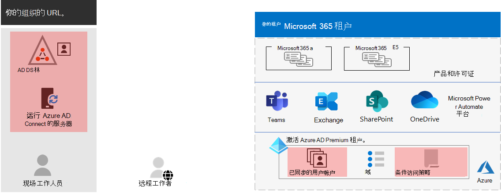

# 步骤 3. 企业租户Microsoft 365的标识

你的Microsoft 365租户包括一Azure Active Directory (Azure AD) 租户，用于管理登录的标识和身份验证。正确配置标识基础结构对于管理Microsoft 365用户访问权限和权限至关重要。

## 仅云与混合

下面是两种类型的标识模型及其最佳匹配和优势。

| 模型 | 说明 | 如何Microsoft 365用户凭据进行身份验证 | 最适用于 | 最大优势 |
|:-------|:-----|:-----|:-----|:-----|
| 仅限云 | 用户帐户仅存在于 Azure AD 租户的 Microsoft 365 租户中。 | Azure AD租户的 Microsoft 365 租户使用云标识帐户执行身份验证。 | 没有或不需要本地 Active Directory 的组织。 | 易于使用。 无需额外的目录工具或服务器。 |
| 混合 |  用户帐户存在于本地 Active Directory 域服务 (AD DS) 并且副本也位于 Microsoft 365 租户的 Azure AD 租户中。 Azure AD 连接在本地服务器上运行，以将 AD DS 更改同步到 Azure AD 租户。 Azure AD中的用户帐户可能还包括已哈希 AD DS 用户帐户密码的哈希版本。 | Azure AD租户的 Microsoft 365 租户处理身份验证过程或将用户重定向到其他标识提供程序。 | 使用 AD DS 或其他标识提供程序的组织。 | 在访问本地或基于云的资源时，用户可以使用相同的凭据。 |
||||||

以下是仅云标识的基本组件。

在此图中，本地用户和远程用户使用其 Azure AD 租户的 Microsoft 365 登录。

下面是混合标识的基本组件。

在此图中，本地和远程用户使用从本地 AD DS 复制的 Azure AD 租户中的帐户登录到 Microsoft 365 租户。

## 同步本地 AD DS

混合标识模型和目录同步是采用混合标识的企业客户最常用的选择，具体取决于业务需求和技术Microsoft 365。 目录同步允许您管理 AD DS 中的标识，并且用户帐户、组和联系人的所有更新将同步到 Microsoft 365 租户的 Azure AD 租户。

> [!NOTE]
> 首次同步 AD DS 用户帐户时，不会自动为其分配 Microsoft 365 许可证，并且无法访问 Microsoft 365 服务，如电子邮件。 您必须先为其分配使用位置。 然后，通过组成员身份单独或动态地向这些用户帐户分配许可证。

下面是使用混合标识模型时两种类型的身份验证。

| 身份验证类型 | 说明 |
|:-------|:-----|
| 托管身份验证 | Azure AD使用本地存储的密码哈希版本处理身份验证过程，或将凭据发送到本地软件代理，由本地 AD DS 进行身份验证。      托管身份验证有两种类型：密码哈希同步 (PHS) PTA (传递) 。 借助 PHS，Azure AD执行身份验证本身。 使用 PTA，Azure AD AD DS 执行身份验证。 |
| 联合身份验证 | Azure AD请求身份验证的客户端计算机重定向到另一个标识提供程序。 |
|  |  |

有关详细信息 [，请参阅选择正确的](/azure/active-directory/hybrid/choose-ad-authn) 身份验证方法。

## 强制执行强登录

若要提高用户登录的安全性，请使用下表中的特性和功能。

| 功能 | 说明 | 详细信息 | 许可要求 |
|:-------|:-----|:-----|:-----|:-----|
| Windows Hello 企业版 | 在设备上登录时，使用强双因素身份验证Windows密码。 这两个因素是一种与设备和生物识别或 PIN 相关联的新型用户凭据。 | [Windows Hello 企业版概述](/windows/security/identity-protection/hello-for-business/hello-overview) | Microsoft 365 E3 或 E5 |
| Azure AD 密码保护 | 检测并阻止已知的弱密码及其变体，还可以阻止特定于您的组织的其他弱术语。 | [配置Azure AD密码保护](/azure/active-directory/authentication/concept-password-ban-bad) | Microsoft 365 E3 或 E5 |
| 使用多重身份验证 (MFA) | MFA 要求用户登录需接受用户帐户密码之外的另一个验证，例如使用智能手机应用进行验证或发送到智能手机的短信。 有关 [用户](https://support.microsoft.com/office/set-up-multi-factor-authentication-in-microsoft-365-business-a32541df-079c-420d-9395-9d59354f7225) 如何设置 MFA 的说明，请参阅此视频。 | [适用于企业的 Microsoft 365 的 MFA](../enterprise/microsoft-365-secure-sign-in.md#mfa) | Microsoft 365 E3 或 E5 |
| 标识和设备访问配置 | 设置策略，这些策略包含建议的先决条件功能及其设置以及条件访问、Intune 和 Azure AD Identity Protection 策略，这些策略确定是否应授予给定访问请求以及应在哪些条件下授予给定访问请求。  | [标识和设备访问配置](../security/office-365-security/microsoft-365-policies-configurations.md) | Microsoft 365 E3 或 E5 |
| Azure AD 标识保护 | 防止凭据泄露，攻击者可确定用户帐户名和密码，以访问组织的云服务和数据。 | [Azure AD Identity Protection](/azure/active-directory/active-directory-identityprotection) | Microsoft 365 E5或Microsoft 365 E3 Identity &威胁防护加载项的加载项 |
|  |  |  |

## 步骤 3 的结果

对于你的租户Microsoft 365标识，你已确定：

- 要使用哪种标识模型。
- 如何强制执行强用户和设备访问。

下面是一个突出显示了新混合标识元素的租户示例。

在此图中，租户具有：

- 使用目录同步服务器和租户与 Azure AD 同步的 AD DS Azure AD 连接。
- AD DS 用户帐户和 AD DS 林中其他对象的副本。
- 一组条件访问策略，用于基于用户帐户强制实施安全用户登录和访问。

## 持续维护标识

您可能需要持续：

- 添加或修改用户帐户和组。 对于仅云标识，使用 Azure AD 工具（如 Microsoft 365 管理中心 或 PowerShell）维护基于云的用户和组。 对于混合标识，使用 AD DS 工具维护本地用户和组。
- 添加或修改标识和设备访问配置以强制实施登录安全要求。

## 后续步骤

继续[迁移，](tenant-management-migration.md)将本地Office服务器及其数据迁移到Microsoft 365。