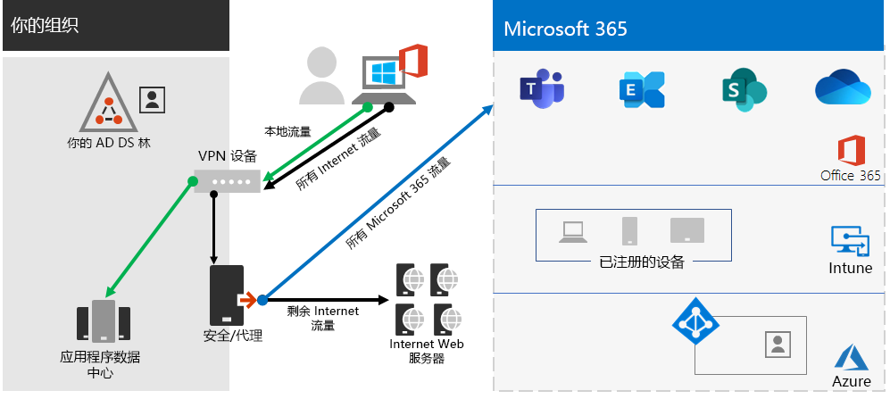
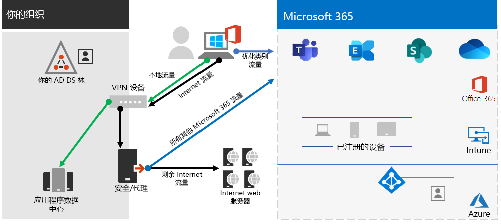

# 步骤 2. 适用于企业租户Microsoft 365最佳网络

Microsoft 365企业版包括云生产力应用（如 Teams 和 Exchange Online）和 Microsoft Intune，以及许多 Microsoft Azure 标识和安全服务。 所有这些基于云的服务都依赖于来自本地网络或 Internet 上任何位置的客户端设备连接的安全性、性能和可靠性。 

若要优化租户的网络访问，需要：

- 优化本地用户与 Microsoft 全球网络最近位置之间的路径。
- 为使用远程访问 VPN 解决方案的远程用户优化对 Microsoft 全球网络的访问。
- 使用网络Insights设计办公地点的网络外围。
- 优化对托管在具有 SharePoint 网站的特定Office 365 CDN。
- 将代理和网络边缘设备配置为Microsoft 365终结点列表绕过对受信任流量的处理，并随着更改自动更新列表。

## Enterprise本地工作人员

对于企业网络，您应通过启用客户端和最近的终结点之间性能最高的网络访问来优化最终用户Microsoft 365体验。 最终用户体验的质量与用户使用的应用程序的性能和响应能力直接相关。 例如，Microsoft Teams依赖于低延迟，以便用户电话呼叫、会议以及共享屏幕协作无故障。

网络设计的主要目标是通过减少从客户端设备到 Microsoft 全球网络的往返时间 (RTT) 来最大程度地减少延迟，Microsoft 的公共网络中枢可将 Microsoft 的所有数据中心与低延迟、高可用性云应用程序入口点（称为"前端门）"相互连接。

下面是一个传统企业网络的示例。

在此图中，分支机构通过广域网连接到中央办公室， (WAN) 和 WAN 主干网。 Internet 访问通过位于中央办公室网络边缘的安全或代理设备以及 ISP (Internet 服务提供商) 。 在 Internet 上，Microsoft 全球网络在全球的区域具有一系列前端门。 组织还可使用中间位置进行额外的数据包处理，并保护通信的安全性。 组织的租户Microsoft 365 Microsoft 全球网络内。

对于云服务，此配置Microsoft 365包括：

- 对于分支机构的用户，流量将发送到非本地前端门，从而增加延迟。
- 将流量发送到中间位置会创建网络发夹，这些网络发夹对受信任流量执行重复数据包处理，从而增加延迟。
- 网络边缘设备对受信任流量执行不需要和重复的数据包处理，从而增加了延迟。

优化Microsoft 365网络性能并不复杂。 可以通过遵循一些关键原则获得最佳性能：

- 标识Microsoft 365网络流量，即发往 Microsoft 云服务的受信任流量。
- 允许用户从用户连接到Microsoft 365的每个位置向 Internet 传输网络通信的本地Microsoft 365。
- 避免网络发夹。
- 允许Microsoft 365流量绕过代理和数据包检查设备。

如果实现这些原则，则企业网络将针对这些Microsoft 365。

在此图中，分支机构通过软件定义的 WAN 设备 (SDWAN) 设备有自己的 Internet 连接，该设备将受信任的 Microsoft 365 流量发送到区域最近的前端。 在中央办公室，受信任的Microsoft 365流量将绕过安全或代理设备，并且不再使用中间设备。

下面是优化的配置如何解决传统企业网络的延迟问题：

- 受信任的Microsoft 365流量将跳过 WAN 主干网并发送到所有办公室的本地前端，从而减少延迟。
- 对于受信任流量，将跳过执行重复数据包Microsoft 365网络发夹，从而减少延迟。
- 对于受信任流量，将跳过执行不需要的数据包处理和重复数据包Microsoft 365，从而减少延迟。

有关详细信息，请参阅Microsoft 365[网络连接概述](../enterprise/microsoft-365-networking-overview.md)。

## 远程工作人员

如果远程工作者正在使用传统的 VPN 客户端来获取对组织网络的远程访问权限，请验证该 VPN 客户端是否支持拆分隧道。 如果没有拆分隧道，所有远程工作通信都将通过 VPN 连接发送。在这种情况下，必须将其转发到组织的边缘设备、进行处理，然后在 Internet 上发送。 以下是示例。

在此图中，Microsoft 365流量必须通过组织采取间接路由，该路由可以转发到远离 VPN 客户端物理位置的 Microsoft 全球网络前端。 此间接路径会增加网络流量的延迟并降低整体性能。 

借助拆分隧道，你可以将 VPN 客户端配置为排除通过 VPN 连接发送到组织网络的特定类型的通信。

要优化 Microsoft 365 云资源的访问权限，请将拆分隧道 VPN 客户端配置为排除通过 VPN 连接的流向 **优化** 类别 Microsoft 365 终结点的流量。 有关详细信息，[请参阅Office 365类别](../enterprise/microsoft-365-network-connectivity-principles.md#new-office-365-endpoint-categories)和用于拆分隧道的优化类别终结点的列表。

下面是拆分隧道产生的流量，其中云应用Microsoft 365流量会绕过 VPN 连接。

在此图中，VPN 客户端直接通过 Internet Microsoft 365到最近进入 Microsoft 全球网络的前端，发送和接收关键的云服务流量。

有关更多信息和指导，请参阅[使用 VPN 拆分隧道为远程用户优化 Office 365 连接](../enterprise/microsoft-365-vpn-split-tunnel.md)。

## 使用网络Insights (预览) 

网络见解是从 Microsoft 365 租户收集的性能指标，可帮助你设计办公地点的网络外围。 每个见解提供有关本地用户访问租户的每个地理位置的指定问题的性能特征实时详细信息。

可能会为租户显示两个租户级别的网络见解：

- [Exchange连接问题影响的已采样连接](../enterprise/office-365-network-mac-perf-insights.md#exchange-sampled-connections-affected-by-connectivity-issues)
- [SharePoint连接问题影响的已采样连接](../enterprise/office-365-network-mac-perf-insights.md#sharepoint-sampled-connections-affected-by-connectivity-issues)

这些是每个办公地点的特定网络见解：

- [回程网络出口](../enterprise/office-365-network-mac-perf-insights.md#backhauled-network-egress)
- [为附近客户检测到更好的性能](../enterprise/office-365-network-mac-perf-insights.md#better-performance-detected-for-customers-near-you)
- [使用非最佳Exchange Online服务前端](../enterprise/office-365-network-mac-perf-insights.md#use-of-a-non-optimal-exchange-online-service-front-door)
- [使用非最佳联机SharePoint联机服务前端](../enterprise/office-365-network-mac-perf-insights.md#use-of-a-non-optimal-sharepoint-online-service-front-door)
- [从前端SharePoint下载速度](../enterprise/office-365-network-mac-perf-insights.md#low-download-speed-from-sharepoint-front-door)
- [中国用户最佳网络出口](../enterprise/office-365-network-mac-perf-insights.md#china-user-optimal-network-egress)

> [!IMPORTANT]
> Microsoft 365 管理中心中的网络见解、性能建议和评估当前处于预览状态。 它仅适用于已在Microsoft 365预览计划注册的租户。

有关详细信息，请参阅 Microsoft 365 [Network Insights](../enterprise/office-365-network-mac-perf-insights.md)。

## SharePoint性能Office 365 CDN

基于云的服务器内容分发网络 (CDN) 减少加载时间、节省带宽并加快响应速度。 一CDN缓存静态资产（如图形或视频文件）以改进性能，这可帮助加快下载速度并减少延迟。 您可以使用 Office 365 内容分发网络 (CDN) 和 E5 中的 SharePoint 中包含的内置 Microsoft 365 E3 来托管静态资产，以便为 SharePoint 页面提供更好的性能。

Office 365 CDN 由多个 CDN 组成，用户可以在多个位置（即 _源_）托管静态资产，并从全局高速网络提供这些资产。 根据你想要在网站中托管的内容Office 365 CDN，你可以添加 **公用** 源和/或私有源。 

部署和配置后，Office 365 CDN上载来自公用源和专用源的资产，并使它们可供通过 Internet 访问的用户快速访问。

有关详细信息，请参阅将 Office 365 CDN[与 SharePoint Online。](../enterprise/use-microsoft-365-cdn-with-spo.md)

## 自动终结点列表

若要让本地客户端、边缘设备和基于云的数据包分析服务跳过受信任 Microsoft 365 流量的处理，必须使用与 Microsoft 365 服务对应的一组终结点 (IP 地址范围和 DNS 名称) 配置它们。 可以在防火墙和其他边缘安全设备、客户端计算机的 PAC 文件以绕过代理或分支机构的 SD-WAN 设备中手动配置这些终结点。 但是，终结点会随着时间而改变，需要持续手动维护这些位置中的终结点列表。

若要为客户端 PAC 文件和网络设备中的 Microsoft 365 终结点自动列出和更改管理，请使用 [Office 365 IP 地址和基于 URL REST 的 Web 服务](../enterprise/microsoft-365-ip-web-service.md)。 此服务可帮助您更好地识别和区分Microsoft 365网络流量，从而更轻松地评估、配置和了解最新更改。

可以使用 PowerShell、Python 或其他语言来确定终结点在一段时间的变化，并配置 PAC 文件和边缘网络设备。

基本过程为：

1. 使用 Office 365 IP 地址和 URL Web 服务以及你选择的配置机制，使用当前的一组 MICROSOFT 365 终结点配置 PAC 文件和网络设备。
2. 运行每日定期检查终结点中的更改或使用通知方法。
3. 检测到更改时，为客户端计算机重新生成和重新分发 PAC 文件，并更改网络设备。

有关详细信息，请参阅 Office 365 [IP 地址和 URL Web 服务](../enterprise/microsoft-365-ip-web-service.md)。

## 步骤 2 的结果

对于Microsoft 365网络的最佳租户，你已确定：

- 如何通过添加到所有分支机构的 Internet 连接并消除网络发夹，为本地用户优化网络性能。
- 如何为基于客户端的 PAC 文件和网络设备和服务实现自动受信任终结点列表，包括最适合企业网络 (更新) 。
- 如何支持远程工作者访问本地资源。
- 如何使用网络Insights
- 如何部署Office 365 CDN。

下面是具有最佳网络的企业组织及其租户的示例。

[查看此图像的较大版本](https://github.com/MicrosoftDocs/microsoft-365-docs/raw/public/microsoft-365/media/tenant-management-overview/tenant-management-tenant-build-step2.png)

在此图中，此企业组织的租户具有：

- 每个分支机构的本地 Internet 访问，其中 SDWAN 设备将受信任Microsoft 365流量转发到本地前端。
- 无网络发夹。
- 将受信任流量转发到本地Microsoft 365的中央办公室安全性和代理边缘设备。

## 持续维护以实现最佳网络

您可能需要持续：

- 针对终结点中的更改更新边缘设备和部署的 PAC 文件，或验证自动化进程是否正常工作。
- 管理资源管理Office 365 CDN。
- 更新 VPN 客户端中的拆分隧道配置，以更改终结点。

## 后续步骤

继续使用 [标识](tenant-management-identity.md) 同步本地帐户和组，并强制执行安全用户登录。
