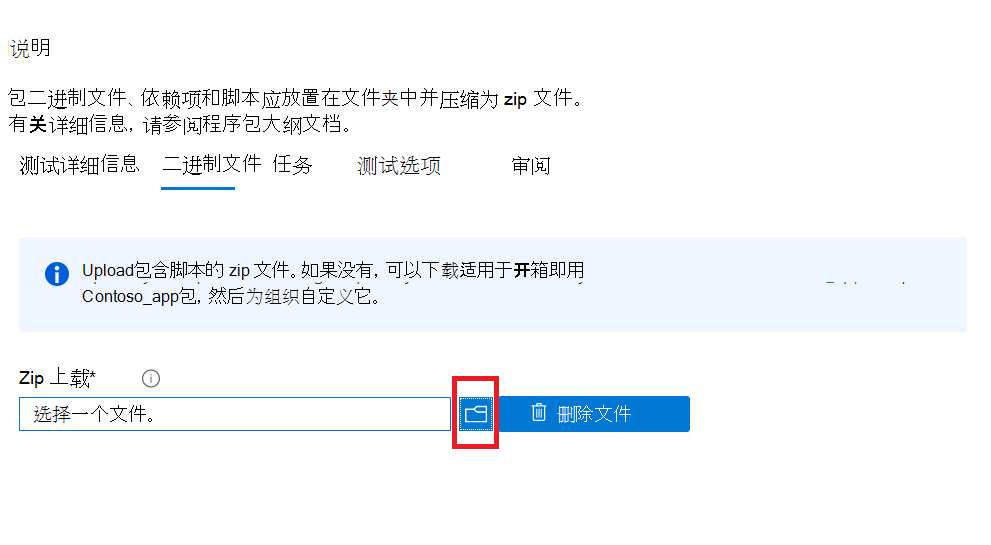

# <a name="step-3-upload-your-binaries-dependencies-and-scripts"></a><span data-ttu-id="11d9c-103">步骤 3：Upload二进制文件、依赖项和脚本</span><span class="sxs-lookup"><span data-stu-id="11d9c-103">Step 3: Upload your binaries, dependencies, and scripts</span></span>

<span data-ttu-id="11d9c-104">在此选项卡上，将上载单个 zip 包，其中包含用于运行测试套件的二进制文件、依赖项和脚本。</span><span class="sxs-lookup"><span data-stu-id="11d9c-104">On this tab, you will upload a single zip package containing your binaries, dependencies and scripts used to run your test suite.</span></span>

## <a name="upload-package-zip-file"></a><span data-ttu-id="11d9c-105">Upload包 zip 文件</span><span class="sxs-lookup"><span data-stu-id="11d9c-105">Upload package zip file</span></span>



  - <span data-ttu-id="11d9c-107">上载的依赖项可能包括测试框架、脚本引擎或将访问以运行应用程序或测试用例的数据。</span><span class="sxs-lookup"><span data-stu-id="11d9c-107">Uploaded dependencies can include test frameworks, scripting engines or data that will be accessed to run your application or test cases.</span></span> <span data-ttu-id="11d9c-108">例如，你可以上载 Selenium 和 Webdriver 安装程序来帮助运行基于浏览器的测试。</span><span class="sxs-lookup"><span data-stu-id="11d9c-108">For example, you can upload Selenium and a webdriver installer to help run browser-based tests.</span></span>
  - <span data-ttu-id="11d9c-109">最佳做法是确保脚本活动保持模块化，即</span><span class="sxs-lookup"><span data-stu-id="11d9c-109">It is best practice to ensure your script activities are kept modular i.e.</span></span> 
    - <span data-ttu-id="11d9c-110">脚本 ```Install``` 仅执行安装操作。</span><span class="sxs-lookup"><span data-stu-id="11d9c-110">The ```Install``` script only performs install operations.</span></span>
    - <span data-ttu-id="11d9c-111">脚本 ```Launch``` 仅启动应用程序。</span><span class="sxs-lookup"><span data-stu-id="11d9c-111">The ```Launch``` script only launches the application.</span></span>
    - <span data-ttu-id="11d9c-112">```Close```脚本仅关闭应用程序。</span><span class="sxs-lookup"><span data-stu-id="11d9c-112">The ```Close``` script only closes the application.</span></span>
    - <span data-ttu-id="11d9c-113">可选 ```Uninstall``` 脚本仅卸载应用程序。</span><span class="sxs-lookup"><span data-stu-id="11d9c-113">The optional ```Uninstall``` script only uninstalls the application.</span></span>

<span data-ttu-id="11d9c-114">**目前，该门户仅支持 PowerShell 脚本。**</span><span class="sxs-lookup"><span data-stu-id="11d9c-114">**Currently, the portal only supports PowerShell scripts.**</span></span>


## <a name="next-steps"></a><span data-ttu-id="11d9c-115">后续步骤</span><span class="sxs-lookup"><span data-stu-id="11d9c-115">Next steps</span></span> 

<span data-ttu-id="11d9c-116">前进到下一篇文章，转到步骤 4： **设置测试任务**。</span><span class="sxs-lookup"><span data-stu-id="11d9c-116">Advance to the next article to go onto Step 4: **Set your Test Tasks**.</span></span>
> [!div class="nextstepaction"]
> [<span data-ttu-id="11d9c-117">回去</span><span class="sxs-lookup"><span data-stu-id="11d9c-117">Go back</span></span>](uploadApplication.md)
> [!div class="nextstepaction"]
> [<span data-ttu-id="11d9c-118">后续步骤</span><span class="sxs-lookup"><span data-stu-id="11d9c-118">Next step</span></span>](testtask.md)

