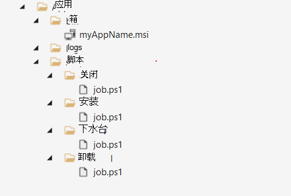

# <a name="build-a-package"></a>生成程序包
包是一.zip应用程序二进制文件和测试脚本的配置文件，这是使用测试库的先决条件。 此快速入门将指导你生成你的第一个程序包，通过该程序包，你可以对应用程序执行开箱即用测试。 
  
*    *开 **箱即用 OOB (OOB)** 测试执行应用程序的安装、启动、关闭和卸载。安装后，在运行单个卸载之前，launch-close 例程将重复 30 次。OOB 测试提供程序包上的标准化遥测，以便跨内部版本Windows比较。*  
    
（可选）你可以下载我们 [的示例包](https://aka.ms/testbase-sample-package) ，以参考并开始使用。 

## <a name="create-a-folder-structure"></a>创建文件夹结构 

在本地计算机上，创建文件夹结构，如下所示：<br> 


这些文件夹用于：
* **App\bin**：保存应用程序和依赖关系二进制文件。<br> 
* **App\scripts**：保存脚本以安装、启动、关闭和卸载应用程序。<br> 
* **应用\日志**：脚本应该将日志输出到此文件夹，然后可以在测试完成后下载和分析日志。<br> 

## <a name="copy-binary-files"></a>复制二进制文件 (文件) 
将应用程序安装文件复制到 **App\bin**。 如果应用程序具有依赖项，则首先需要安装它们。 此外，将依赖项安装文件复制到 **App\bin**。<br> 


## <a name="add-powershell-scripts"></a>添加 PowerShell 脚本
若要执行 OOB 测试，您需要添加 PowerShell 脚本以安装、启动、关闭和卸载应用程序。
> [!NOTE]  
> *在 OOB 测试中，需要安装、启动和关闭脚本，而卸载脚本是可选的*。
    
脚本应添加到文件夹，如下所示：  


脚本通常包括以下行为：<br> 
-   **运行命令以安装/启动/关闭/卸载应用程序**。 例如，如果您的应用程序是 MSI 文件，请运行 [msiexec](/windows-server/administration/windows-commands/msiexec) 进行安装。 <br> 
-   **检查安装/启动/关闭/卸载操作的结果**，如果预期结果，则返回零退出代码。 如果 Test Base 返回非零退出代码，它会将脚本运行标记为失败。<br> 
-   **保存足够的日志**，保存正确的日志供将来使用。<br> 

请参阅以下示例。 只需将它们复制到文件并相应地进行更改。 <br>

**安装脚本 (App\scripts\install\job.ps1 示例)**
```powershell
        push-location $PSScriptRoot
        $exit_code = 0
        $script_name = $myinvocation.mycommand.name
        $log_dir = "$PSScriptRoot\..\..\logs"
        $log_file = "$log_dir\$script_name.log"


        if(-not (test-path -path $log_dir )) {
            new-item -itemtype directory -path $log_dir
        }

        Function log {
           Param ([string]$log_string)
           write-host $log_string
           add-content $log_file -value $log_string
        }

        log("Installing TestBaseM365 Digital Clock")
        push-location "..\..\bin"
        if ([Environment]::Is64BitProcess) {
            $installer_name = "TestBaseM365DigitalClock.msi"
        }
        else {
            $installer_name = "TestBaseM365DigitalClock.msi"
        }
        $arguments = "/i "+$installer_name+" /quiet /L*v "+"$log_dir"+"\atp-client-installation.log"

        $installer = Start-Process msiexec.exe $arguments -wait -passthru
        pop-location

        if ($installer.exitcode -eq 0) {
            log("Installation succesful as $($installer.exitcode)")
        }
        else {
            log("Error: Installation failed as $($installer.exitcode)")
            $exit_code = $installer.exitcode
        }

        log("Installation script finished as $exit_code")
        pop-location
        exit $exit_code
```

**启动脚本 (App\scripts\launch\job.ps1 示例)**
```powershell
        push-location $PSScriptRoot
        $exit_code = 0
        $script_name = $myinvocation.mycommand.name
        $log_dir = "$PSScriptRoot\..\..\logs"
        $log_file = "$log_dir\$script_name.log"

        if(-not (test-path -path $log_dir )) {
            new-item -itemtype directory -path $log_dir
        }

        Function log {
           Param ([string]$log_string)
           write-host $log_string
           add-content $log_file -value $log_string
        }

        log("Launch TestBaseM365 Digital Clock")

        $PROCESS_NAME = "DigitalClock"
        $exePath = "C:\Program Files\Test Base M365\DigitalClock\DigitalClock.exe"

        Start-Process -FilePath $exePath

         if (Get-Process -Name $PROCESS_NAME) {
                log("Launch successfully $PROCESS_NAME...") 
                $exit_code = 0
         }
         else {
            log("Not launched $PROCESS_NAME...") 
            $exit_code = 1
         }

        log("Launch script finished as $exit_code")
        pop-location
        exit $exit_code 
```

## <a name="compress-to-zip-file"></a>压缩为 zip 文件
准备好脚本和二进制文件后，继续将文件夹压缩为 zip 文件。 右键单击"应用"文件夹，选择 **"压缩到 ZIP 文件"**。<br>


## <a name="verify-your-package-locally-optional"></a>验证你的程序包是否 (可选) 
生成 zip 包后，你可以将其上载到测试基础帐户。 <br>
但是，最佳做法是在本地运行测试，以确保脚本在上载之前正常工作。 本地测试可以快速识别问题并加快上传过程。 若要在本地验证，请按照以下步骤操作：<br>
1.  准备虚拟机 (虚拟机) <br>
    我们建议将虚拟机用于此本地测试，因为每个测试Windows需要干净环境。 在 Azure (快速入门：[Windows](/azure/virtual-machines/windows/quick-create-portal) 虚拟机) 上创建 Windows VM 非常简单，你可以为测试选择正确的 Windows (映像) ，例如 *Windows 10 专业版 版本 21H2。*<br>

2.  将程序包复制到 VM<br>
    有许多方法将程序包文件复制到 VM。 如果你使用的是 Azure VM，可以选择：
     -  直接在远程桌面连接中复制文件。 <br>
     -  使用 Azure 文件共享 ([快速入门：创建和管理 Azure) ](/azure/storage/files/storage-files-quick-create-use-windows)
    
    你可以为此测试创建特定文件夹，并复制此文件夹下的包文件。 例如， *C：\TestBase*。<br>
3.  测试程序包<br>
    打开Windows PowerShell，切换到包含程序包的目录（例如 cd C：\TestBase）并开始在程序包上运行测试：<br>
    a.  提取包文件。
     -  *Expand-Archive -LiteralPath C:\TestBase\App.zip -DestinationPath C：\TestBase*<br>
    
    b.  运行安装脚本。  
     -  *C:\TestBase\App\scripts\install\job.ps1*<br>
    
    c.  如有必要，请重新启动 VM。<br>
    
    d.  运行启动脚本。
     -  *C:\TestBase\App\scripts\install\job.ps1*<br>
    
    e.  运行关闭脚本。
     -  *C:\TestBase\App\scripts\close\job.ps1*<br>
    
    f.  如果您有一个 (，请运行卸载) 。
     -  *C:\TestBase\App\scripts\uninstall\job.ps1*<br>
    
    每个步骤后，都可以检查脚本中是否存在任何问题。 如果所有脚本都如期运行，则你的程序包已准备好上传到你的测试基础帐户。


## <a name="next-steps"></a>后续步骤
[Upload包](uploadApplication.md)
 
 
