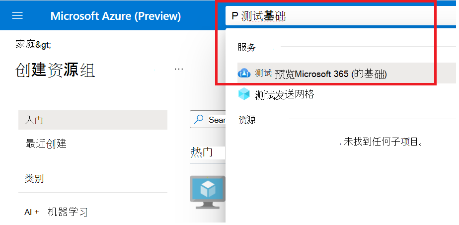
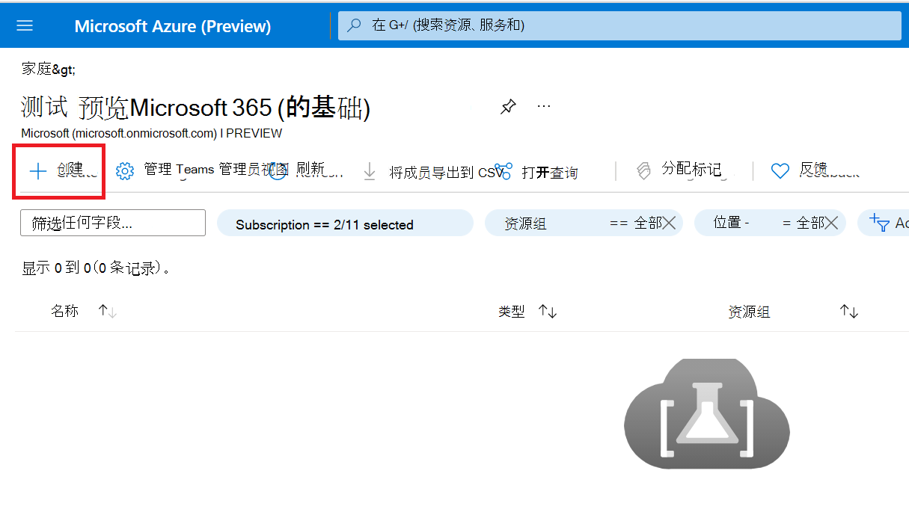
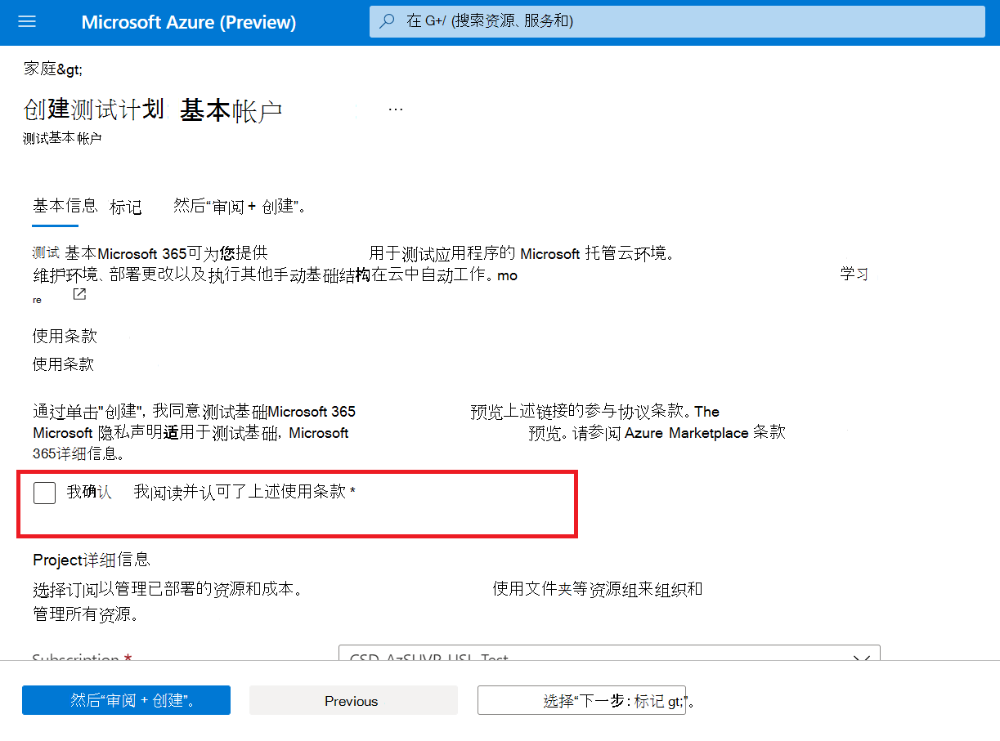
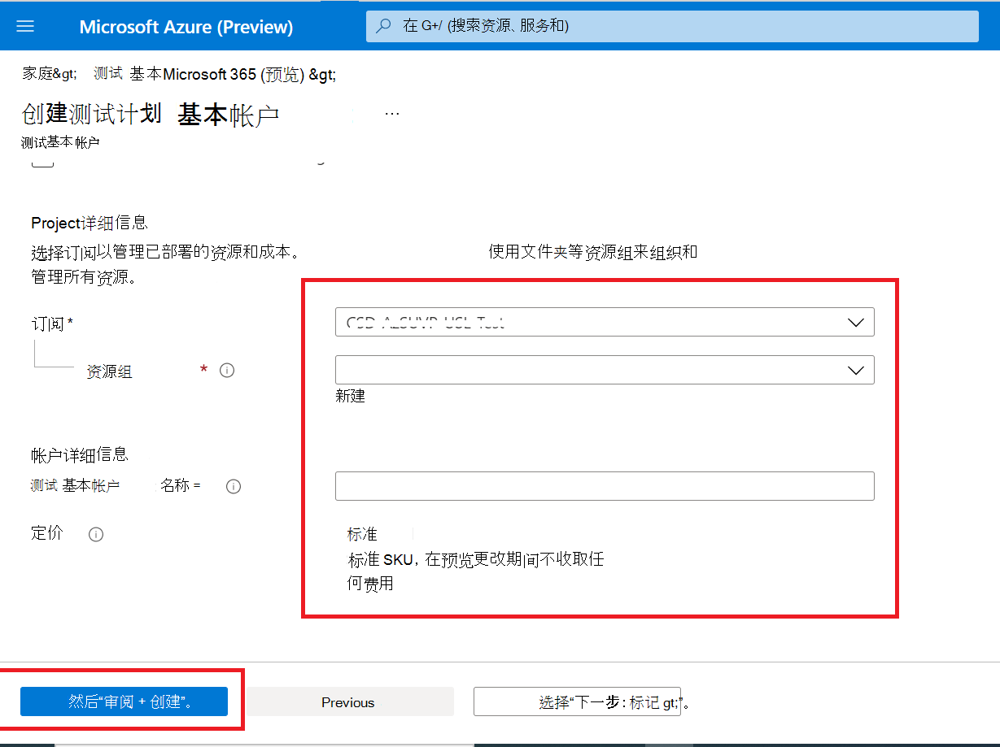

# <a name="step-1-create-a-test-base-account"></a>步骤 1：创建测试基础帐户

如果你没有 Azure 订阅，在开始之前 [创建一](https://azure.microsoft.com/free/) 个免费帐户。

## <a name="enter-details-for-test-base-account"></a>输入测试基本帐户的详细信息
 
1. 在 Azure **门户中搜索** "测试基础"。



2. 单击 **"创建"** 以创建测试基础帐户。



3.  阅读 ， ```Terms of Use``` 然后选中复选框以确认你对 的满意度 ```Terms of Use```。



4.  根据以下要求填写正确的信息： 
    -   订阅：资源组
    -   实例详细信息：名称。

**目前，测试基础仅支持标准定价层。**



5.  最后，单击以 ```Review + Create``` 验证并启用新创建的帐户。

## <a name="next-steps"></a>后续步骤

前进到下一篇文章，开始使用步骤 2： **了解如何上传程序包。**
> [!div class="nextstepaction"]
> [后续步骤](uploadApplication.md)

<!---
Add button for next page
-->
