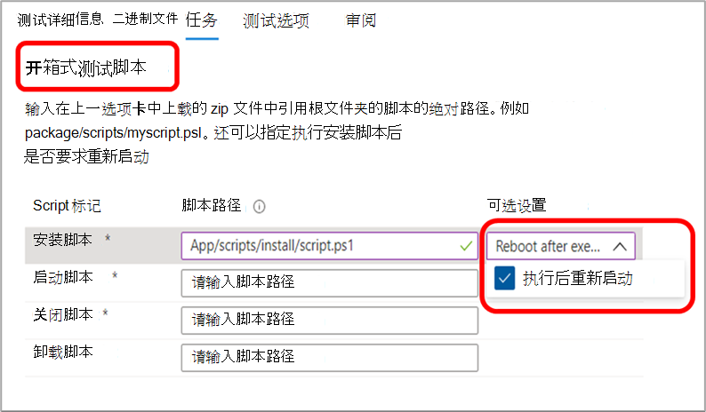
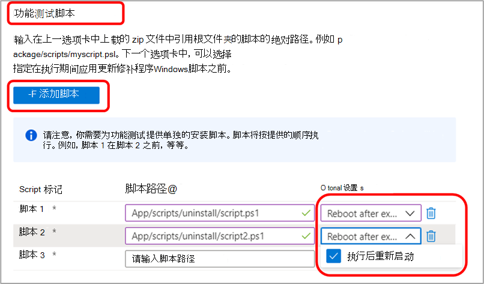

# 测试基础常见问题解答

**问：如何将程序包提交到测试基础团队？**

**答：** 使用自助门户将程序包直接提交到测试基础环境。

若要提交应用程序包，请导航到 [Azure](https://www.aka.ms/testbaseportal "测试基本主页") 门户，然后通过自助式测试基础门户仪表板上传包含应用程序二进制文件、依赖项和测试脚本的压缩文件夹。 

有关详细信息，请参阅载入用户指南，或联系我们的团队 <testbasepreview@microsoft.com> 获取帮助和详细信息。

**问：OOB 测试 (开箱) 是什么？**

**答：** 开箱即用 OOB (测试) 标准化的默认测试运行，安装、启动和关闭应用程序包 30 (30 次) 卸载。 

为测试库创建的程序包将具有以下测试脚本：安装、启动、关闭和（可选）卸载脚本。 

开箱即用 OOB (测试) 应用程序上的标准化遥测，以跨内部版本Windows比较。

**问：我们能否在安装、启动、关闭、卸载测试脚本 (外部的开箱测试) ？**

**答：** 是的，客户还可以通过自助服务门户仪表板上载用于功能测试的应用程序包。
**功能** 测试是使客户能够执行其脚本以在应用程序上运行自定义功能的测试。

## 测试

**问：是否支持功能测试？**

**答：** 是，测试库支持功能测试。 功能测试是使我们的客户能够执行其脚本以在应用程序上运行自定义功能的测试。 

若要提交应用程序包进行功能测试，只需通过自助服务门户仪表板上载包含应用程序二进制文件、依赖项和测试脚本的压缩文件夹。 

有关详细信息，请参阅载入用户指南，或联系我们的团队 <testbasepreview@microsoft.com> 获取帮助和详细信息。

**问：测试基础如何处理我们的测试数据？**

**答：** 测试库安全地收集和管理 Azure 环境上的测试数据。 

**问：测试基础能否支持我们的自动测试？**

**答：** 是的，测试库支持自动测试，但是，由于服务功能，我们目前不支持手动测试。

**问：你支持哪些语言和自动测试框架？**

**答：** 我们支持所有语言和框架。 我们通过 PowerShell 调用所有脚本。 

你还需要提供 (上传) 所需框架的从属二进制文件。

**问：测试基础多久提供测试结果？**

**答：** 对于针对预发布版本运行的每个测试，我们将在 48 小时内在 Azure 门户仪表板 [上提供](https://www.aka.ms/testbaseportal "测试基本主页") 结果。

**问：能否在安装后重新启动？**

**答：** 是的，我们的过程支持在安装后重新启动。 在载入门户上设置任务时，请务必从"可选设置"下拉列表中选择此选项。

对于开箱即 (OOB) 测试，您可以指定安装脚本是否需要 _重新启动。_

对于功能测试，你可以指定添加的每个脚本是否需要重新启动。

**问：Windows支持哪些版本？**

**答：** 我们目前Windows 10支持 Windows 10、Windows Server 2016、Windows Server 2016 Core 版本、Windows Server 2019 和 Windows Server 2019 Core 版本。

**问：安全更新测试与功能更新测试之间有什么区别？**

**答：** 对于安全更新测试，我们针对每月预发布 **<ins></ins>** 安全更新进行测试Windows这些更新侧重于确保我们的用户始终安全和受保护。 对于功能更新测试，我们将针对两年一 **<ins></ins>** 次预发布功能更新进行测试，这些更新在功能更新中引入了新的Windows。

## 调试选项

**问：在出现故障时，我们 (虚拟机) 虚拟机？测试基础共享是什么？**

**答：** 若要使服务合规且预发布更新是安全的，只有 Microsoft 可以访问 VM。 但是，客户可以在门户仪表板上查看测试结果和其他测试指标，包括崩溃和挂起信号、可靠性指标、内存和 CPU 使用率等。我们还在仪表板上生成并提供测试运行的日志，以便下载和进一步分析。 

我们还可以根据需要提供用于崩溃调试的内存转储。

**问：如果在测试过程中发现问题，那么解决这些问题的下一步是什么？**

**答：** 测试基础团队将执行初始会审过程以确定错误的根本原因，然后根据我们的结果，我们将路由至 Microsoft 内的客户或内部团队进行调试。 

我们始终与客户密切合作，共同解决任何问题。 

**问：在问题解决之前，Microsoft 是否保留安全修补程序的发布？哪些备用分辨率可用？**

**答：** 测试基础的目标是确保我们的联合最终客户不会面临任何问题。 我们将与软件供应商一起努力在发布之前解决任何问题，但如果修复不可行，我们还有其他解决方案，如填充码和块。

## 其他

**问：该服务如何与内部服务器一起运行？**

**答：** 我们目前不提供对地服务器的支持。 但是，如果服务器公开 HTTP 终结点，我们可以通过 Internet 连接到它。

**问：Who托管 VM？**

**答：** Microsoft 设置此服务的 VM，从客户处获得执行此操作的负载。

**问：此服务是否支持 Web、移动或桌面应用程序？**

**答：** 目前，我们侧重于桌面应用程序，但是，我们计划将来载入 Web 应用程序，但我们目前不支持移动应用程序。

**问：测试基础和 SUVP 之间有什么区别？**

**答：** 测试基础与 SUVP 之间的最大差异是，我们的合作伙伴将他们的应用程序载入测试基础 Azure 环境，以针对预发布更新运行验证，而不是自行执行测试。 

除了预发布安全更新测试之外，我们还支持在平台上进行预发布功能更新测试。 我们的路线图中有很多其他类型的更新和操作系统测试。

**问：服务是否有相关成本？**

**答：** 测试基础服务将一直由用户免费使用，直到通用 (GA) 。 此时，我们将宣布一个成本结构，该结构将作用于所有客户。 

**问：如何提供有关测试基础的反馈？**

**答：** 若要共享有关测试基础的反馈，请选择门户左下角的反馈图标。 在提交内容中包括屏幕截图，以帮助 Microsoft 更好地了解你的反馈。 

还可以提交产品建议，并可在 上对其他想法进行选择 <testbasepreview@microsoft.com> 。
