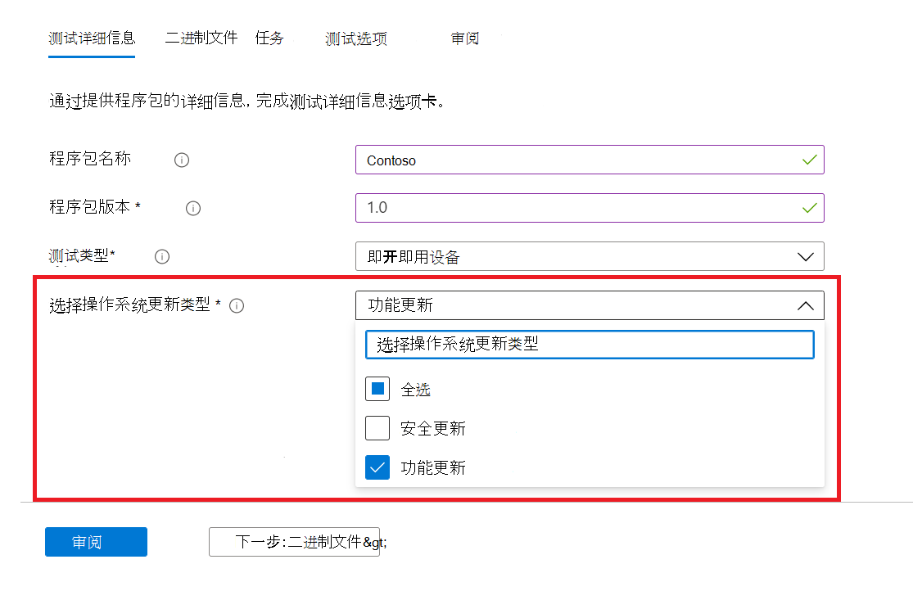
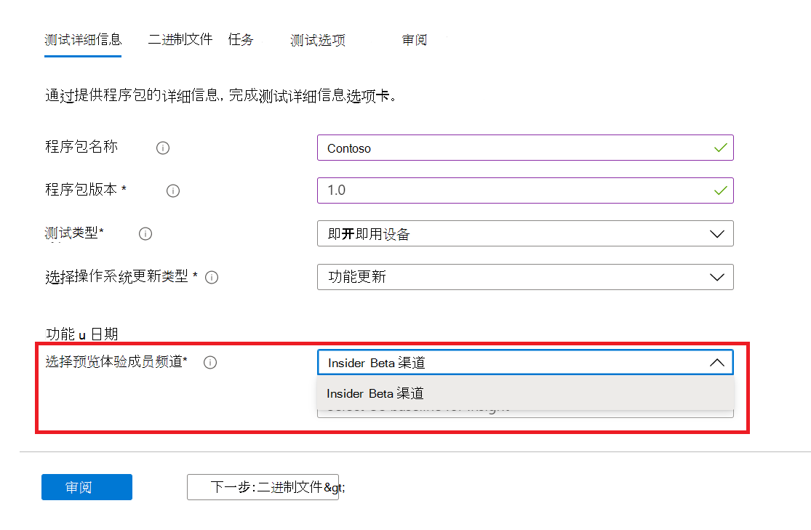
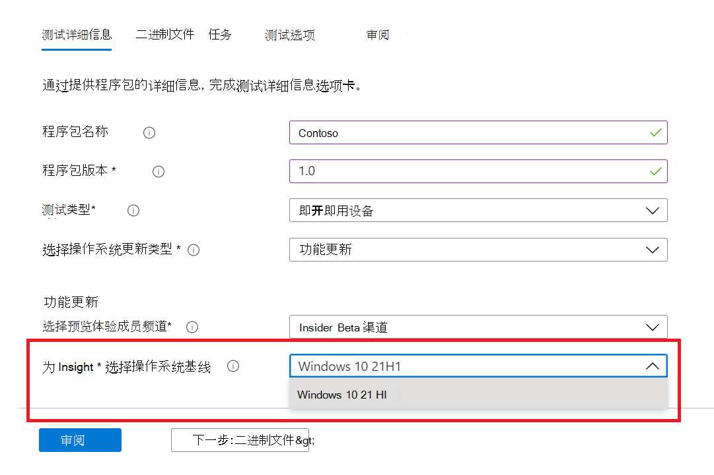

# <a name="windows-feature-update-validation"></a>Windows功能更新验证

是否需要深入了解应用程序在下次发布 Windows 10 或 Windows 11 时将如何执行，而无需维护环境来验证新的 Windows 功能？ 

是否要针对 Azure 环境中预览体验Windows内部版本运行验证测试？

**M365** 测试基础上的功能更新验证可以帮助你实现所有这些目标以及更多功能！

请查看下面的分步大纲，了解如何在 M365 服务测试基础中访问此新功能。

若要开始使用 M365 测试基础，请 (自助服务载入门户) 应用程序和相关 ```Feature update validation``` 文件。 

下面突出显示了填写测试详细信息时 **要执行的步骤**：

1. 选择 **"功能更新** "作为操作系统更新类型：



2. 选择Windows验证应用程序的预览体验成员频道。  



3. 选择 Windows 10 或 Windows 11 的市场内版本作为测试 (和生成的见解！) 并提供成功载入程序包所需的其他详细信息。



4. 若要查看针对预发布功能更新验证应用程序的结果Windows 10，请访问 ```Feature Updates Test Results``` 。


## <a name="next-steps"></a>后续步骤

前进到下一篇文章，开始了解内存回归分析。
> [!div class="nextstepaction"]
> [下一步](memory.md)

<!---
Add button for next page
-->
