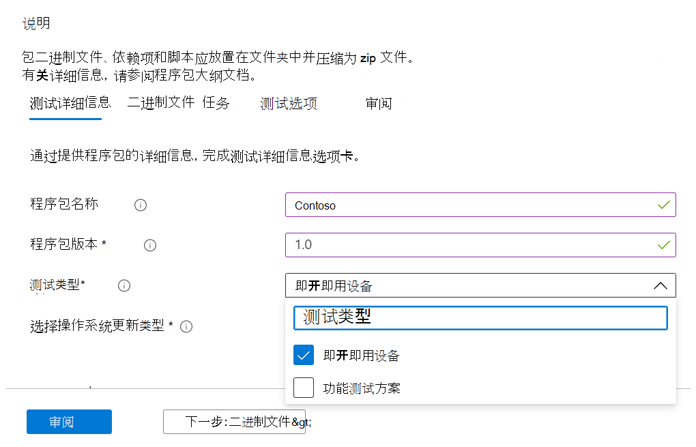
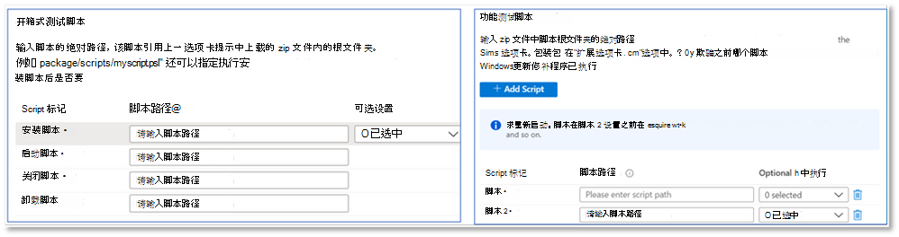
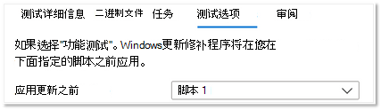

# <a name="functional-testing"></a><span data-ttu-id="813b9-103">功能测试</span><span class="sxs-lookup"><span data-stu-id="813b9-103">Functional testing</span></span>

<span data-ttu-id="813b9-104">作为软件供应商，你现在可以使用你选择的测试框架（通过 M365 自助测试库门户）执行自定义功能测试。</span><span class="sxs-lookup"><span data-stu-id="813b9-104">As a software vendor, you can now perform custom functional tests, using the test framework of your choice - via the self-serve Test Base for M365 portal.</span></span> 

<span data-ttu-id="813b9-105">当我们最初启动该服务时，我们提供了开箱即用测试，这是一组通过标准化脚本驱动的预定义测试。</span><span class="sxs-lookup"><span data-stu-id="813b9-105">When we initially launched the service, we offered the Out-of-box tests, which is a pre-defined set of tests driven through standardized scripting.</span></span> <span data-ttu-id="813b9-106">但是，这无法为许多独立软件供应商和 ISV (完全) 。</span><span class="sxs-lookup"><span data-stu-id="813b9-106">This, however, could not achieve full test coverage for many Independent Software Vendors (ISVs).</span></span> 

<span data-ttu-id="813b9-107">因此，为了响应您的反馈，我们将为 ISV 提供上载自动功能测试的功能。</span><span class="sxs-lookup"><span data-stu-id="813b9-107">Hence, in response to your feedback, we are providing our ISVs with the ability to upload automated functional tests.</span></span>

<span data-ttu-id="813b9-108">若要使用此功能，请按照以下步骤操作：</span><span class="sxs-lookup"><span data-stu-id="813b9-108">To use this feature, follow the steps below:</span></span>

1. <span data-ttu-id="813b9-109">Upload文件 (单个文件包) 二进制文件、依赖项和.zip脚本。</span><span class="sxs-lookup"><span data-stu-id="813b9-109">Upload your files (binaries, dependencies and scripts) as a single .zip package.</span></span>
2. <span data-ttu-id="813b9-110">选择是否要在各种执行点 (虚拟机) 虚拟机。</span><span class="sxs-lookup"><span data-stu-id="813b9-110">Choose if you want to reboot the test Virtual Machines (VMs) at various points of execution.</span></span>
3. <span data-ttu-id="813b9-111">管理脚本的可用选项。</span><span class="sxs-lookup"><span data-stu-id="813b9-111">Manage available options for your scripts.</span></span>
4. <span data-ttu-id="813b9-112">选择在执行期间Windows虚拟机上的更新。</span><span class="sxs-lookup"><span data-stu-id="813b9-112">Choose when to apply the Windows update on the VM during execution.</span></span>

<span data-ttu-id="813b9-113">下面重点介绍了上述步骤的详细说明：</span><span class="sxs-lookup"><span data-stu-id="813b9-113">Detailed descriptions of the above steps are highlighted below:</span></span>

<span data-ttu-id="813b9-114">**Upload功能测试包**</span><span class="sxs-lookup"><span data-stu-id="813b9-114">**Upload a functional test package**</span></span>

<span data-ttu-id="813b9-115">To get started， navigate to the Upload page， select Upload new application under Application catalog on the left-side navigation menu of the Test Base for M365 portal in Azure.</span><span class="sxs-lookup"><span data-stu-id="813b9-115">To get started, navigate to the Upload page, select Upload new application under Application catalog on the left-side navigation menu of the Test Base for M365 portal in Azure.</span></span> <span data-ttu-id="813b9-116">从该时间开始：</span><span class="sxs-lookup"><span data-stu-id="813b9-116">From there:</span></span>

<span data-ttu-id="813b9-117">选项卡 1 - 输入基本信息。</span><span class="sxs-lookup"><span data-stu-id="813b9-117">Tab 1 - Enter basic information.</span></span> <span data-ttu-id="813b9-118">提供应用程序的名称和版本。</span><span class="sxs-lookup"><span data-stu-id="813b9-118">Provide the name and version of your application.</span></span> <span data-ttu-id="813b9-119">在"测试类型"选项中，选择 ```Functional tests``` 。</span><span class="sxs-lookup"><span data-stu-id="813b9-119">In the Type of test option, select ```Functional tests```.</span></span> 

<span data-ttu-id="813b9-120">*请注意，默认情况下，"开箱即 (OOB) 选项是必需的。*</span><span class="sxs-lookup"><span data-stu-id="813b9-120">*Note that the Out-of-Box (OOB) option is required by default.*</span></span>




<span data-ttu-id="813b9-122">选项卡 2 - Upload通过上传包含整个测试文件（二进制文件、依赖项、脚本等）的 zip 文件 (包) 。</span><span class="sxs-lookup"><span data-stu-id="813b9-122">Tab 2 - Upload the components of your package by uploading a zip file with your entire test (binaries, dependencies, scripts etc).</span></span> 

<span data-ttu-id="813b9-123">有关详细信息 aka.ms/usl-package-outline 请参阅 Aka.ms/usl-package-outline。</span><span class="sxs-lookup"><span data-stu-id="813b9-123">See aka.ms/usl-package-outline for details.</span></span> <span data-ttu-id="813b9-124"> (注意：开箱即用测试脚本和功能测试内容应放在同一 zip 文件中) 。</span><span class="sxs-lookup"><span data-stu-id="813b9-124">(Note: Both the Out-of-Box test scripts and the Functional test contents should be placed into the same zip file).</span></span> <span data-ttu-id="813b9-125">目前，文件大小限制为 2GB。</span><span class="sxs-lookup"><span data-stu-id="813b9-125">Currently, the file size is limited to 2GB.</span></span>

<span data-ttu-id="813b9-126">选项卡 3 - 配置开箱即用和功能测试任务。</span><span class="sxs-lookup"><span data-stu-id="813b9-126">Tab 3 - Configure the Out-of-Box and Functional test tasks.</span></span> <span data-ttu-id="813b9-127">在此处，选择将安装、启动、关闭和卸载应用程序 (for Out-of-Box) 的 PowerShell 脚本的 () 路径，以及所有自定义脚本的 () 路径，以执行功能测试。</span><span class="sxs-lookup"><span data-stu-id="813b9-127">Here, choose the path(s) to the PowerShell scripts that will install, launch, close, and uninstall your application (for Out-of-Box) as well as the path(s) to all your custom scripts to perform your functional test.</span></span> <span data-ttu-id="813b9-128">**(注意：用于卸载应用程序的脚本是可选的) 。**</span><span class="sxs-lookup"><span data-stu-id="813b9-128">**(Note: A script to uninstall your application is optional).**</span></span>

<span data-ttu-id="813b9-129">目前，您可以上载 1 到 8 个脚本，用于功能测试。</span><span class="sxs-lookup"><span data-stu-id="813b9-129">Currently, you can upload between 1 and 8 scripts for your functional tests.</span></span> <span data-ttu-id="813b9-130"> (脚本，请对此文章进行评论！) </span><span class="sxs-lookup"><span data-stu-id="813b9-130">(Kindly comment on this post if you need more scripts!)</span></span>



<span data-ttu-id="813b9-132"> (可选) 安装后配置重启。</span><span class="sxs-lookup"><span data-stu-id="813b9-132">(Optional) Configure a restart after installation.</span></span> <span data-ttu-id="813b9-133">某些应用程序需要在安装后重新启动。</span><span class="sxs-lookup"><span data-stu-id="813b9-133">Some applications require a restart after installation.</span></span> 

<span data-ttu-id="813b9-134">如果希望在执行该脚本后重新启动，请在"任务"选项卡中选择特定 ```Reboot After Execution``` 脚本。</span><span class="sxs-lookup"><span data-stu-id="813b9-134">Select ```Reboot After Execution``` for the specific Script in the Tasks tab if you would like a restart to be conducted after the execution of that script.</span></span>

<span data-ttu-id="813b9-135">选项卡 4 - 选择安装Windows更新时间：Windows更新修补程序的应用程序在你选择的任何脚本之前完成。</span><span class="sxs-lookup"><span data-stu-id="813b9-135">Tab 4 - Choose when the Windows update gets installed: The application of the Windows Update patch is done before any script of your choice.</span></span> <span data-ttu-id="813b9-136">建议您在应用程序安装Windows安装更新，以密切模仿实际的应用程序使用方案。</span><span class="sxs-lookup"><span data-stu-id="813b9-136">It is recommended that you install a Windows update after the application's installation to closely mimic your real-world application use scenarios.</span></span>



<span data-ttu-id="813b9-138">选项卡 5 - 查看并创建程序包。</span><span class="sxs-lookup"><span data-stu-id="813b9-138">Tab 5 - Review and create the package.</span></span> <span data-ttu-id="813b9-139">完成上面列出的步骤后，选择 ```Create``` 以完成上传过程。</span><span class="sxs-lookup"><span data-stu-id="813b9-139">Once you have completed the steps listed above, select ```Create``` to finish the uploading process.</span></span>

<span data-ttu-id="813b9-140">创建程序包后，你可以检查程序包的验证状态。</span><span class="sxs-lookup"><span data-stu-id="813b9-140">Once your package has been created, you can check the verification status of your package.</span></span>

<span data-ttu-id="813b9-141">我们运行初始测试来安装、启动、关闭和卸载应用程序。</span><span class="sxs-lookup"><span data-stu-id="813b9-141">We run an initial test to install, launch, close, and uninstall your application.</span></span> <span data-ttu-id="813b9-142">这使我们可以验证你的程序包能否安装在我们的服务上，并且没有错误。</span><span class="sxs-lookup"><span data-stu-id="813b9-142">This allows us to verify that your package can install on our service error-free.</span></span>

<span data-ttu-id="813b9-143">验证过程最多可能需要 24 小时。</span><span class="sxs-lookup"><span data-stu-id="813b9-143">The verification process could take up to 24 hours.</span></span> <span data-ttu-id="813b9-144">验证完成后，您可以在菜单中看到状态 ```Manage packages``` ，该状态可以是两个条目之一：</span><span class="sxs-lookup"><span data-stu-id="813b9-144">Once verification is complete, you can see the status in the ```Manage packages``` menu, which would be one of two entries:</span></span>

1. <span data-ttu-id="813b9-145">验证成功：程序包将自动针对所选操作系统Windows预发布更新进行测试。</span><span class="sxs-lookup"><span data-stu-id="813b9-145">Verification succeeds: The package will be automatically tested against pre-release Windows updates for the OS builds you selected.</span></span>
<span data-ttu-id="813b9-146">或</span><span class="sxs-lookup"><span data-stu-id="813b9-146">or</span></span>
2. <span data-ttu-id="813b9-147">验证失败：你将需要调查失败的原因、修复问题，然后重新上传你的程序包。</span><span class="sxs-lookup"><span data-stu-id="813b9-147">Verification fails: You will need to investigate the reasons for the failure, fix the issue, and re-upload your package.</span></span>

<span data-ttu-id="813b9-148">你还将通过 Azure 门户中的通知图标收到任一结果的通知。</span><span class="sxs-lookup"><span data-stu-id="813b9-148">You will also be notified of either outcome via the notification icon in the Azure portal.</span></span>
