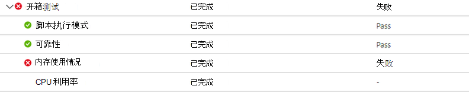
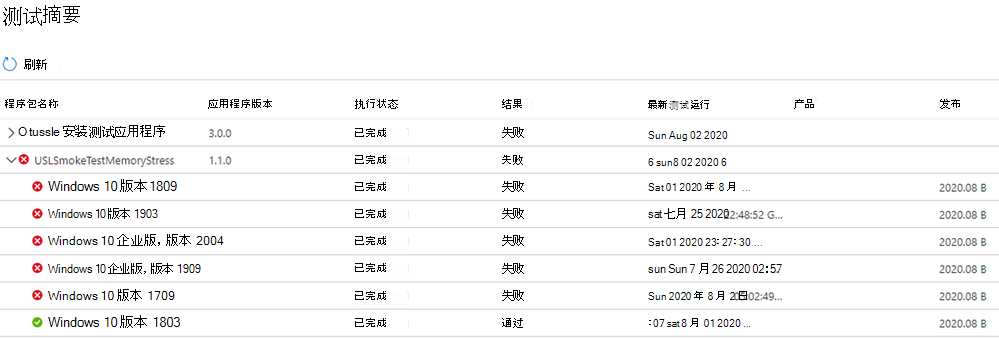
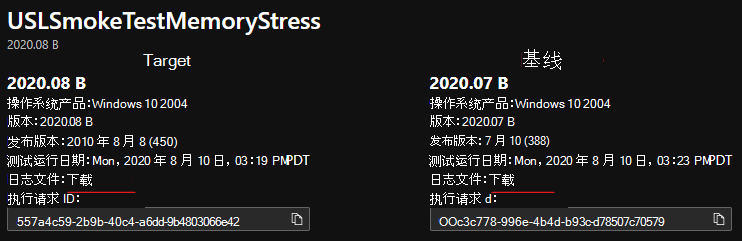

# <a name="memory-regression-analysis"></a>内存回归分析

测试基础可帮助你更清楚地注意到运行应用的测试 VM 中的内存使用量显著增加。 性能指标（如内存使用率）可以指示整体应用程序运行状况，我们认为此添加将大大有助于使应用保持最佳性能。

阅读了解详细信息或观看此视频，快速了解最新改进。 

有关针对 M365 的 M365 能否帮助进行回归分析，请参阅基于过程可靠性的回归结果。

<b>进一步了解内存回归</b>

M365 测试基础仪表板显示应用程序在新的预发布 Windows 更新中使用的内存，并将其与上次发布的 Windows 更新使用的内存进行比较。 

通过本月的增强功能，内存回归分析现在成为你最喜爱的流程中的一项功能。 应用程序可以包含多个进程，并且可以通过"可靠性"选项卡手动选择你最喜爱的进程。然后，我们的服务将识别这些收藏过程中的内存回归，同时比较跨不同更新版本Windows运行。 如果检测到回归，则很容易获得有关回归的详细信息。

现在我们来看一下此功能，并讨论如何使用 Performance Analyzer 对内存回归进行Windows疑难解答。

内存回归导致的失败信号显示在"测试结果"页的"内存使用率"下的"M365 测试基础"仪表板中：




应用程序因内存消耗较高而失败，还将在"测试摘要"页上 ```Fail``` 显示：



通过提前提供这些失败信号，我们的目标是明确标记可能干扰和影响应用程序最终用户体验的潜在问题。 

然后，您可以下载日志文件，并使用 Windows Performance Analyzer 或首选工具包进行进一步调查。 还可以与 M365 测试基础团队一起修复问题并帮助防止影响最终用户的问题。

对于所有测试运行，内存信号在 M365 服务测试基础的"内存使用率"选项卡中捕获。 下面的示例显示了针对预发布 2020 年 8 月安全更新的已载入应用程序"消耗测试内存压力"的最新测试运行。  (本应用程序由我们团队编写，以演示内存回归。) 


此示例中，与发布的 7 月更新相比，收藏的进程"USLTestMemoryStress.exe"过程在 8 月发布的更新中平均消耗了大约 100 MB，因此 M365 测试基础确定了一个回归。 

此处显示为"USLTestMemoryStress_Aux1.exe"和"USLTestMemoryStress_Aux2.exe"的其他进程也属于同一应用程序，但在两个版本中消耗的内存量大致相同，因此它们"通过"并被视为正常。

主要过程的回归被确定为"统计显著"，因此服务向用户传达并突出显示了此差异。 如果比较在统计上没有意义，将不会突出显示。 内存使用率可能会很干扰，因此，我们使用统计模型来区分不同内部版本和版本之间的有意义的差异与非必要差异。 

当误报 (没有真正的差异时，很少标记比较) 但这是一个必要的权衡，以提高正确识别回归值或正 (的可能性。) 

下一步是了解导致内存回归的原因。 可以从"下载日志文件"选项下载执行这两个压缩文件，如下所示。 

这些 zip 文件包含测试运行的结果，包括脚本结果以及 ETL 文件中包含的内存和 CPU 性能数据。



您可以下载并解压缩两个测试运行的日志，然后找到每个文件夹中的 ETL 文件，并将其重命名为 target.etl (以用于预发布更新) 上的测试运行，将 baseline.etl (用于上次发布的更新) 测试运行，以简化探索和导航。
 
## <a name="next-steps"></a>后续步骤

继续阅读下一篇文章，开始了解智能 CPU 回归分析。
> [!div class="nextstepaction"]
> [下一步](cpu.md)

<!---
Add button for next page
-->
