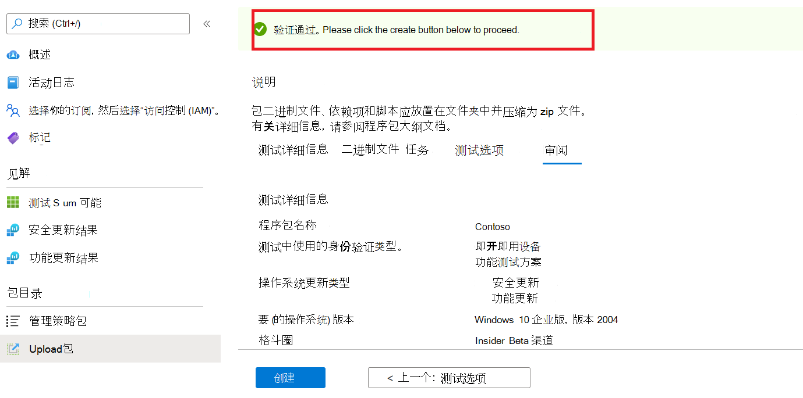
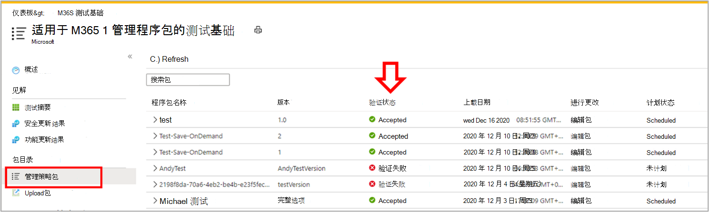

# <a name="step-6-review-your-selections-to-create-your-package"></a><span data-ttu-id="99982-103">步骤 6：查看选择以创建程序包。</span><span class="sxs-lookup"><span data-stu-id="99982-103">Step 6: Review your selections to create your package.</span></span>

1.  <span data-ttu-id="99982-104">在此选项卡上，该服务显示测试详细信息并运行快速完成性检查。</span><span class="sxs-lookup"><span data-stu-id="99982-104">On this tab, the service displays your test details and runs a quick completeness check.</span></span> 

    <span data-ttu-id="99982-105">A ```Validation passed``` 或 message shows whether you can proceed to next steps or ```Validation failed``` not.</span><span class="sxs-lookup"><span data-stu-id="99982-105">A ```Validation passed``` or ```Validation failed``` message shows whether you can proceed to next steps or not.</span></span>

2.  <span data-ttu-id="99982-106">查看测试详细信息，如果满意，请单击 ```Create``` 按钮。</span><span class="sxs-lookup"><span data-stu-id="99982-106">Review your test details and if satisfied, click on the ```Create``` button.</span></span> 



3.  <span data-ttu-id="99982-108">这会将程序包载入测试基础环境。</span><span class="sxs-lookup"><span data-stu-id="99982-108">This will onboard your package to the Test Base environment.</span></span> <span data-ttu-id="99982-109">如果成功创建程序包，将触发用于验证是否可以在 Azure 上成功执行程序包的自动测试。</span><span class="sxs-lookup"><span data-stu-id="99982-109">If your package is successfully created, an automated test which verifys whether your package can be successfully executed on Azure will be triggered.</span></span>


> [!Note]
> <span data-ttu-id="99982-111">你将从 Azure 门户收到通知，通知程序包验证是成功还是失败。</span><span class="sxs-lookup"><span data-stu-id="99982-111">You will get a notification from the Azure portal to notify you on the success or failure of the package verification.</span></span> 
>
> <span data-ttu-id="99982-112">请注意，此过程最多可能需要 24 小时，因此，如果您未在网页上处于活动状态，您的网页可能会超时，因此，通知不会通知您此按需运行完成。</span><span class="sxs-lookup"><span data-stu-id="99982-112">Please note that the process can take up to 24 hours, so it is likely your webpage will timeout if you are not active on it and hence, the notification will not inform you of the completion of this on-demand run.</span></span> 

  - <span data-ttu-id="99982-113">如果发生这种情况，可以在选项卡上查看程序包 ```Manage packages``` 的状态。</span><span class="sxs-lookup"><span data-stu-id="99982-113">Peradventure this happens, you can view the status of your package on the ```Manage packages``` tab.</span></span>



  - <span data-ttu-id="99982-115">对于成功测试，可以按计划间隔（通常在上传后几天开始）通过 和 页面查看其结果 ```Test Summary``` ```Security Updates Results``` ```Feature Updates Results``` 。</span><span class="sxs-lookup"><span data-stu-id="99982-115">For succesful tests, their results can be seen via the ```Test Summary```, ```Security Updates Results``` and ```Feature Updates Results``` pages at scheduled intervals, often starting a few days after your upload.</span></span>
  
  - <span data-ttu-id="99982-116">测试失败时，需要上传新程序包。</span><span class="sxs-lookup"><span data-stu-id="99982-116">While failed tests, require you to upload a new package.</span></span> 
  
    <span data-ttu-id="99982-117">可以从 和 ```test logs``` 页面下载 以进一 ```Security update results``` 步 ```Feature updates results``` 分析。</span><span class="sxs-lookup"><span data-stu-id="99982-117">You can download the ```test logs``` for further analysis from the ‘```Security update results``` and ```Feature updates results``` pages.</span></span>

  - <span data-ttu-id="99982-118">如果遇到重复测试失败，请联系 testbasepreview@microsoft.com 并提供有关错误的详细信息。</span><span class="sxs-lookup"><span data-stu-id="99982-118">If you experience repeated test failures, please reach out to testbasepreview@microsoft.com with details of your error.</span></span> 

## <a name="next-steps"></a><span data-ttu-id="99982-119">后续步骤</span><span class="sxs-lookup"><span data-stu-id="99982-119">Next steps</span></span>

<span data-ttu-id="99982-120">通过下面的链接发现我们的内容指南。</span><span class="sxs-lookup"><span data-stu-id="99982-120">Discover our Content Guidelines via the link below.</span></span>
> [!div class="nextstepaction"]
> [<span data-ttu-id="99982-121">后续步骤</span><span class="sxs-lookup"><span data-stu-id="99982-121">Next step</span></span>](contentguideline.md)
