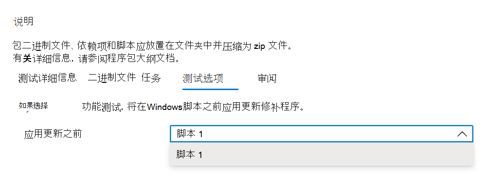

# <a name="step-5-choose-your-test-options"></a>步骤 5：选择测试选项。 

该选项卡适用于希望执行功能测试以指示应在何时应用 Windows Update 修补程序以执行其功能测试脚本 ```Test Options``` 的用户。



选择 _**"查看**_ "以导航到下一个选项卡并查看所选的测试选项。

## <a name="next-steps"></a>后续步骤

可以在下一篇文章中通过下面的链接查看嵌套步骤的详细信息：
> [!div class="nextstepaction"]
> [后续步骤](review.md)
