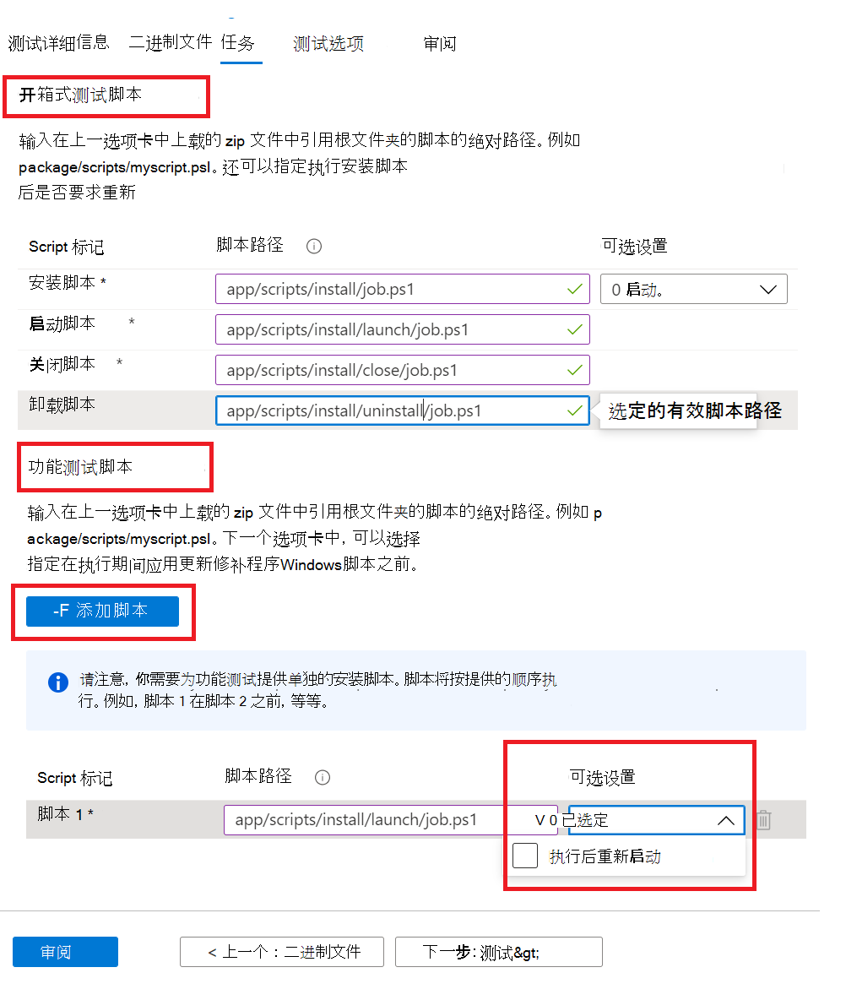

# <a name="step-4-the-tasks-tab"></a>步骤 4："任务"选项卡

在"任务"选项卡上，应提供测试脚本的路径，这些脚本位于"二进制文件"选项卡下上载的 zip 文件夹中。

  - **开箱式测试脚本：** 键入安装、启动、关闭和卸载脚本的相对路径。 还可以选择安装脚本的其他设置。
  - **功能测试脚本：** 键入上载的每个功能测试脚本的相对路径。 可以使用 按钮添加其他功能测试 ```Add Script``` 脚本。 至少需要一个 1 (1) 脚本，并且可以在 8 个 (8 个) 测试脚本。 
  
    脚本按上载顺序运行，特定脚本中的失败将停止后续脚本的执行。
    还可以选择为提供的每个脚本选择其他设置。

## <a name="set-script-path"></a>设置脚本路径



下面是如何在文件夹结构上提供相对路径的示例：

_**Zip_file_uploaded**_
~~~
├── file1.exe

├── ScriptX.ps1

├── folder1

│   ├── file3.exe

│   ├── script.ps1
~~~
  - **ScriptX.ps1** 一个。 _ScriptX.ps1_ 作为相对路径。
  - **Script.ps1** 将 _folder1/script.ps1_ 作为相对路径。


## <a name="next-steps"></a>后续步骤

查看下一篇文章中的"测试选项"选项卡的详细信息 
> [!div class="nextstepaction"]
> [下一步](testoptions.md)
