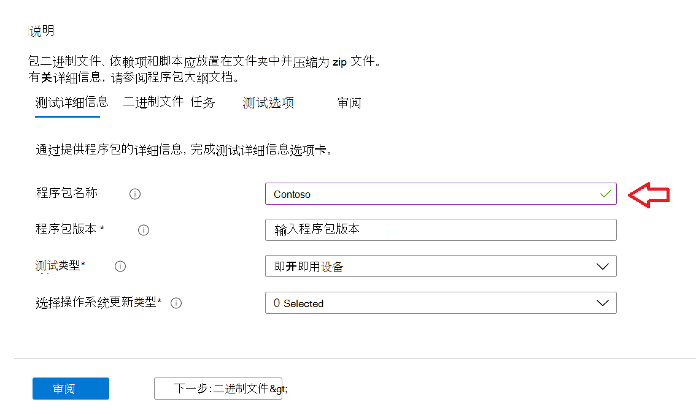
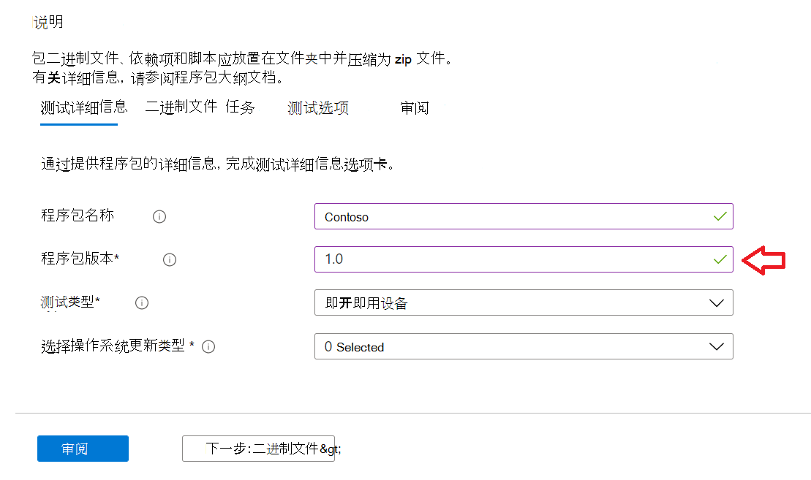
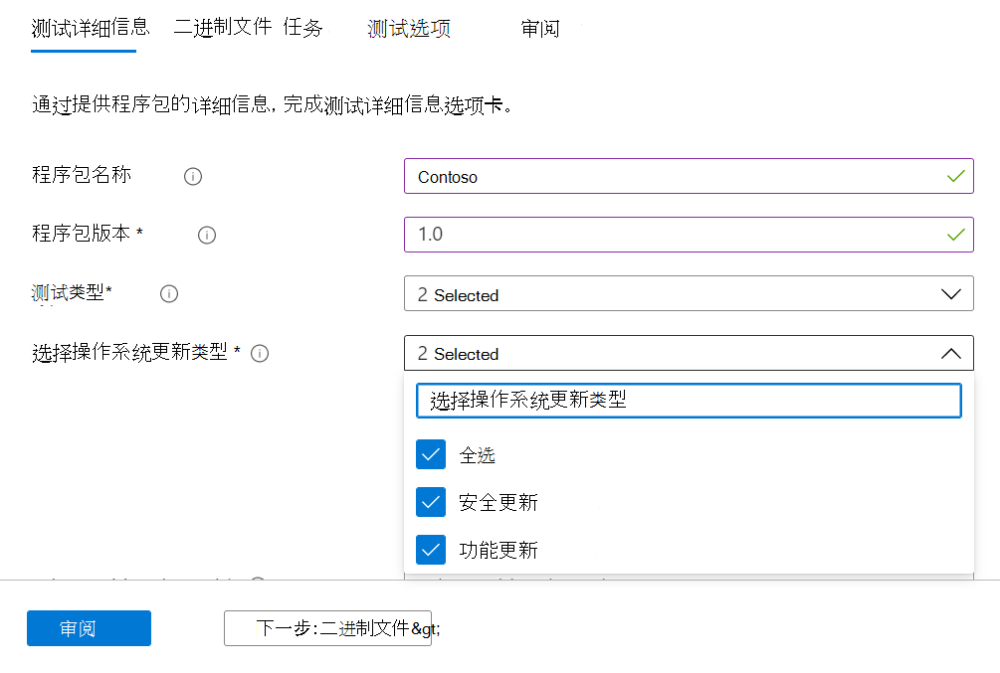
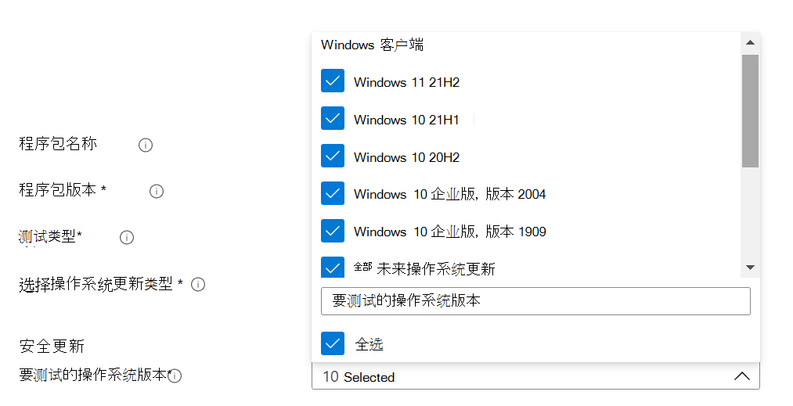
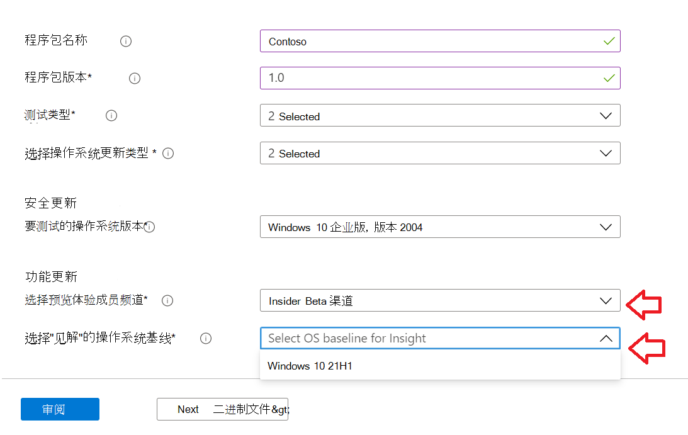
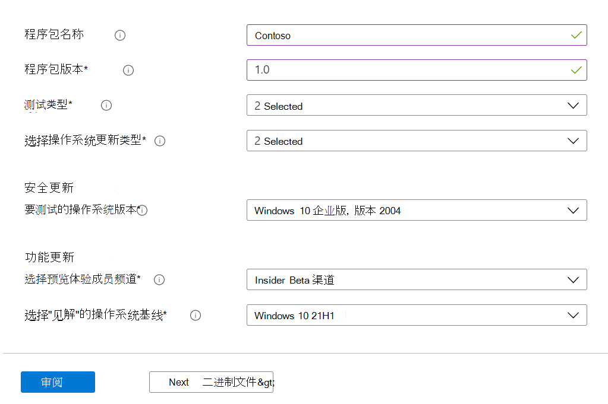

# <a name="step-2-uploading-a-package"></a>步骤 2：上载程序包

在"测试基础门户"页上，导航到左侧导航栏上的"Upload新程序包"选项，如下所示：Upload 

完成后，请按照以下步骤上载新程序包。

## <a name="enter-details-for-your-package"></a>输入程序包的详细信息

在"测试详细信息"选项卡上，键入程序包的名称、版本和其他详细信息（如所请求）。 

**可通过此仪表板** 完成开箱即用和功能测试。

以下步骤提供了如何填写程序包详细信息的指南：

1.  **在 字段中输入要给定程序包 ```“Package name``` 的名称。**

> [!Note]  
> 输入的程序包名称和版本组合在组织中必须是唯一的。 检查标记对此进行验证，如下所示。
  
  - 如果选择重新使用程序包的名称，则版本号必须是唯一的 (即从不用于包含该特定名称的程序包) 。
  - 如果程序包名称 + 版本的组合未通过唯一性检查，你将看到一条错误消息，显示"程序包 *包含此程序包版本已存在"。* 



2. **在"程序包版本"字段中输入版本。**



3.  **选择要在此程序包上运行的测试类型**

    开 **箱即用 OOB (OOB)***测试执行程序包* 的安装、启动、*关闭* 和卸载。 安装后，在运行单个卸载之前，launch-close 例程将重复 30 次。 
    
    此 OOB 测试提供了程序包上的标准化遥测，可跨内部版本Windows比较。

    功能 **测试** 将在程序包上执行 () 脚本。 脚本按上载顺序运行，特定脚本中的失败将停止后续脚本的执行。

> [!Note]
> **所有** 脚本最多运行 80 分钟。 
    
4.  **选择操作系统更新类型**

   - 通过"安全更新"，可以针对预发布每月安全更新中Windows增量改动测试程序包。 
   - 利用"功能更新"，可以针对预览体验计划Windows预发布两年功能更新版本测试Windows程序包。
<!---
Change to the correct picture
-->


5.  **选择用于安全更新 () 操作系统版本。**

在多选下拉列表中， (安装) Windows选择操作系统版本。 

  - 若要仅针对客户端WINDOWS测试程序包，请从Windows列表中选择适用的 11 操作系统版本。
  - 若要仅针对 Windows OSes 测试程序包，请从Windows列表中选择适用的服务器操作系统版本。
  - 若要针对客户端和Windows OSes 测试程序包，请从菜单列表中选择所有适用的 OSes。 

> [!Note]
> 如果选择针对服务器和客户端 OSes 测试程序包，请确保程序包兼容，并且可在两个 OSes 上运行



<!---
Change to the correct picture
-->
6.  **选择功能更新测试的选项：**

  - 在"选择预览体验成员频道"选项上，选择 作为应针对其测试程序包 ```Windows Insider Program Channel``` 的内部版本。
  
    我们目前使用预览体验成员 Beta 渠道中测试的内部版本。

  - 在"为 Insight 选择操作系统基线"选项上，Windows用作比较测试结果基线的 os 版本。 

> [!Note]
> 目前我们不支持服务器 OSes 的功能更新测试
<!---
Note to actual note format for markdown
-->
<!---
Change to the correct picture
-->


7.  完成的"测试详细信息"页应如下所示： 


## <a name="next-steps"></a>后续步骤

我们的下一篇文章介绍了将二进制文件上载到系统。
> [!div class="nextstepaction"]
> [后续步骤](binaries.md)

<!---
Add button for next page
-->

