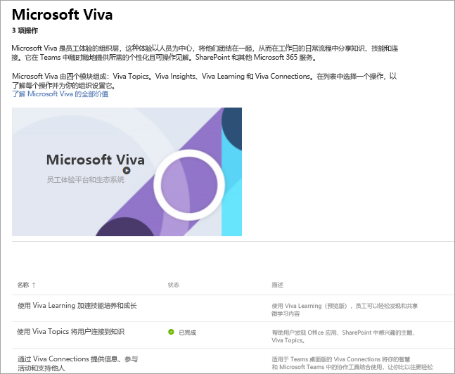

# 设置 Microsoft Viva
Microsoft Viva 是员工体验的组织层，以人员为中心，将他们团结在一起，在工作的日常流程中分享知识、技能和连接。 它在 Teams、SharePoint 和其他Microsoft 365服务中提供个性化且可操作的见解。 

Microsoft Viva 包括四个模块：Viva 主题、Viva Insights、Viva Learning 和 Viva Connections。 若要设置整个套件，需要单独设置每个模块。
 
### 开始设置

若要直接登录并开始设置，必须是 Microsoft 管理员才能登录到帐户。 

[直接转到 Microsoft Viva 管理员页面](https://admin.microsoft.com/Adminportal/Home?source=applauncher#/featureexplorer/collections/VivaExperiences)

在页面底部，选择要设置的模块。
在模块页上，选择 **转到设置指南** 按钮，或者在 Viva Topics 的情况下，选择 **入门** 按钮，转到引导你完成此过程的安装向导。

或者，如果想稍后进行设置，可以按照以下步骤操作：
1.  转到 Microsoft 365 管理中心
2.  选择左侧导航栏上的"**设置**"
3.  选择 **Microsoft Viva** 磁贴
4.  在页面底部，选择要设置的模块。
5.  选择 **转到设置指南** 按钮，或者在 Viva Topics 中，选择 **入门** 按钮，转到引导你完成此过程的安装向导。

### 更多信息
如果想了解有关每个模块以及如何首先设置模块的更多信息，请参阅以下资源：

**Viva Learning** 

加快技能水平和增长 – 员工可以轻松发现和共享从培训课程到微学习内容的所有内容。

[概述](/microsoft-365/learning)

[了解如何设置](/microsoft-365/learning/set-up-teams-admin-center)

**Viva Insights**

平衡生产力与生活 - 提供数据驱动、受隐私保护的见解和可操作建议，帮助组织中的每个人更智能地工作并实现平衡。

[概述](/viva/insights/introduction)

[了解如何设置](/viva/insights/setup/setup-intro)

**Viva Topics**

将人员连接到知识 – 用户可以轻松发现 Office 应用、SharePoint 和搜索结果中感兴趣的主题。

[概述](/microsoft-365/knowledge/)

[了解如何设置](/microsoft-365/knowledge/set-up-topic-experiences)

**Viva Connections**

通知、参与和授权 - Microsoft Viva Connections 新式参与体验的网关，旨在让每个人都参与和了解情况。

[概述](/sharepoint/viva-connections-overview)

[了解如何设置](/sharepoint/guide-to-setting-up-viva-connections)

**详细信息**

[获取有关 Microsoft Viva 的其他文档和方法](/microsoft-365/viva)
